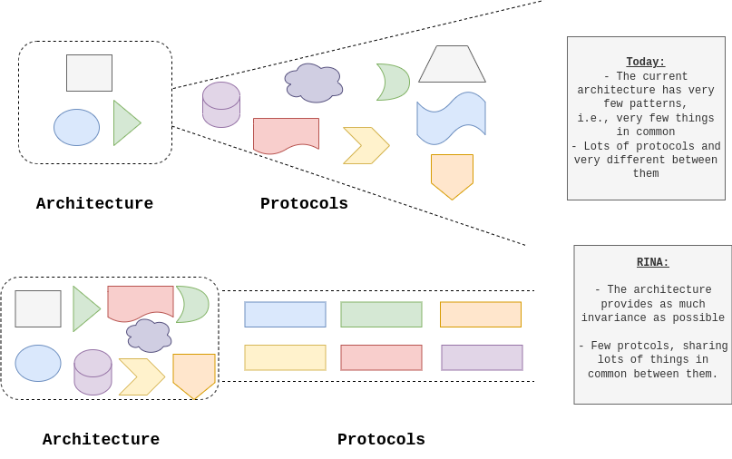
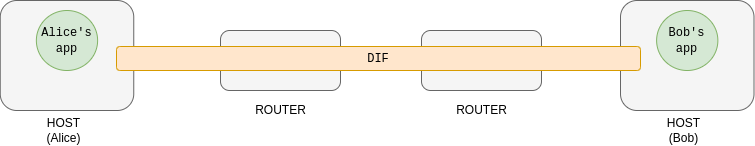
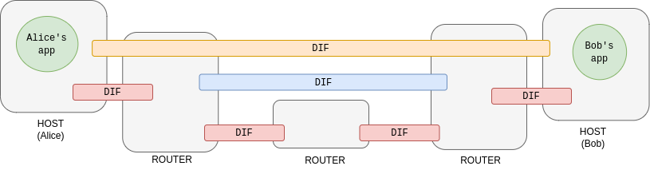

In [the previous article](https://sergiogimenez.com/rina_1/) we talked about the flaws in the current network architecture. Before starting to break down how RINA improves the defects that the current architecture has, I would like to clarify something that I consider important. **RINA is not intended as a replacement for the current TCP/IP model**. RINA was born with the motivation to propose a new architecture to reach to where TCP/IP cannot. RINA can be incrementally deployed by interoperating with current technologies. You don't need a clean deployment as for example if you need with IPv6. That is, it can work in several different use cases (over an Ethernet network, over an IP network, etc.).

## Architecture Principles

In general, RINA is based on the principle of **maximizing the invariants in the architecture**, so that the number of protocols on this one can be minimized. The following figure exemplifies this statement graphically:

*Abstract representation of the current network architecture and protocols versus the desired goal. Source: [RINA ETSI Report](https://www.etsi.org/deliver/etsi_gr/NGP/001_099/009/01.01.01_60/gr_NGP009v010101p.pdf)*

What RINA tries, is to solve most of the complex problems within the architecture, that is, **all the issues that do not depend on the requirements of each network**. By solving those problems within the architecture, we will have fewer protocols and these will be more similar among them.

## What is "The Network"?

As we have explained in the previous article, the network is nothing more than the channel that allows communication between applications (e.g. Skype, Mail, WhatsApp, etc.). Therefore, the network itself is a distributed application specialized in providing this communication channel between applications (ie, processes). In RINA, this channel is called DIF (Distributed IPC Facility), which means exactly what we have been saying: **an application that provides communication services between processes**.

Let's do a little exercise to understand how the network is built.

As a first approach for our model, we could have a single DIF that provides two applications with the ability to communicate:

*Representation of a DIF to provide IPC between two endpoints Source: Eduard Grasa, slides [Introduction to RINA](https://www.youtube.com/watch?v=1tB7Iy2Q3-o)*

Now, Alice and Bob can speak to each other, but this is not fine at all. If we only have a DIF to provide communication to all the applications in the world, it would not work, ergo it is not scalable. But this is something that we can solve relatively easily. We need to isolate the different scopes in the networks:

*Representation of several DIFs to provide IPC between two endpoints. Source: Eduard Grasa, slides [Introduction to RINA](https://www.youtube.com/watch?v=1tB7Iy2Q3-o)*

What we have in RINA then, are multiple DIFs that provide IPC to each other. At the end of the day, a DIF is just a distributed application. And how many DIFs have to be used in a network? Well, as many as the network designer deems appropriate for the use case that IPC is to be provided. For example, there will be a DIF (red) that will be above the physical level, which will accommodate the technology that modulates the information below (air, fiber, cable, etc.); or it may be interesting to have a segment of the metropolitan network (blue) further from the users, which adds more traffic to the flow.

In the end, what we have is a more abstract and simpler architecture, since in a network there is only the same element repeated `N` times. With which, managing the network becomes easier, since only knowing how a DIF behaves and how it is related to another DIF (or application, because they interact in the same way), can be generalized to how the entire network interacts with all the elements that compose it. This is where Recursive in RINA comes from, since what you have is the same type of layer that is repeated and services are used from one layer to another in the same way that applications use services. It is important to emphasize that the different layers (different DIFs) do not have different functionalities, they only deal with providing communication services between processes in a scope. So, a DIF provides services for two applications to communicate, but… Can there be several applications using the services of the same DIF? Of course, in fact, more precisely, a DIF provides the communication services by allocating resources (memory in buffers, bandwidth capacity, etc.) for the different applications. Then, the applications request a communication flow from the DIF with specific requirements and some applications compete with others to obtain that flow.

## Inside a DIF

And what exactly is inside a DIF? Within the DIFs, following the RINA philosophy, it is also intended to simplify their internal structure as much as possible (following the principle of maximizing invariances). The functions that a DIF performs are classified into three types:

* Data transfer functions.
* Data transfer control functions.
* Layer management functions.

To be able to carry out these functions, protocols are needed, just as it happens to us in the current architecture. But remember that we want to have the minimum protocols and we want to design them as simple as possible. To minimize the variability between protocols within the DIF to a minimum, what is done is to separate between **mechanism** and **policy**.

Mechanisms are the **fixed** parts in a protocol. For example, the acknowledgment (ACK); which is a type of message used to find out if a packet has successfully arrived at its destination.

Policy is the part of the protocol that changes. For example, **when** and **how** to send an ACK is a policy.

And with this premise of separating between mechanism and policy, we find that only two protocols are enough to cover the three functions of the DIF: **EFCP** for data transfer and control, and **CDAP** for layer management.

## Naming and Addressing

Without going into much detail, since [we have already talked about this in the other article](https://sergiogimenez.com/rina_1/), RINA proposes a naming scheme that facilitates mobility, simplifies traffic routing and provides multi-homing natively. We need applications to have a name, and applicatoins need to keep it regardless of where they are. Then, we have node addresses, which give us clues as to where they live. Finally, we have the point of attachment addresses, these addresses do tell us how to get to where the applications live.

Below is a comparative table with the current naming system:

| **Name**                	| **Indicates**       	| **Property**                         	| RINA 	| IP                     	|
|-------------------------	|---------------------	|--------------------------------------	|------	|------------------------	|
| Name of the application 	| What?               	| Location independent                 	| Yes  	| No                     	|
| Node address            	| Where?              	| Location dependent, path independent 	| Yes  	| No                     	|
| Point of attachment     	| How do I get there? 	| Path dependent                       	| Yes  	| Yes, twice: IP and MAC 	|

As we discussed earlier, we need applications to have a name, and to keep it regardless of where they are. Then we have node addresses, which give us clues as to where applications live. Finally, we have the point of attachment addresses, these addresses do tell us how to get to where the applications live.

## Final Recap

If you have got it till the end, you will have realized that RINA provides a fairly abstract architecture, and consequently, the ultimate goal of RINA is to have a framework that allows you to develop protocols and thus be able to simplify networks in general. As I said at the beginning of the article, RINA can be applied in specific scopes, such as within datacenters. Being a relatively new technology, the idea is to start with very simple use cases and gradually move to larger and more complex use cases.

Finally, if attach here some references that could might be interesting to extend RINA knowledge.

* [Future Internet and RINA Architecture - EduTec&Cria](https://www.youtube.com/watch?v=1tB7Iy2Q3-o&t=2820s). The first is a talk, which has been used as a guide and reference to write these articles. In fact, these two articles could be considered as a synthesis/introduction of this talk. This talk explains in a very understandable and simple way what problems the current architecture has and how RINA can solve them.
* [IRATI](https://irati.github.io/stack/) is an open source implementation of RINA that has a fairly comprehensive wiki and documentation on RINA.
* [ETSI RINA Report](https://www.etsi.org/deliver/etsi_gr/NGP/001_099/009/01.01.01_60/gr_NGP009v010101p.pdf). This is the RINA standardization document in which all the technical details of RINA are explained in a more technical way.