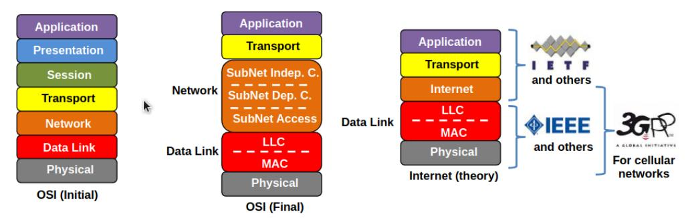
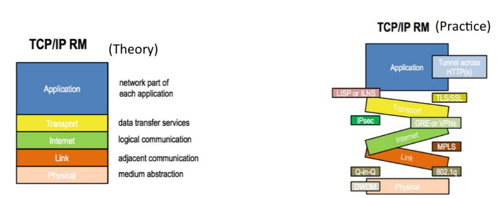
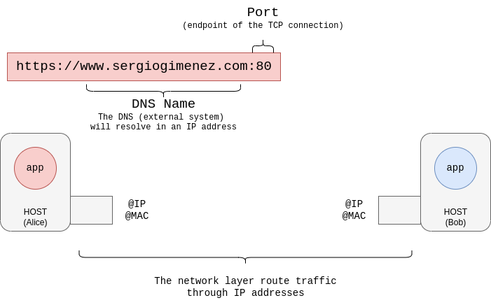
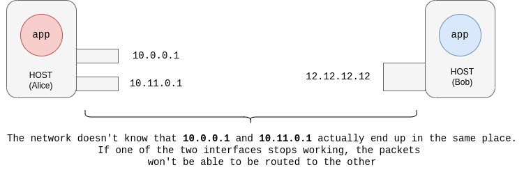
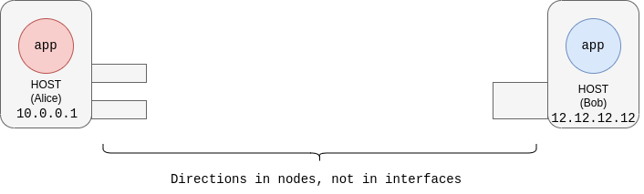

Well, maybe Internet is not completely broken, but it does have several flaws. In fact, by being a little more rigorous and less alarmist with the title statement, we could say that the network architecture in which the Internet as we know it today is designed, can be improved. It may seem naive to say this, but I hope that by the end of this article you will understand the weaknesses of the current architecture and how we could improve it.

But, let us start from the beginning. What is an **architecture**? We could define an architecture as a set of patterns and methodologies that allow designing elements with different requirements. Let's exemplify it. If we have in mind a church/cathedral, we can tell with relative ease, seeing the building, that it has a Gothic, Romanesque, classical architecture, etc. Although all the elements are buildings, each one has different characteristics. Therefore, **an architecture captures invariant and common patterns between different constructions independent of the requirements of each construction**.

So we already have the concept of architecture defined, now we need the second: **network**. What is a network? After all, a network provides us with communication between two extremes, which from now on we will call endpoints. But what are these endpoints? These endpoints are ultimately applications (strictly speaking, process instances of the operating system). Therefore, a network is nothing more than a way to copy data in a distributed (and imperfect) way between two applications. This definition of network was very present at the beginning of communication networks, and in conclusion, it comes to say that **computer networks present inter-process communication services** (IPC).

Well, we already have a more or less clear idea of ​​what a network architecture is. Now the question we could ask ourselves would be the following: What is the current network architecture? Answer is: **it is not formally defined**. According to our definition of architecture, the current model does not correspond to a formally and precisely defined architecture. What does exist are a series of rules that are fulfilled (more or less) and that work (more or less) and that there are problems that they do not contemplate, and then each use case must be solved independently. Let's take a closer look at what problems we have with the current "architecture".

*OSI architecture model (left, center) and Internet protocol suite model (left). Souce: [RINA ETSI REPORT](https://www.etsi.org/deliver/etsi_gr/NGP/001_099/009/01.01.01_60/gr_NGP009v010101p.pdf)*

## Problems

### Layering

The current architecture leaves no room for new network protocols. There is a layer called "*network layer*" common throughout the internet above the link level. This implies that, for example, if a network wants to do non-IP routing, or hide internal routers of private networks from the public Internet, ad-hoc solutions must be used.

The fact that specific solutions have to be used for each use case is a problem, because since it is something that is not contemplated in the common architecture, each network designer solves "his problems his way". The use case exposed before, where you want to do routing in a different way, can be solved with MPLS (Layer 2.5), but it can also be solved in other ways, for example in cellular networks there is GTP, or IP-tunneling protocols (packets IP within IP packets), etc.

Ultimately, this section is intended to illustrate that because the architecture does not contemplate a common solution independent of network type, there are myriad disparate solutions. And in the end, this is solved in the way that is illustrated in the figure below. Something that a priori should be simple, with fixed layers, ends up becoming a reality in what is shown in the image below, where different protocols appear that are inserted between the different layers to be able to solve use cases that occur today and that architecture does not contemplate. If we had a well-defined and concrete architecture, we would not end up having a *macedonia* of protocols and specific solutions.

*The Internet architecture model is constantly being extended to accommodate new use cases. Source: [RINA ETSI REPORT](https://www.etsi.org/deliver/etsi_gr/NGP/001_099/009/01.01.01_60/gr_NGP009v010101p.pdf)*

### Naming and Addressing

Another problem that exists in the current architecture is how to identify different entities within a network. We have the **applications**, which are the **endpoints** of a network communication service. Let's see an example in the figure below.

*Naming and Addressing in Current Architecture. Source: Eduard Grasa, slides [Introduction to RINA](https://www.youtube.com/watch?v=1tB7Iy2Q3-o)

Applications do not have a separate name. To establish a TCP connection flow, we need the address where the application is located, as well as a port, which indicates the endpoint of the flow.

Let's stop here for a moment.

If we look at Alice's application address as [www.sergiogimenez.com:80](www.sergiogimenez.com:80), we see that this does not look like an IP address, and indeed requires DNS translation to convert it to an IP address. The DNS resolves the address before establishing the connection flow, but the DNS is an external system, not part of the network.  
The network doesn't understand application addresses, the network only understands that you are connecting one network interface (and one port) to another network interface (and another port). For example, if the network moves, the network has no idea that the same application is being instantiated elsewhere, then any management that needs to be done (such as re-routing traffic), cannot be done without a external element to the network (as is the case of the DNS).

In conclusion: The fact that the network does not know the names of the applications is indeed an issue.

### Mobility

As we have seen, the name of the application is not stable, and depends on the site where you are. A very simple example of the problems caused by this fact would be the following: I'm called myself Sergio at home, but that at work they called me something else, just for the simple fact of having moved. With networks, exactly this happens. If you move, your direction changes. And it must be so! Because the address must identify exactly where you are; but **the name of the application should be stable**, since it only indicates **who** you are and should not vary depending on **where** you are.

But in the current model this does not happen. At the network layer (which deals with routing) there is only a single identifier: the IP address. Routers don't understand application names, only IP addresses. So if you want to be mobile on a network, you have to use... Guess what? More protocols.

### Multi-homing

It may be the case that Alice has more than two network interfaces on her machine, that is, Alice can connect to one network or to more than one network. The problem here is that each interface must have a different IP address. So Alice's application has 2 addresses, since we have one address for each interface.

Let's take an example, if Bob's app sends traffic to Alice's app, the network will route that traffic from `12.12.12.12` to `10.0.0.1`. What happens is that if `10.0.0.1` breaks, Bob's app has no way to send that traffic to Alice's app. The issue here is that Bob's app doesn't want to go to `10.0.0.1`, or `10.11.0.1`, **it wants to go to Alice's app**.

*The multi-homing problem. Source: Eduard Grasa, slides [Introduction to RINA](https://www.youtube.com/watch?v=1tB7Iy2Q3-o)*

Of course, this is something that can be partially solved in the current model (*partially solved*, because the endpoints must participate in this solution, it is not the network itself that provides solutions). At this point, the reader already imagines how… more protocols (SHIM6, Multipath TCP, BGP…).

However, if this had been thought of from the beginning and included in the architecture, a solution provided natively in the architecture could have been found for it. However, the solution to this problem is as trivial as shown in the figure below.

*Solution to the multi-homing problem. Source: Eduard Grasa, slides [Introduction to RINA](https://www.youtube.com/watch?v=1tB7Iy2Q3-o)*

It would be enough that the architecture was designed with **addresses on the nodes**, not the interfaces. And then route traffic based on these node addresses.

## In Conclusion

The current architecture, as we have been seeing, has defects:

* In its structure.
* In how protocols are designed: things in common between protocols are not rejected, they are all designed from scratch (although they perform very similar functions).
* Names and addresses. As we have been seeing, it has all the multi-homing and mobility problems that we have mentioned.

And we haven't talked about things that also would take us a while, such as the sockets API to program applications, security, network management, since the more protocols, the more complications when managing a network.

Perhaps at this point, you might be thinking about how naive it can be to talk about "*how badly the Internet works*", but in reality, this information is reaching you thanks to the current architecture. And millions of things that work on this architecture and that no one 20 years ago thought could happen. But really, the things that have been mentioned are real defects that the architecture has and that can be improved. And from the will to try to improve all this, RINA appears. But this, we will talk about in detail in part 2 of this article.