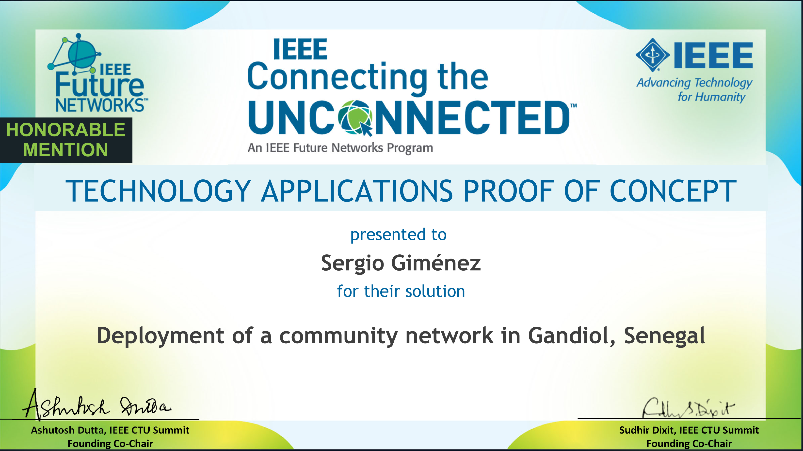

We are proud to announce that our team has won the Hahatay Network Prize in the IEEE CUNC Challenge. The IEEE CUNC Challenge is a competition that recognizes proof of concept and prototype solutions that address the challenges of the future internet in underserved areas. Our solution has been awarded with the "Honorable Mention" prize in the proof of concept category.

We would like to thank the IEEE CUNC Challenge organizers for this recognition and we look forward to continuing our work in this area.

Please, find also below  the presentation slides and the [final text](./files/Connected_the_unconnected_application_final.pdf) of the application.

📊 Key Resources:

* [Presentation Slides](files/IEEE-CTU-Presentation-Hahatay-Network.odp)
* [Full Application](files/Connected_the_unconnected_application_final.pdf)