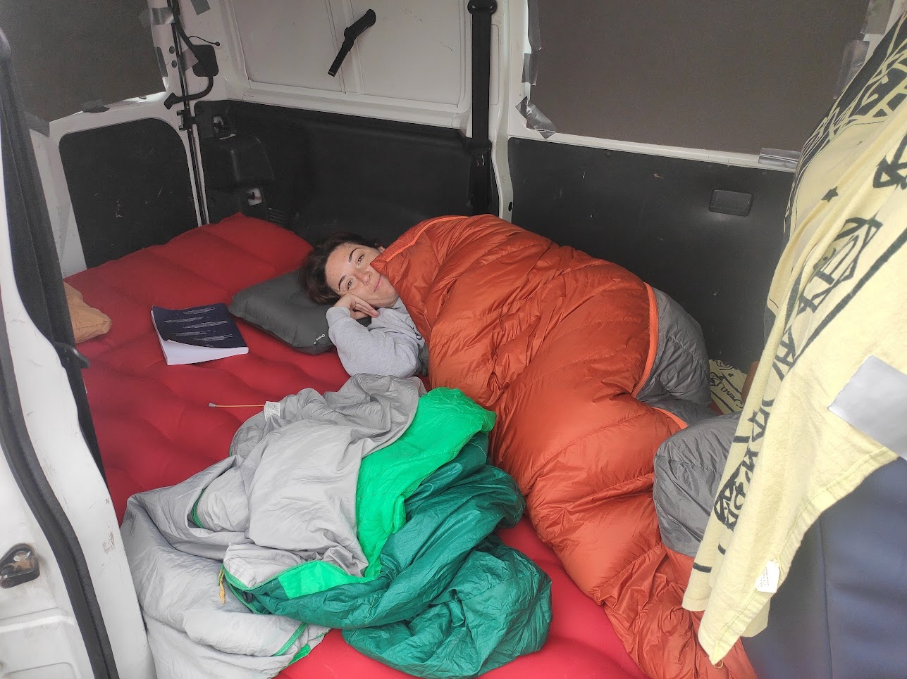

A todos nos ha pasado. Abres Instagram o Youtube y te bombardean con esas furgonetas camper perfectas: acabados de madera, luces cálidas, cocinas de diseño y vistas a fiordos noruegos. Y piensas: "Ojalá pudiera, pero eso no es para mí". Pues no, no hace falta tener una furgo de Instagram para disfrutar de la libertad de viajar en furgoneta.

Mi historia camper no empezó con un gran presupuesto ni con conocimientos de carpintería, sino con una furgoneta normal y corriente (la llamamos "la furgo de los melones"), que con mucha suerte heredé de un negocio familiar, un colchón hinchable y muchas ganas de aventura. Y a lo largo de los años, se ha convertido en nuestra cómplice perfecta de escapadas.

## 2021: El caos de los inicios

Mi primer viaje en solitario fue, siendo sinceros, un auténtico desastre logístico. La "camperización" consistía en un colchón hinchable tirado en la parte de atrás. No había muebles, ni organización, y para colmo, ¡me olvidé de quitar los asientos traseros! El espacio era mínimo y el caos, máximo.

*Así empezó todo: un colchón, los asientos de serie y mucho desorden.*

Era Semana Santa en el Pirineo y hacía demasiado frío para estar fuera. Decidí cocinar dentro, en una mesita improvisada, sin tener siquiera un hornillo en condiciones. El menú: una pasta que, spoiler, fue una pesadilla para limpiar después.


El caos culinario de los inicios. Al menos el plato estaba bueno....


Pero a la mañana siguiente, todo ese caos se olvidó. Te despiertas, abres la puerta y te encuentras con esto... y entonces, se te pasan todos los males.

*La recompensa: despertares que no tienen precio.*

## 2022: Aprendiendo juntos en la carretera

### Nuestra Primera Escapada

En 2022, animé a Julia a hacer un viaje en furgoneta juntos. Nuestra primera experiencia juntos fue una escapada a Pitarque, Teruel. Para ella, que nunca se había imaginado disfrutando de la vida *jipi* en furgoneta, fue toda una prueba de fuego. Dormíamos en un colchón hinchable con sacos de dormir. Menos mal que llevé mi saco de 0 grados, porque Julia es muy friolera y, aunque era verano, en Teruel las noches refrescan bastante. Cocinábamos con lo básico que traíamos de casa.


Julia contenta desayunando, y cocinando unas gulas para cenar


### Nuestro Primer Viaje Largo Juntos

Ese verano nos lanzamos a nuestro primer gran viaje juntos: una ruta por Navarra, Euskadi, Cantabria y Asturias. Aún no teníamos somier, así que improvisamos una base con unas hamacas de Decathlon.


Julia durmiendo en la furgoneta en la primera noche del viaje, en el valle de Baztán.


Sin electricidad y con muy poca organización, necesitábamos planificar un poco más, así que intercalamos noches de furgoneta con algún hotel reservado. Y así fuimos aprendiendo, viendo que funciona y que no, que echábamos de menos. Pero aquí nos dimos cuenta que aunque fueramos unos cutres, podíamos viajar donde quisieramos.

A pesar de no ser un viaje 100% camper, fue el punto de inflexión. Julia descubrió que hacer la *jipi* le encantaba, y desde entonces, cada verano buscamos un hueco para escaparnos con nuestra furgoneta de los melones.

## 2023: Viaje por Almería

El viaje a Almería en 2023 decidimos que ya nada de hoteles, que con intercalar con camping para cargar baterias y una ducha, suficiente.

Así que tocaba mejorar el equipamiento:

* **Un somier en condiciones:** Adiós a dormir sobre hamacas
* **Una batería y una nevera:** Poder tener bebidas frías y comida en condiciones sin tener que recurrir siempre al hielo y que todo esté empapado es un buen upgrade.

Claro que no todo es perfecto a la primera. En casa haces tus cálculos, pero la realidad siempre te enseña algo nuevo. Viajar en verano significa que la nevera tiene que trabajar más, y pronto me di cuenta de que la batería que había elegido no era suficiente para darnos autonomía de dos días sin pasar por un camping. Pero de eso se trata, de aprender sobre la marcha.

Pero lo de siempre, al final siempre te puedes apañar. Aquí una foto de una buena comida:

Ese año también inauguramos el "kit vermutero playero", un imprescindible que nos ha acompañado desde entonces.


El kit vermutero es bien sencillo pero le damos bastante uso. La foto es en Moncófar, pero la esencia es la misma.


## 2024 - 2025: La comodidad es esto

Aunque en 2024 no hemos hecho un viaje largo, las escapadas han sido mucho más cómodas. La furgoneta ha alcanzado su mejor versión hasta la fecha.

Ahora contamos con:

* Un somier y colchón cómodos.
* Dos baterías que nos dan autonomía para un par de días.
* Un ventilador para combatir el calor.
* Buena iluminación interior.
* Más o menos una buena organización...

Y aún así, se aleja de lo que son los vídeos de youtube y las fotos de instagram... Pero para nosotros es todo un lujo y estamos super a gusto en nuestra furgo de los melones :D.

## La conclusión es simple

Hemos pasado de un colchón hinchable a tener una mini casa con lo justo para vivir cómodamente. Sin homologaciones, sin ninguna obra y aprendiendo con cada viaje. Así que si estás soñando con la vida camper pero te frena no tener la furgoneta perfecta, olvídate de eso. Empieza con lo que tengas. Un colchón, un par de cajas y prueba a ver si te gusta. Lo importante no es cómo se ve tu furgoneta, sino los lugares a los que te lleva y las experiencias que vives en ella.