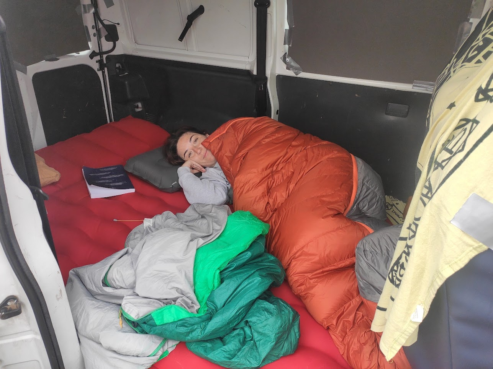
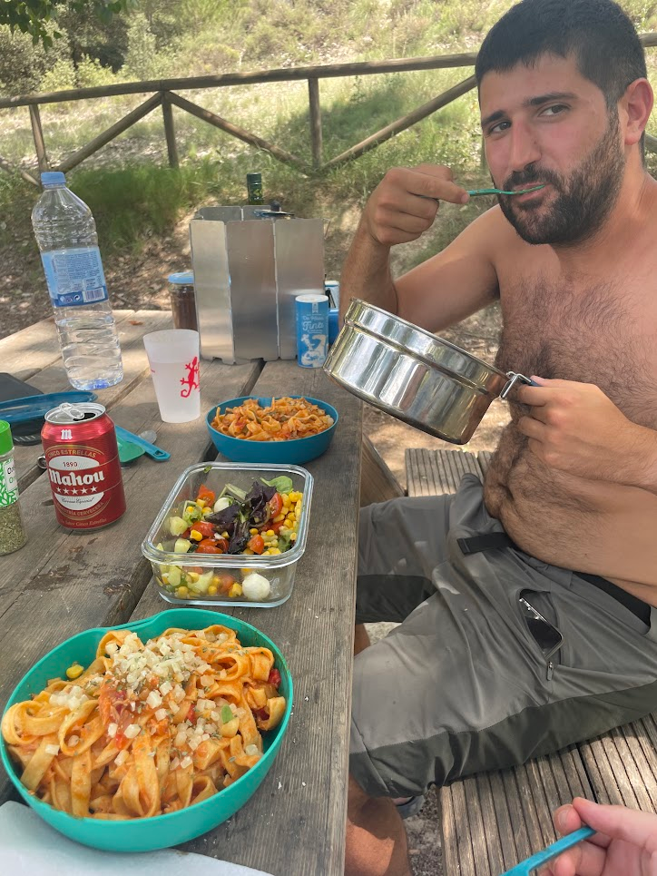

We've all been there. You open Instagram or YouTube and get bombarded with those perfect camper vans: wooden finishes, warm lighting, designer kitchens, and views of Norwegian fjords. And you think: "I wish I could, but that's not for me." Well, no, you don't need an Instagram van to enjoy the freedom of van life.

My camper story didn't start with a big budget or carpentry skills, but with an ordinary van (we call it "la furgo de los melones" which literally translates to "the melon van" because that's typically what gipsy uses to sell fruit in the rural Spain), which I luckily inherited from a family business, an air mattress, and lots of appetite for adventure. And over the years, it has become our perfect accomplice for getaways.

## 2021: The Chaos of the Beginning

My first solo trip was, honestly, a complete logistical disaster. The "camperization" consisted of an air mattress thrown in the back. There were no furniture, no organization, and to top it off, I forgot to remove the rear seats! The space was minimal and the chaos, maximum.

*That's how it all started: a mattress, the stock seats, and a lot of mess.*

It was Easter week in the Pyrenees and it was too cold to be outside. I decided to cook inside, on an improvised little table, without even having a proper stove. The menu: pasta that, spoiler alert, was a nightmare to clean up afterwards.


The culinary chaos of the early days. At least the dish was good...


But the next morning, all that chaos was forgotten. You wake up, open the door and find yourself with this... and then, all troubles fade away.

*The reward: wake-ups that are priceless.*

## 2022: Learning Together on the Road

### Our First Getaway

In 2022, I encouraged Julia to take a van trip together. Our first experience together was a getaway to Pitarque, Teruel. For her, who had never imagined enjoying the *hippie* van life, it was quite a trial by fire. We slept on an air mattress with sleeping bags. Thank goodness I brought my 0-degree sleeping bag, because Julia gets very cold and, although it was summer, the nights in Teruel get quite cool. We cooked with the basics we brought from home.


Julia happy having breakfast, and cooking some gulas for dinner


### Our First Long Trip Together

That summer we embarked on our first big trip together: a route through Navarra, Euskadi, Cantabria and Asturias. We still didn't have a bed frame, so we improvised a base with some Decathlon hammocks.


Julia sleeping in the van on the first night of the trip, in the Baztán valley.


Without electricity and with very little organization, we needed to plan a bit more, so we alternated van nights with some reserved hotel stays. And that's how we learned, seeing what works and what doesn't, what we were missing. But here we realized that even though we were quite rough around the edges, we could travel wherever we wanted.

Despite not being a 100% camper trip, it was the turning point. Julia discovered that going *hippie* was something she loved, and since then, every summer we look for time to escape with our melon van.

## 2023: Trip to Almería

For the trip to Almería in 2023, we decided no more hotels, that alternating with camping to charge batteries and take a shower would be enough.

So it was time to improve the equipment:

* **A proper bed frame:** Goodbye to sleeping on hammocks
* **A battery and a fridge:** Being able to have cold drinks and proper food without always having to resort to ice and everything being soaked is a good upgrade.

Of course, not everything is perfect on the first try. At home you do your calculations, but reality always teaches you something new. Traveling in summer means the fridge has to work harder, and I soon realized that the battery I had chosen wasn't enough to give us two days of autonomy without going through a campsite. But that's what it's all about, learning on the go.

But as always, in the end you can always manage. Here's a photo of a good meal:

That year we also inaugurated the "beach vermouth kit", an essential that has accompanied us ever since.


The vermouth kit is quite simple but we use it a lot. The photo is in Moncófar, but the essence is the same.


## 2024 - 2025: This is Comfort

Although we haven't taken a long trip in 2024, the getaways have been much more comfortable. The van has reached its best version to date.

Now we have:

* A comfortable bed frame and mattress.
* Two batteries that give us autonomy for a couple of days.
* A fan to combat the heat.
* Good interior lighting.
* More or less good organization...

And yet, it's far from what you see in YouTube videos and Instagram photos... But for us it's a total luxury and we're super comfortable in our melon van :D.

## The Conclusion is Simple

We've gone from an air mattress to having a mini house with just enough to live comfortably. Without homologations, without any construction work, and learning with each trip. So if you're dreaming of van life but are held back by not having the perfect van, forget about that. Start with what you have. A mattress, a couple of boxes, and try to see if you like it. What matters is not how your van looks, but the places it takes you and the experiences you live in it.
