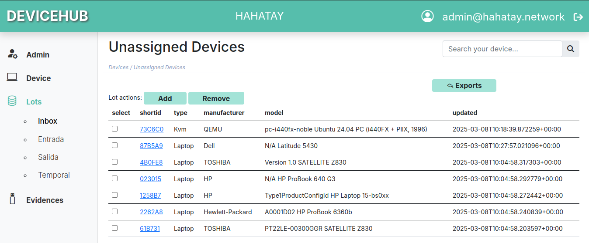

Hahatay está adoptando el [conjunto de software eReuse](https://ereuse.org/es/), específicamente Devicehub y Workbench, para mejorar su gestión de inventario. Esto marca un avance significativo en el seguimiento y la gestión eficiente de los numerosos portátiles reacondicionados recibidos a través de la iniciativa [Labdoo]((https://platform.labdoo.org/edoovillage?e=108374). Actualmente en su fase de pruebas beta (como se detalla [aquí](https://ereuse.org/es/2025/02/12/trabajando-en-el-nuevo-devicehub/)), el software eReuse ya está proporcionando información valiosa a la organización, mientras que también proporcionamos comentarios a los desarrolladores para futuras mejoras del software. Los beneficios clave experimentados por Hahatay incluyen:

* **Devicehub para Tareas de Inventario:** Gracias al [apoyo de la iniciativa Labdoo](https://platform.labdoo.org/edoovillage?e=108374), Hahatay ha recibido un número significativo de portátiles. Gestionar esta afluencia ha sido un desafío, pero Devicehub proporciona un sistema centralizado para rastrear con precisión el hardware de cada portátil en nuestro inventario.
* **Devicehub para la asignación y disponibilidad:** Devicehub también facilita el seguimiento de las asignaciones de portátiles a trabajadores y voluntarios, así como la disponibilidad de los dispositivos. Esto asegura una distribución eficiente y elimina la confusión con respecto a la asignación de dispositivos.
* **Workbench para Diagnósticos:** El componente Workbench permite la fácil lectura de las especificaciones técnicas de cada portátil y permite diagnósticos exhaustivos para confirmar la funcionalidad adecuada. Esto agiliza significativamente el proceso de preparación de los portátiles para su despliegue.

Incluso en su fase beta, el software eReuse está demostrando su potencial para mejorar sustancialmente los procesos de gestión de inventario de Hahatay. Esta mayor eficiencia permite al equipo centrarse más en la misión principal y garantiza la utilización efectiva de los portátiles recibidos.

Hahatay se enorgullece de ser parte de la comunidad eReuse y contribuir al desarrollo de esta poderosa herramienta de código abierto. El código fuente de Devicehub y Workbench está disponible en el [repositorio de GitHub de eReuse](https://github.com/eReuse).
