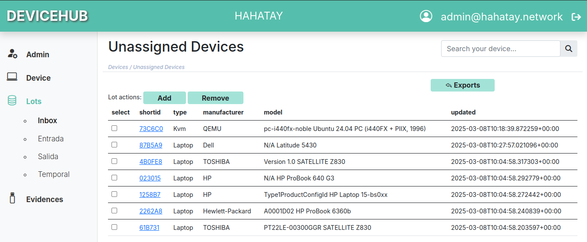

Hahatay adopte la [suite logicielle eReuse](https://ereuse.org/fr/), en particulier Devicehub et Workbench, pour améliorer sa gestion d'inventaire. Cela marque une avancée significative dans le suivi et la gestion efficace des nombreux ordinateurs portables reconditionnés reçus grâce à l'initiative Labdoo. Actuellement en phase de test bêta (comme détaillé [ici](https://ereuse.org/fr/2025/02/12/travail-nouveau-devicehub/)), le logiciel eReuse fournit déjà des informations précieuses à l'organisation, tandis que nous fournissons également des commentaires aux développeurs pour de futures améliorations du logiciel. Les avantages clés expérimentés par Hahatay incluent:

* **Devicehub pour les Tâches d'Inventaire:** Grâce au [soutien de l'initiative Labdoo](https://platform.labdoo.org/edoovillage?e=108374), Hahatay a reçu un nombre important d'ordinateurs portables. La gestion de cet afflux a été un défi, mais Devicehub fournit un système centralisé pour suivre avec précision le matériel de chaque ordinateur portable de notre inventaire.
* **Devicehub pour l'attribution et la disponibilité:** Devicehub facilite également le suivi des attributions d'ordinateurs portables aux travailleurs et aux bénévoles, ainsi que la disponibilité des appareils. Cela garantit une distribution efficace et élimine la confusion concernant l'attribution des appareils.
* **Workbench pour les Diagnostics:** Le composant Workbench permet la lecture facile des spécifications techniques de chaque ordinateur portable et permet des diagnostics approfondis pour confirmer la fonctionnalité appropriée. Cela rationalise considérablement le processus de préparation des ordinateurs portables pour le déploiement.

Même en phase bêta, le logiciel eReuse démontre son potentiel pour améliorer considérablement les processus de gestion d'inventaire de Hahatay. Cette efficacité accrue permet à l'équipe de se concentrer davantage sur notre mission principale et garantit l'utilisation efficace des ordinateurs portables reçus.

Hahatay est fier de faire partie de la communauté eReuse et de contribuer au développement de cet outil puissant et open-source. Le code source de Devicehub et Workbench est disponible sur le [dépôt GitHub de eReuse](https://github.com/eReuse).

Restez à l'écoute pour plus de mises à jour à mesure que Hahatay continue d'intégrer et d'utiliser le logiciel eReuse.