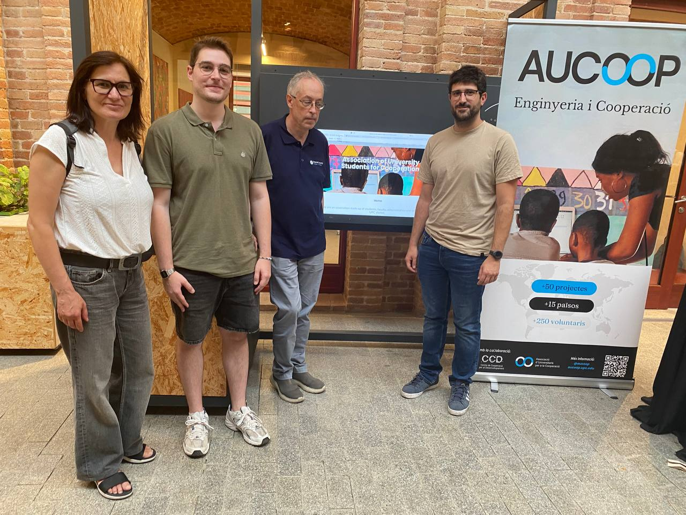


This article is based on and translated from content originally published by the Internet Society Catalan Chapter at [isoc.cat/accions/2025/06/11/giga2025/](https://www.isoc.cat/accions/2025/06/11/giga2025/)


The Hahatay Community Network project was highlighted at the "Science Fair | Government Tech Exchange Program (GTEP)" held on June 11, 2025, at the [Giga Barcelona Technology Center](https://giga.global/) (Ca l'Alier). This international event provided an excellent platform to share our experience connecting underserved communities in Senegal through sustainable, community-driven networking solutions.

The Government Technology Exchange Program (GTEP), a joint initiative between UNICEF and the International Telecommunication Union (ITU), invited our team to share insights from projects like the Hahatay Network, which has been instrumental in providing internet access to the rural region of Gandiol, Senegal.

The June 2025 GTEP cohort included approximately 30 participants from **Mozambique, Namibia, South Africa, and Tanzania**, representing Ministries of Education, Ministries of ICT/Digitalization, and national ICT regulatory bodies.

### Sharing Knowledge and Experiences

At the Science Fair, our presentation showcased how community networks can be effectively implemented in rural contexts through:

- Collaborative approaches involving local communities
- Implementation of network monitoring tools like Zabbix
- Centralized network management with OpenWISP
- Integration of educational resources through partnerships with initiatives like Labdoo
- Volunteers who participated in our Beyond-the-Net funded projects shared firsthand experiences from deployment trips to Senegal, highlighting both technical solutions and community engagement strategies that have made the Hahatay Network successful.

  
  Presenting the Community Network model to Tanzanian officials
  

### Impact Beyond Technology

The presentation emphasized that the Hahatay Network is more than just technical infrastructure—it's a catalyst for social development, enabling:

- Educational opportunities through connected classrooms
- Digital skills development for local youth
- Enhanced communication capabilities for the Hahatay association
- Support for local entrepreneurship initiatives

Support for local entrepreneurship initiatives
This international visibility furthers our commitment to documenting and sharing our methodologies, inspiring similar community network projects in other underserved regions worldwide.
