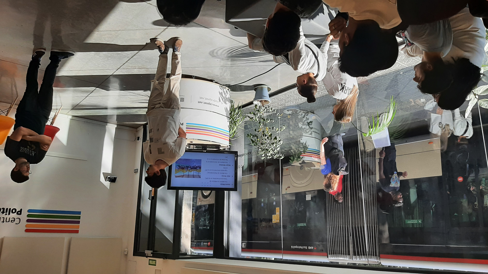
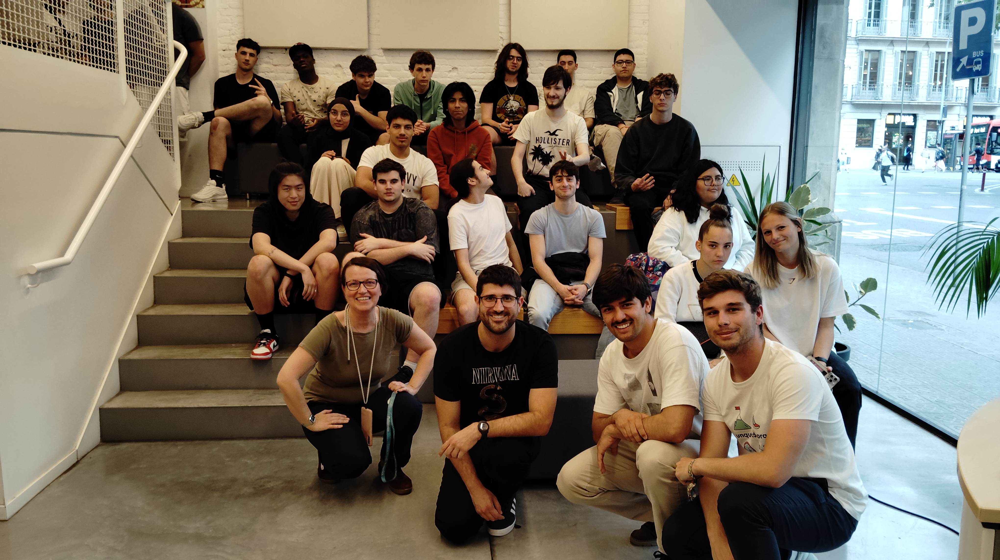

Recientemente tuvimos la oportunidad de visitar el [Instituto Politécnico de Barcelona](https://politecnics.barcelona/es/) para compartir con los alumnos de Formación Profesional nuestra experiencia con el proyecto de red comunitaria en Gandiol, Senegal. Fue una jornada muy enriquecedora donde pudimos mostrar de primera mano cómo su trabajo tiene un impacto real en comunidades a miles de kilómetros de distancia.

Durante nuestra presentación, explicamos detalladamente la estructura de nuestra red comunitaria: cómo funciona técnicamente, qué servicios ofrece a la población local y cuáles son los retos que enfrentamos en su implementación

## El papel fundamental de Labdoo

Un aspecto central de nuestra charla fue destacar el rol esencial que juega Labdoo en todo este proceso. Esta organización actúa como puente entre donantes de portátiles y receptores como Hahatay, coordinando una red de voluntarios que se dedican a sanear y preparar estos equipos para que puedan tener una segunda vida en proyectos educativos.

En el caso específico del Instituto Politécnico, descubrimos algo particularmente especial: son los propios alumnos quienes, como parte de su programa formativo, reacondicionan estos ordenadores que luego llegan a nuestro proyecto en Gandiol. Esta experiencia directa no solo les permite aplicar conocimientos técnicos, sino también participar en un proyecto con impacto social real.

## Un círculo virtuoso de aprendizaje

Lo que hace esta colaboración tan valiosa es el círculo de aprendizaje que se genera: los estudiantes del instituto mejoran sus habilidades técnicas mientras preparan dispositivos que, a su vez, servirán para que jóvenes y adultos en Gandiol puedan formarse a través de los programas educativos de Hahatay. Es una cadena de solidaridad donde el conocimiento fluye y se multiplica.

Desde nuestro equipo considerábamos fundamental que estos alumnos pudieran ver el destino final de su trabajo. Queríamos que supieran que esos portátiles que pasan por sus manos no se pierden en el anonimato, sino que tienen nombres, rostros y historias detrás. Cada dispositivo recuperado significa una oportunidad de formación para alguien en Gandiol.

Esta visita ha sido también una excelente manera de cerrar esta etapa del proyecto, agradeciendo personalmente a quienes hacen posible que nuestra red comunitaria siga creciendo. El intercambio de experiencias, preguntas y reflexiones nos permitió valorar aún más esta cadena de colaboración que une Barcelona con Gandiol. Este tipo de encuentros refuerza nuestra convicción de que la tecnología, cuando se comparte y se utiliza con propósito, puede ser una poderosa herramienta de transformación social.

