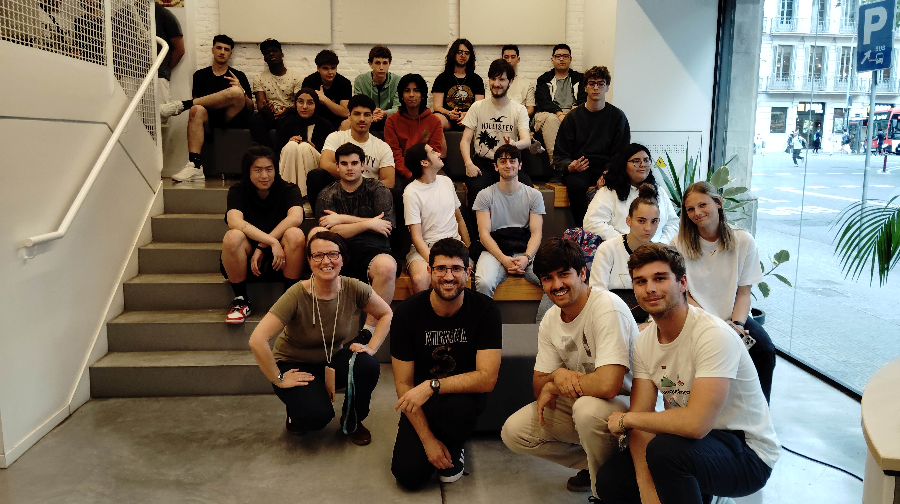

Recently, we had the opportunity to visit the [Barcelona Polytechnic Institute](https://politecnics.barcelona/es/) to share with vocational training students our experience with the community network project in Gandiol, Senegal. It was a highly enriching day where we could demonstrate firsthand how their work has a real impact on communities thousands of kilometers away.

During our presentation, we explained in detail the structure of our community network: how it works technically, what services it offers to the local population, and what challenges we face in its implementation.

## The Fundamental Role of Labdoo

A central aspect of our talk was highlighting the essential role that Labdoo plays in this entire process. This organization acts as a bridge between laptop donors and recipients like Hahatay, coordinating a network of volunteers who are dedicated to refurbishing and preparing these devices so they can have a second life in educational projects.

In the specific case of the Polytechnic Institute, we discovered something particularly special: it's the students themselves who, as part of their training program, recondition these computers that later reach our project in Gandiol. This direct experience not only allows them to apply technical knowledge but also to participate in a project with real social impact.

## A Virtuous Circle of Learning

What makes this collaboration so valuable is the learning circle it generates: the institute's students improve their technical skills while preparing devices that, in turn, will help young people and adults in Gandiol to train through Hahatay's educational programs. It's a chain of solidarity where knowledge flows and multiplies.

From our team's perspective, we considered it essential that these students could see the final destination of their work. We wanted them to know that those laptops that pass through their hands aren't lost in anonymity, but have names, faces, and stories behind them. Each recovered device means a training opportunity for someone in Gandiol.

This visit has also been an excellent way to close this stage of the project, personally thanking those who make it possible for our community network to continue growing. The exchange of experiences, questions, and reflections allowed us to further appreciate this chain of collaboration that connects Barcelona with Gandiol. This type of encounter reinforces our conviction that technology, when shared and used with purpose, can be a powerful tool for social transformation.

