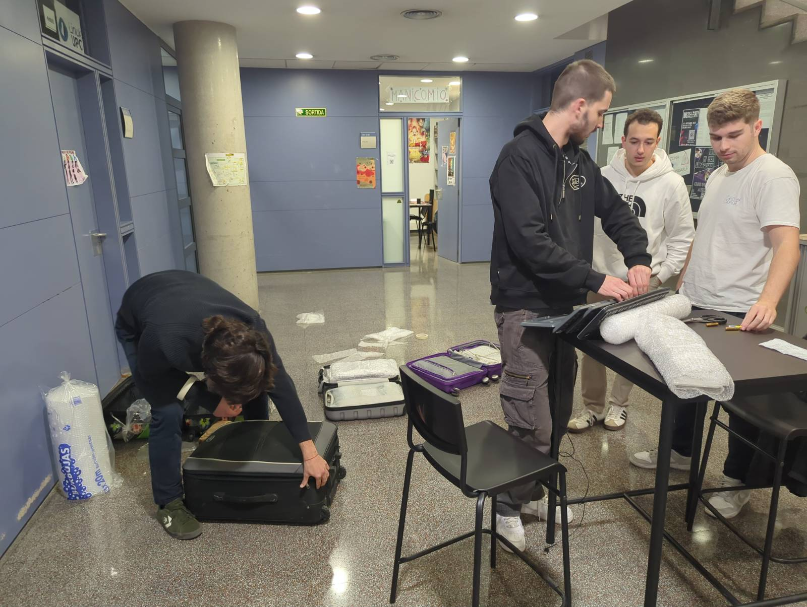

El viernes 17 quedamos por la tarde en la universidad para hacer las maletas. Estuvimos pensando como colocábamos los ordenadores que nos ha donado labdoo en las maletas, cual era la mejor distribución, etc. Estuvimos un par de horas largas preparando las maletas: embalando el material electrónico, cerrando todas las cosas que nos podían quedar en el tintero...

Una vez cerramos maletas, Roger se las llevó al coche para traerlas al día siguiente directamente al aeropuerto.
