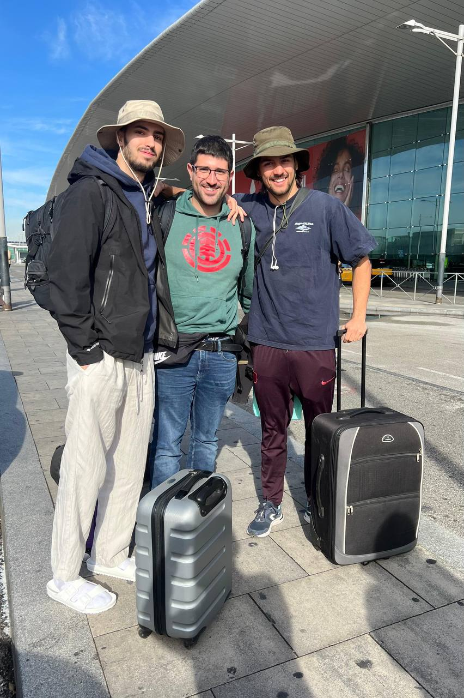
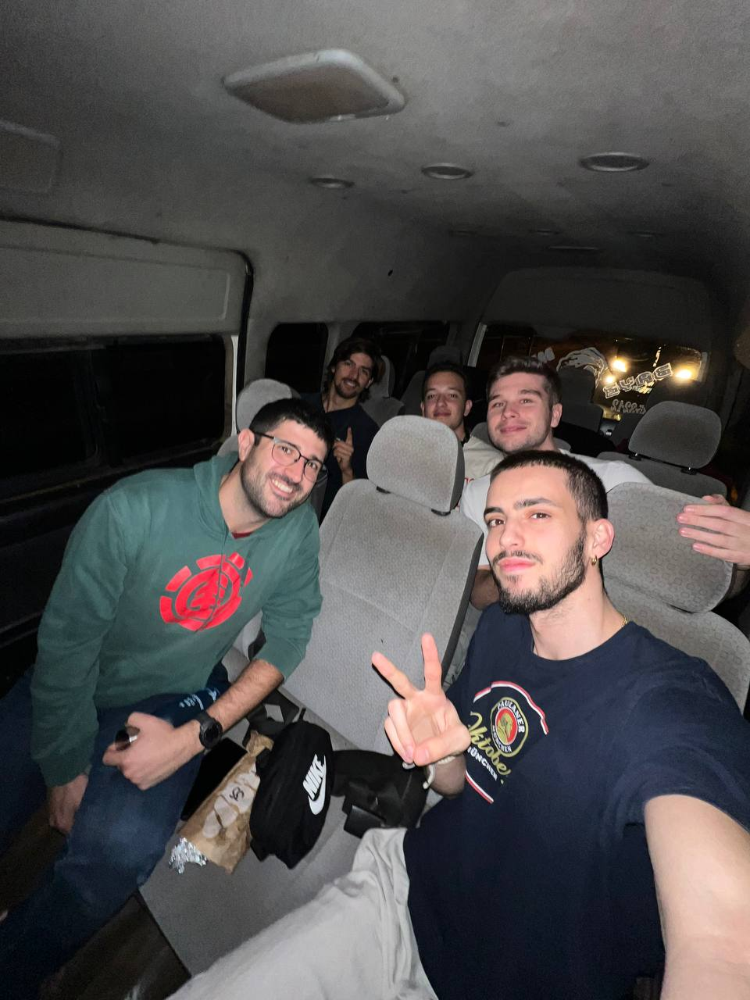

The day of travel is always a day full of nerves. But good nerves. In the end, we've spent a lot of time working on this, so it's very normal to feel a bit anxious.

The day started off a bit complicated right from the check-in counter. Jaume and I (Sergio) went to check in the suitcase. It weighed 26 kg, while the maximum allowed was 25. The woman marked it as "Heavy" but didn’t say anything else. She didn’t charge us extra, so we assumed that even though it was "Heavy," it was within the tolerance. Then, the woman at the counter asked us:

—What’s your carry-on luggage?

Jaume and I looked at each other and almost in unison replied:

—This one. —We pointed to Jaume's backpack.

The woman, in a not-so-friendly tone, said:

—Well, it has to fit there. —She pointed to a metal frame where the backpack had to fit.

Jaume, almost instinctively, like a ninja, reached into his backpack, pulled out the metal frame that was part of its structure, and passed it to me under the counter. I held the metal frame, hiding it from the woman’s view. Jaume managed to fit the backpack into the metal frame. He had to force it, but he did it. The woman nodded, looked at me, and asked:

—You’re not carrying anything else?

I shook my head.

—Alright, you need to be at the boarding gate at 2:30 PM.

Jaume and I nodded and left. Great, first boss of the day defeated.

Next, we headed to the security check. There, from two carry-on bags, we took out 12 laptops, each in its own tray. The laptops were wrapped in bubble wrap to minimize damage from any impacts during the trip. The guard at the checkpoint, perplexed by the 10 trays filled with bubble-wrapped laptops — which looked more like drug packages than laptops — called his supervisor to take a look. He asked me:

—What’s all this?

—They’re laptops for a donation.

—Do you have any documentation?

I nodded and asked Roger for the donation letter that Lorenzo (Hahatay) had written in case something like this happened. The guard read the letter, it all checked out, and he let us pass. Second boss defeated.

At the boarding gate, we managed to get all the luggage through as well. We only had a “backpack under the seat” allowance, and all the backpacks we carried exceeded the size limit (yes, the budget didn’t allow for much more). Third boss defeated.

I’m writing these lines from 10 km above the ground, flying over some part of the Sahara. Now, when we arrive at the airport, we’ll face the final boss: customs. I’ll update later with the result.

---

When we arrived at the airport, we passed through immigration without any issues, exchanged some euros for CFA francs, and then proceeded to customs. Roger went first without any problems. Then Jaume was asked to open the large suitcase. While his suitcase was being inspected, Joan and Aitor left with the other small suitcase. I stayed with Jaume and the police. The officer checked for a while; we gave him the donation letter. According to him, the letter didn’t have the customs stamp, and he recommended we keep that in mind for the next time. He let us through without any further issues. Final boss defeated.

A little while later, Bachir, the taxi driver, picked us up and drove us to Gandiol. There, Pablo and Rober were waiting for us. We gave each other a big hug after almost a year without seeing each other. We settled into our rooms and went to sleep, as we were exhausted.

