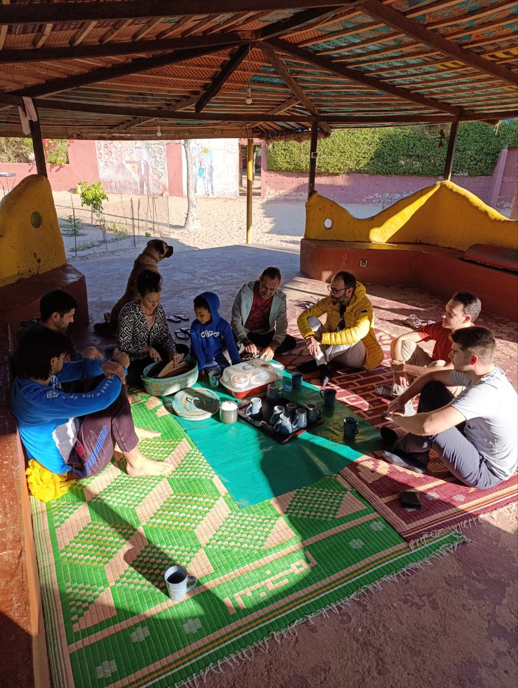
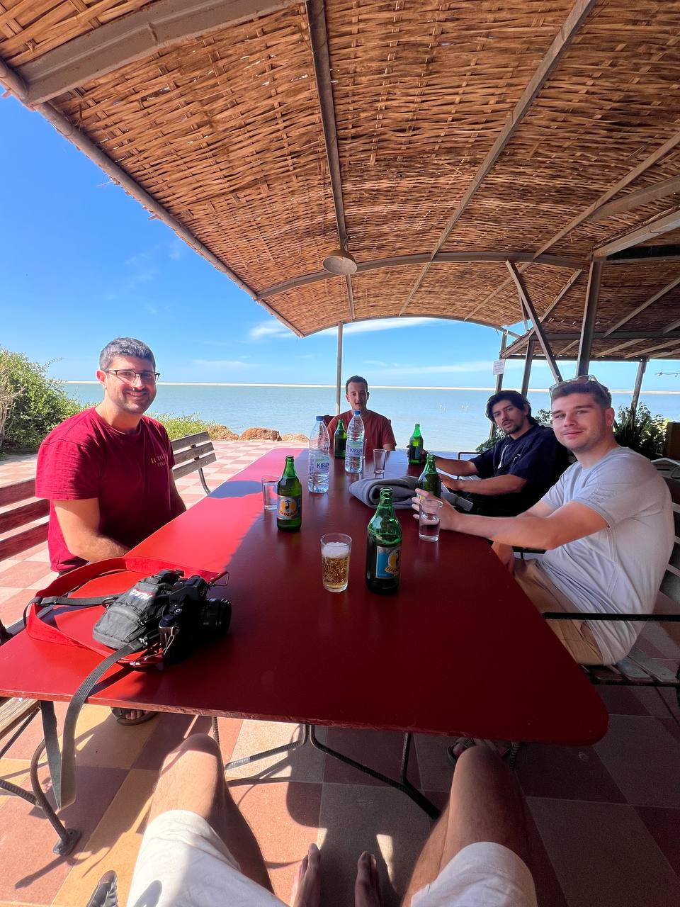

Hoy ha sido un día lleno de reencuentros y primeras impresiones en Hahatay. Después de llegar, comenzamos el día con el desayuno, que sin duda es el mejor momento del día aquí. Compartimos una agradable mañana con Laura, los niños y toda la gente maravillosa que forma parte de Hahatay.

Tras cargar energías, hicimos una vuelta de reconocimiento por la zona para ponernos al día con lo que ha cambiado y lo que queda por hacer. Durante este recorrido, nos encontramos con el primer desafío técnico: el router de Aminata no funciona, algo que nos ocuparemos de solucionar lo antes posible.

La comida fue en el Zebra Bar, donde nos reunimos con Lorenzo y demás buenos conocidos. Fue un momento para compartir historias y risas, y disfrutamos de una larga sobremesa todos juntos.

Por la tarde, decidimos dar un paseo por la playa de vuelta a casa,  mientras se ponía el sol. AL terminar nos sentamos a  planificar el trabajo de las próximas semanas. Cada uno compartió sus ideas y juntos priorizamos lo que queremos lograr

Para esta primera semana, nos hemos propuesto los siguientes objetivos:

1. Solucionar los problemas con la conexión de internet en Aminata.
2. Instalar el software de gestión de los routers, OpenWisp.
   1. De esta forma, podremos gestionar de forma centralizada todos los puntos de acceso de la red y poder hacer cambios de contraseñas en todos los puntos de acceso de forma simultánea.
3. Monitorizar todos los elementos de la red en Gandiol utilizando Zabbix.
   1. De esta forma, podremos detectar problemas de forma proactiva y solucionarlos antes de que afecten a los usuarios.

Si logramos cumplir con estos objetivos, habremos dado un gran paso hacia el éxito de esta primera semana. Nos espera mucho trabajo por delante, pero la motivación es alta y estamos preparados para enfrentar los desafíos.

Cerramos el día con la satisfacción de haber dado el primer paso y con la esperanza de que estos esfuerzos tengan un impacto positivo en la comunidad. 

