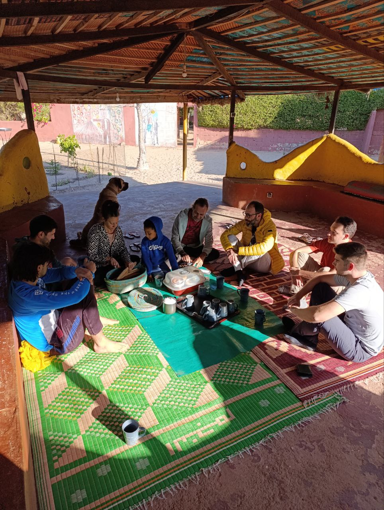
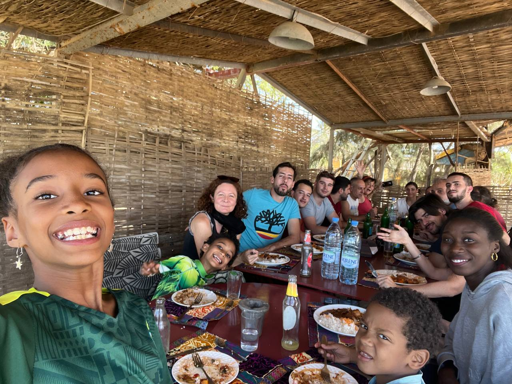

Today has been a day full of reunions and first impressions at Hahatay. After arriving, we started the day with breakfast, which is undoubtedly the best time of the day here. We shared a pleasant morning with Laura, the children, and all the wonderful people who are part of Hahatay.

After recharging our energy, we took a tour around the area to get up to date on what has changed and what remains to be done. During this tour, we encountered our first technical challenge: Aminata's router isn’t working, something we will address as soon as possible.

Lunch was at Zebra Bar, where we met with Lorenzo and other good friends. It was a time to share stories and laughter, and we enjoyed a long chat together after the meal.

In the afternoon, we decided to take a walk along the beach on our way back home, just as the sun was setting. Afterward, we sat down to plan the work for the coming weeks. Each of us shared our ideas, and together we prioritized what we want to accomplish.

For this first week, we’ve set the following goals:

1. Resolve the internet connection issues at Aminata.
2. Install OpenWisp management software on the routers.
   1. This will allow us to centrally manage all access points and simultaneously make changes to passwords across all of them.
3. Monitor all network elements in Gandiol using Zabbix.
   1. This will enable us to proactively detect and resolve issues before they affect users.

If we achieve these objectives, we will have made significant progress toward the success of this first week. There’s a lot of work ahead, but the motivation is high, and we’re ready to face the challenges.

We closed the day with the satisfaction of having taken the first step and with the hope that these efforts will have a positive impact on the community.
