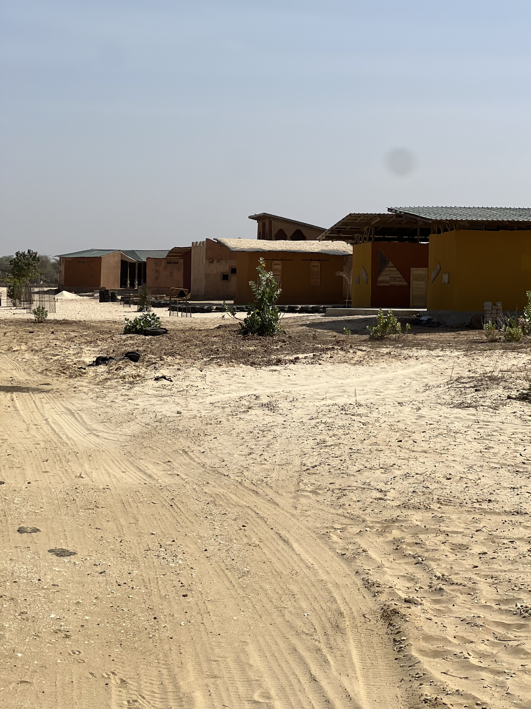
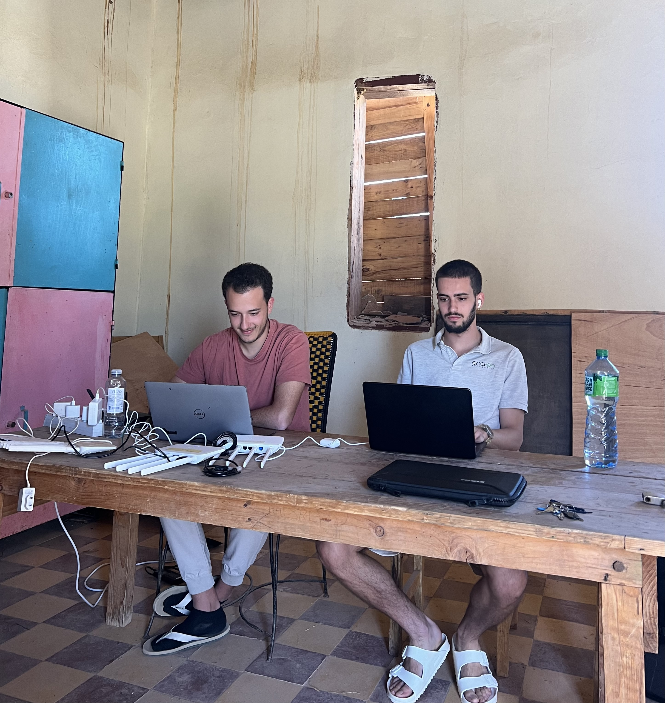

El día comenzó con la misma rutina de siempre: un buen desayuno para cargar energías antes de ponernos en marcha. Pero hoy había una pequeña sorpresa en la mesa: Laura había preparado hummus casero, un pequeño cambio que hizo la diferencia y nos dejó a todos con el ánimo arriba.

## Trabajo en Fess

Aitor y Roger se pusieron en marcha temprano para trabajar en Fess. El paseo de 20 minutos hasta allí fue agradable, con una temperatura perfecta y una brisa ligera que hacía el camino mucho más llevadero. 

Una vez en Fess, siguieron afinando los templates de OpenWISP para asegurarse de que las configuraciones de los routers no dejaran ningún cabo suelto. También se encargaron de reconfigurar algunas IPs estáticas que se habían perdido el día anterior. Aunque los resultados no fueron demasiado alentadores, al menos lograron obtener conclusiones que les ayudarán a seguir mejorando la implementación de OpenWISP en los próximos días. La vuelta, sin embargo, fue otro cantar: el viento cálido proveniente del Sahara convirtió el camino en una auténtica odisea. Sin la brisa de la mañana, el calor se hacía casi insoportable.

## Recuperación de Defaratt

Por su parte, Jaume y Joan tenían previsto recuperar **Defaratt**, un centro de Hahatay dedicado al reciclaje de plástico. En teoría, el sitio ya contaba con una antena y un router master, así que lo primero fue revisar el antiguo *Zabbix* para ver si seguían en funcionamiento. Para nuestra suerte, todo estaba operativo, así que nos ahorramos el desplazamiento y nos quedamos en *Sunukeur* trabajando en las configuraciones. 

Sin embargo, el router en cuestión era un **Linksys**, el mismo modelo que ya nos había dado problemas en otras ocasiones, y no conseguimos descargar los paquetes necesarios. Tras varias pruebas infructuosas, decidimos centrarnos en una nueva implementación en *Zabbix* para detectar dispositivos que se reinician repetidamente en un mismo día, lo que suele indicar un problema en el cableado o en el contacto eléctrico. Para nuestra sorpresa, encontramos más problemas de los que habíamos imaginado, así que este tema seguirá en proceso los próximos días.

## Descanso y planificación

Para el almuerzo, nos esperaba un plato típico: **theibuiene rouge**. 

Después de comer, el calor era demasiado intenso para seguir trabajando, así que cada uno se retiró a su habitación a descansar un rato. Algunos aprovecharon para dormir una siesta, y ya hacia las 16:00 retomamos el trabajo, usando cualquier cosa a nuestro alcance para abanicarnos.

A las 17:00, cuando Sergio terminó su jornada laboral, nos reunimos todos para organizar las tareas, marcar las que ya habíamos completado, actualizar los problemas que habían surgido y planear el trabajo del día siguiente. Seguimos trabajando hasta las 18:00 y, tras una jornada larga y calurosa, decidimos que era momento de darnos un respiro en el *Teranga*. Llegamos aún acalorados, pero allí pudimos refrescarnos con unas bebidas frías y relajarnos un rato.

## Cierre del día

La cena fue el cierre perfecto del día. Además, conocimos a **Amina**, una artista que ha venido a pasar unos días en *Sunukeur* con el objetivo de compartir, inspirarse y aprender de otros artistas, una de las tantas iniciativas interesantes que ofrece *Hahatay*.

La conversación fluyó entre risas y bromas, hasta que alguien mencionó la película *Torrente*. La broma se convirtió en reto, y nos pusimos a buscarla para verla. No fue fácil, pero al final logramos encontrar un fragmento y nos despedimos del día entre carcajadas.

Un día más de aprendizajes, trabajo y momentos compartidos. Mañana nos espera otra jornada intensa, pero por ahora, toca descansar.
