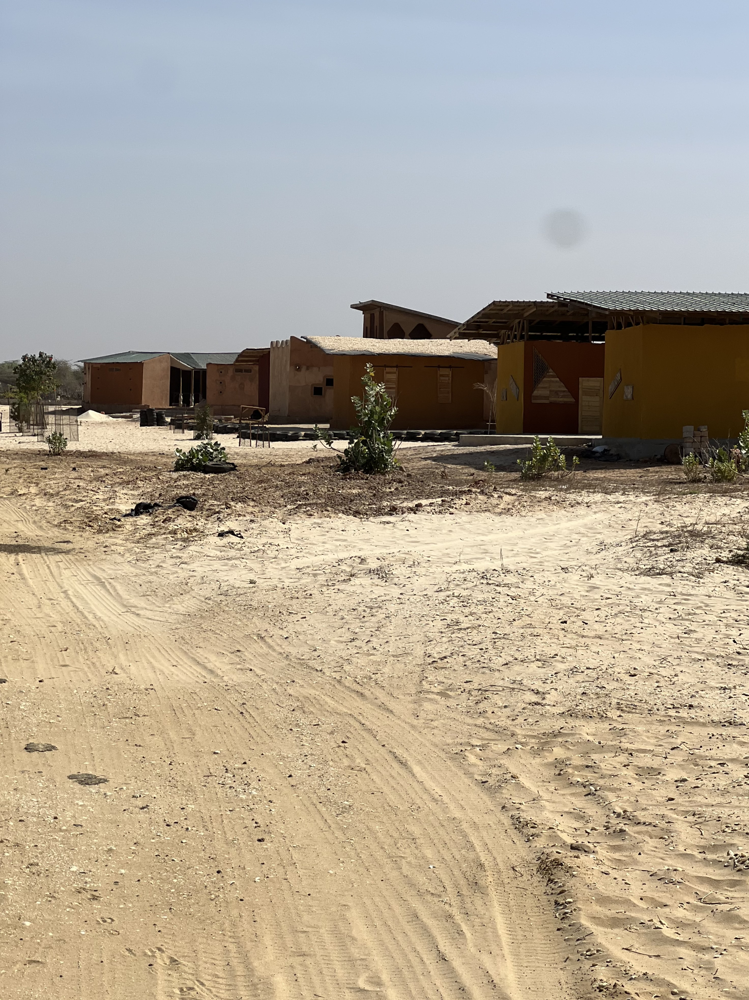
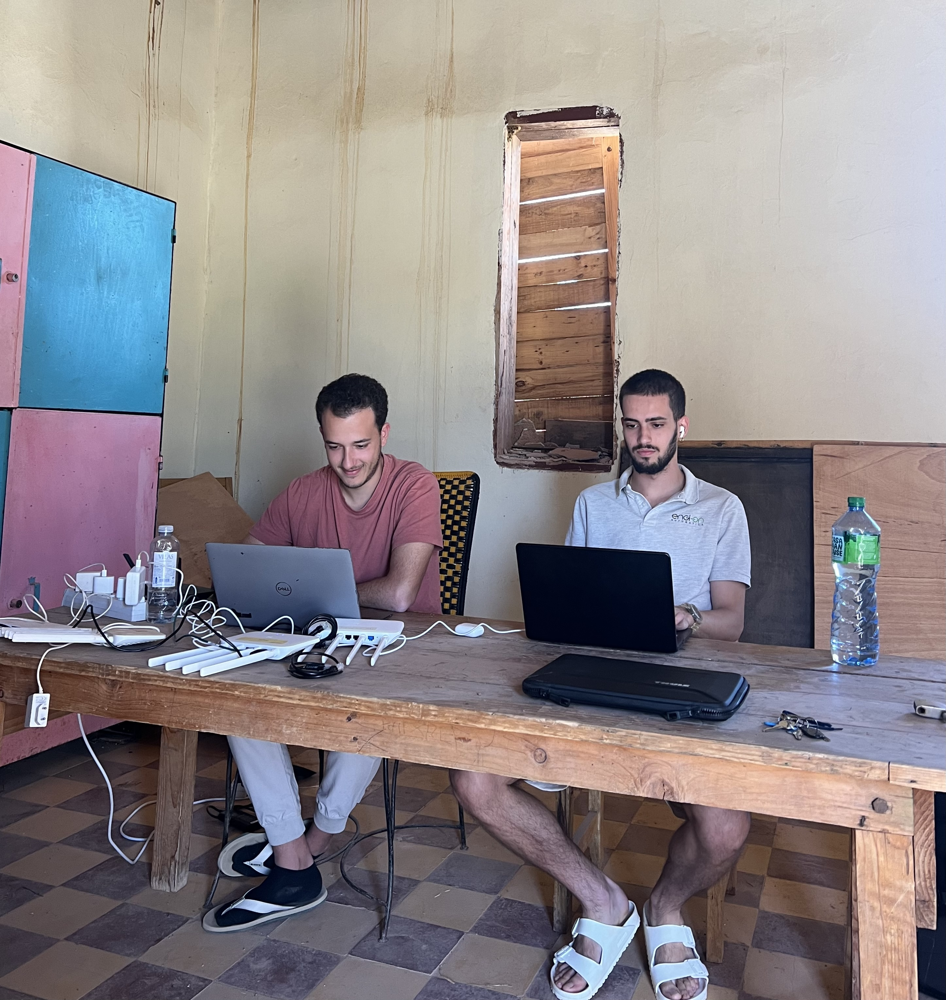
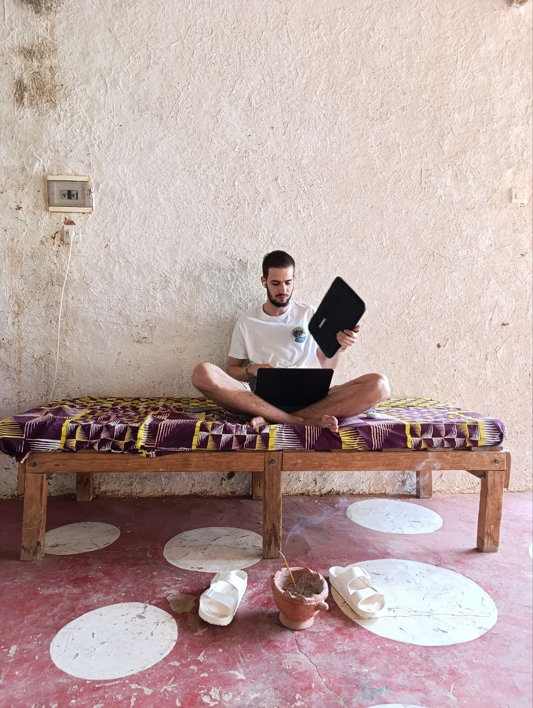
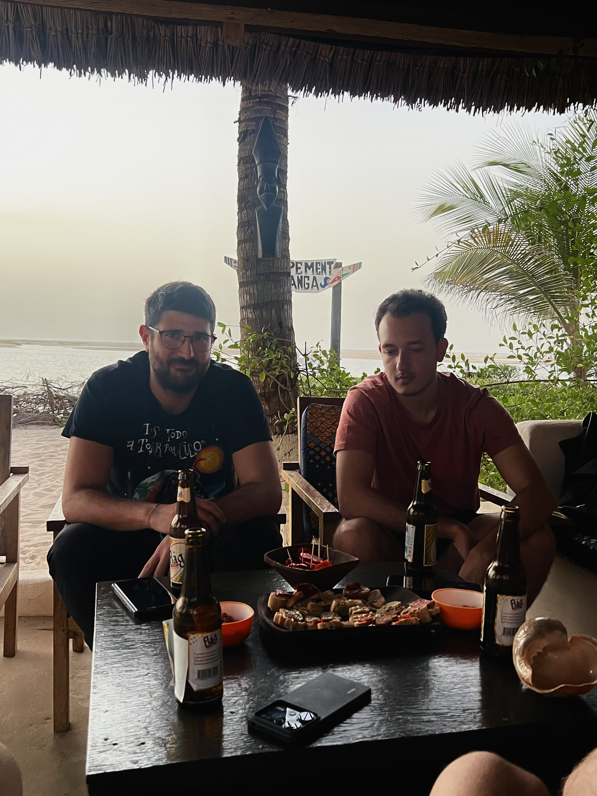
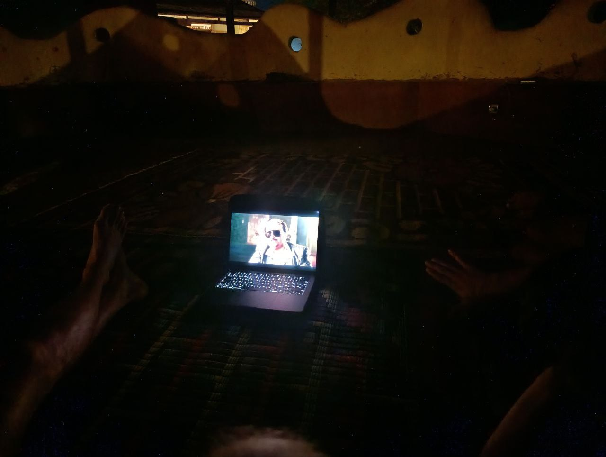

The day began with the usual routine: a good breakfast to recharge before getting to work. But today, there was a little surprise on the table: Laura had prepared homemade hummus, a small change that made a difference and lifted everyone's spirits.

## Work in Fess

Aitor and Roger set off early to work in Fess. The 20-minute walk there was pleasant, with perfect weather and a light breeze that made the journey much easier.

Once in Fess, they continued refining the OpenWISP templates to ensure the router configurations left no loose ends. They also worked on reconfiguring some static IPs that had been lost the previous day. Although the results weren’t too promising, at least they reached conclusions that will help improve OpenWISP implementation in the coming days. 

The way back, however, was a different story: the warm wind from the Sahara turned the walk into a real ordeal. Without the morning breeze, the heat became almost unbearable.

## Recovery of Defaratt

Meanwhile, Jaume and Joan planned to recover **Defaratt**, a Hahatay center dedicated to plastic recycling. In theory, the site already had an antenna and a master router, so the first step was to check the old *Zabbix* system to see if they were still operational. Fortunately, everything was up and running, so we avoided the trip and stayed in *Sunukeur* to work on the configurations.

However, the router in question was a **Linksys**, the same model that had given us trouble before, and we couldn’t download the necessary packages. After several unsuccessful attempts, we decided to focus on a new implementation in *Zabbix* to detect devices that restart multiple times in a single day, which usually indicates an issue with the wiring or the power connection. To our surprise, we found more problems than expected, so this task will continue in the coming days.

## Rest and Planning

For lunch, we had a typical dish: **theibuiene rouge**.

After eating, the heat was too intense to keep working, so everyone retreated to their rooms for a break. Some took a nap, and around 4:00 PM, we resumed work, using anything we could find to fan ourselves.

At 5:00 PM, when Sergio finished his workday, we all gathered to organize tasks, mark the ones we had completed, update the issues that had arisen, and plan the next day's work. We kept working until 6:00 PM and, after a long and hot day, decided it was time for a break at *Teranga*. We arrived still overheated, but there we could cool down with some cold drinks and relax for a while.

## End of the Day

Dinner was the perfect way to close the day. Plus, we met **Amina**, an artist who came to spend a few days in *Sunukeur* to share, get inspired, and learn from other artists—one of the many interesting initiatives offered by *Hahatay*.

The conversation flowed with laughter and jokes until someone mentioned the movie *Torrente*. The joke turned into a challenge, and we started searching for it to watch. It wasn’t easy, but in the end, we managed to find a clip and ended the day laughing.

Another day of learning, work, and shared moments. Tomorrow, another intense day awaits, but for now, it's time to rest.
