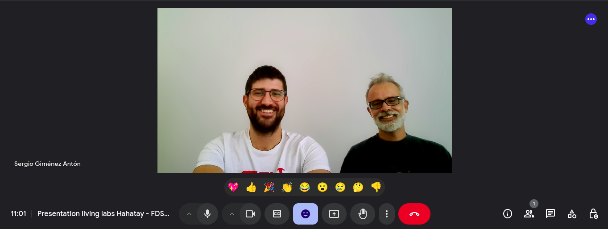
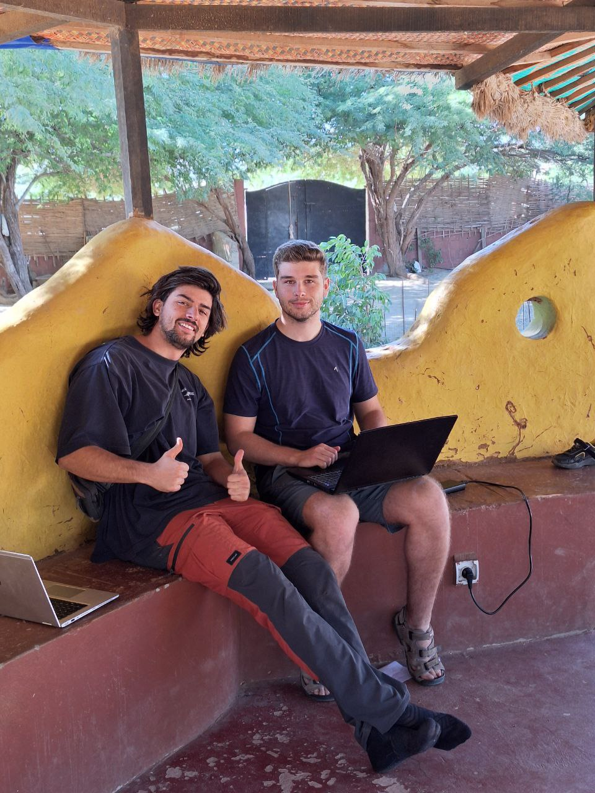
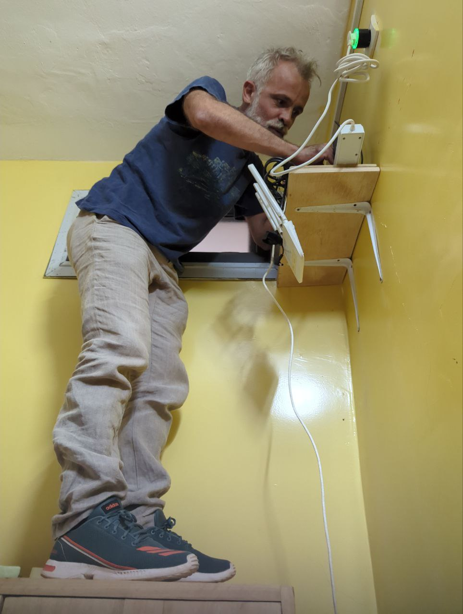
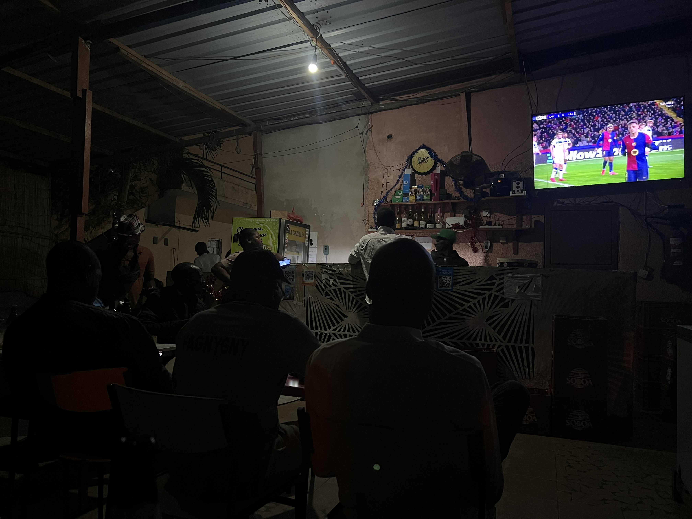
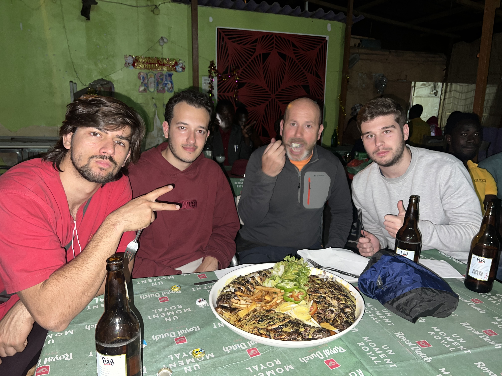
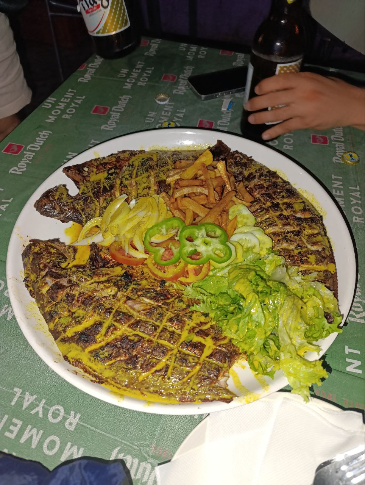
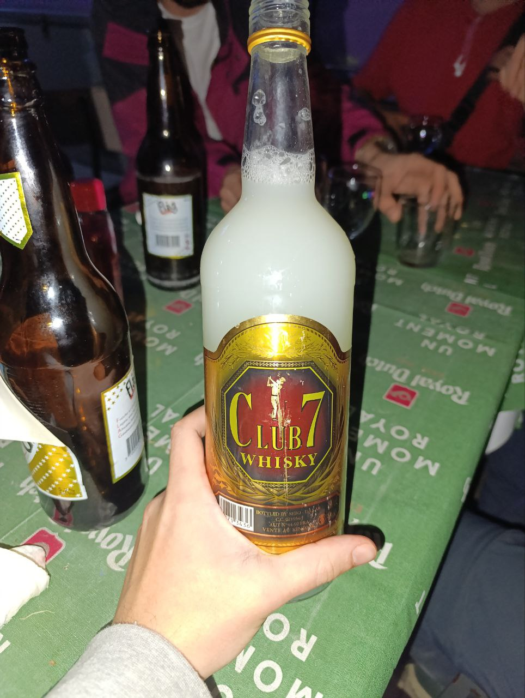

Hoy, miércoles, comenzó con un desayuno compartido bajo el calor típico de Senegal, pero el equipo mantuvo el buen ánimo y la motivación para seguir con los avances técnicos del proyecto.

## Planes Futuros con FDSUT

Sergio se juntó por la mañana con Lorenzo para tener una reunión con el [FDSUT](https://fdsut.sn/), explicarles el proyecto que llevamos juntos haciendo y abrir posibles vías para una colaboración futura. La reunión fue muy positiva y se abrieron muchas posibilidades para futuros proyectos en la región.

## Avances en la red y optimización del firewall  

Joan y Jaume hicieron una pequeña pausa en su trabajo con Zabbix para centrarse en mejorar la configuración de la red. Se dedicaron a centralizar las reglas del firewall de los routers con salida a internet para que, en algunos centros de Hahatay, no haya conexión durante las horas no laborables, y en la residencia, de 23:00 a 8:00. Esta implementación ya se había hecho en el master de cada mesh, pero presentaba un inconveniente: al bloquearse la salida a internet, no podíamos acceder a los routers de otras zonas cuando necesitábamos hacer configuraciones. Ahora, con esta nueva solución, podemos acceder a los routers sin problema ya que solo bloqueamos la salida a internet.  
  

## El desafío de los routers Xiaomi  

Mientras tanto, Roger y Aitor decidieron quedarse en Sunukeur, ya que el regreso de ayer les dejó agotados. Se encontraron con algunos problemas al intentar configurar los routers Xiaomi, que no recibían bien las órdenes de OpenWISP. Resulta que Xiaomi sacó dos versiones de estos routers con diferencias mínimas en su hardware, lo que genera incompatibilidades con el firmware necesario para instalar OpenWISP. El proceso de instalación y actualización continuó siendo un desafío, pero fue una buena oportunidad para preparar routers de repuesto o para reemplazar aquellos que aún no habían sido revisados.  
  

## Nuevas ideas y desafíos con Zabbix  

Después de comer, Joan y Jaume volvieron al trabajo con Zabbix. Aunque hoy no lograron grandes avances, discutieron algunas ideas y comenzaron a implementar nuevas estrategias para optimizar la monitorización de la red en los próximos días.  

## Resolviendo el problema de las radios apagadas  

Por la tarde, Roger y Aitor se dedicaron a un problema que había surgido en varios routers nuevos: las radios estaban apagadas. Esto impedía que los routers pudieran radiar wifi y comunicarse con la red mesh. Después de varios intentos, encontraron unas líneas de código en la documentación de OpenWISP que aparentemente podían solucionar el problema, pero al implementarlas, desactivaban otras interfaces necesarias. Tras mucho ensayo y error, lograron resolver el problema y ahora las plantillas para configurar routers slave y master están listas.  

## Nuevo Servidor en JangKom

Sergio y Lorenzo, después de su jornada de trabajo en Ndar weesul, se fueron a Jangkom para poder instalar un nuevo servidor que permitirá monitorizar y gestionar las redes de JangKom y Wesul utilizando Zabbix y OpenWisp. La instalación fue un tanto ortodoxa, pero finalmente quedó todo estable.

## Tarde de fútbol y una cena memorable  

Eran las 18:30 de la tarde y Aitor, Jaume, Joan y Roger cogieron un taxi a Saint Louis para ver los muchos partidos de champion que se jugaban esa tarde. Fueron a un antro muy particular llamado *Le Montagne*. Allí tenían una pantalla grande donde iban poniendo los diferentes partidos, como 20 minutos cada uno, ya que se jugaban a la vez. 
  

También vino más tarde Javier, uno de los amigos de Lorenzo y Pablo que residen estos días en Hahatay. Resultó que Javi trabaja en diferentes proyectos de cooperación y ha viajado por medio África y muchos otros países. Nos pasamos gran parte de la noche escuchando sus experiencias, cosas que había visto, que había vivido, que le habían llevado a pensar y a creer de un forma particular, y que nos contaba con humildad y una sonrisa en la cara.
  

La noche culminó con una cena espectacular: tres *poissons* a la brasa que, sin duda, fueron lo mejor del día. Ya para terminar, vimos a muchos locales con un brebaje blanco que compraban a granel en el restaurante y Jaume no pudo contenerse en comprar una botella. La verdad que ni olía ni sabía muy bien, pero todos lo probamos y a nadie le sentó mal al día siguiente.
  
  
