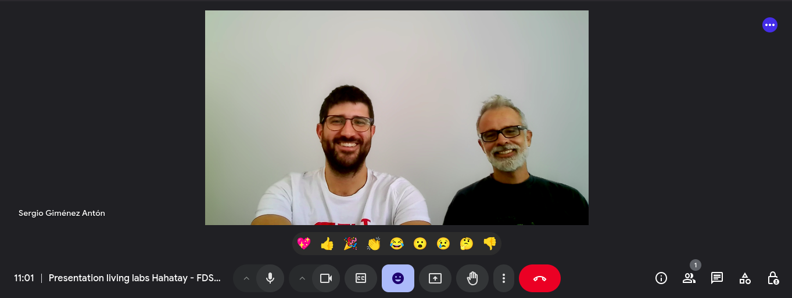
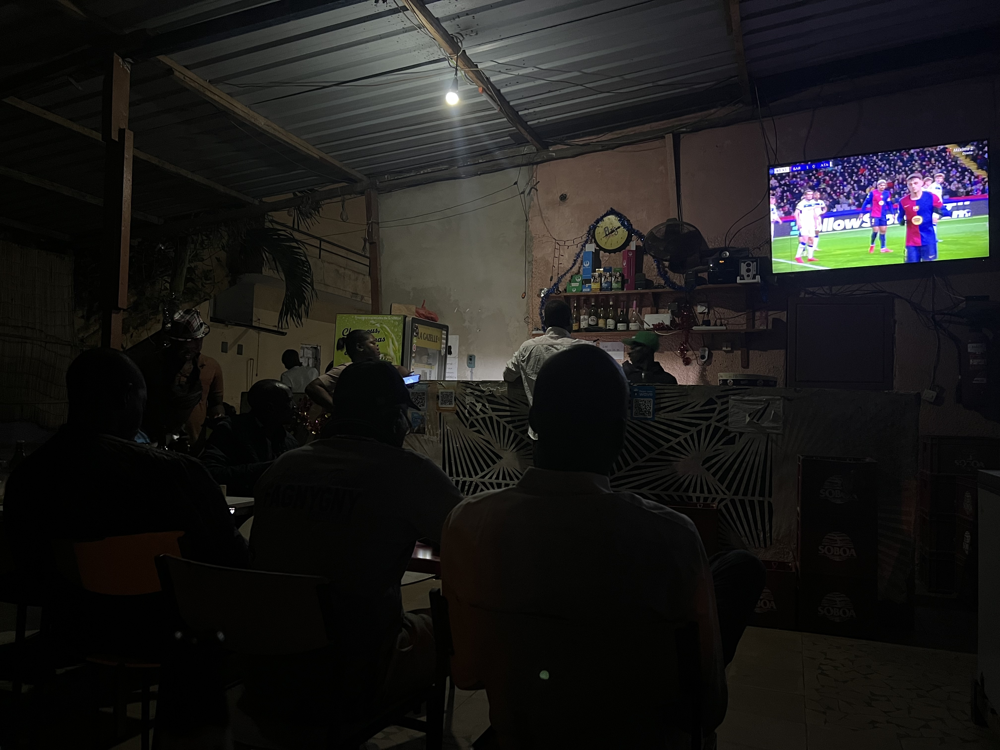
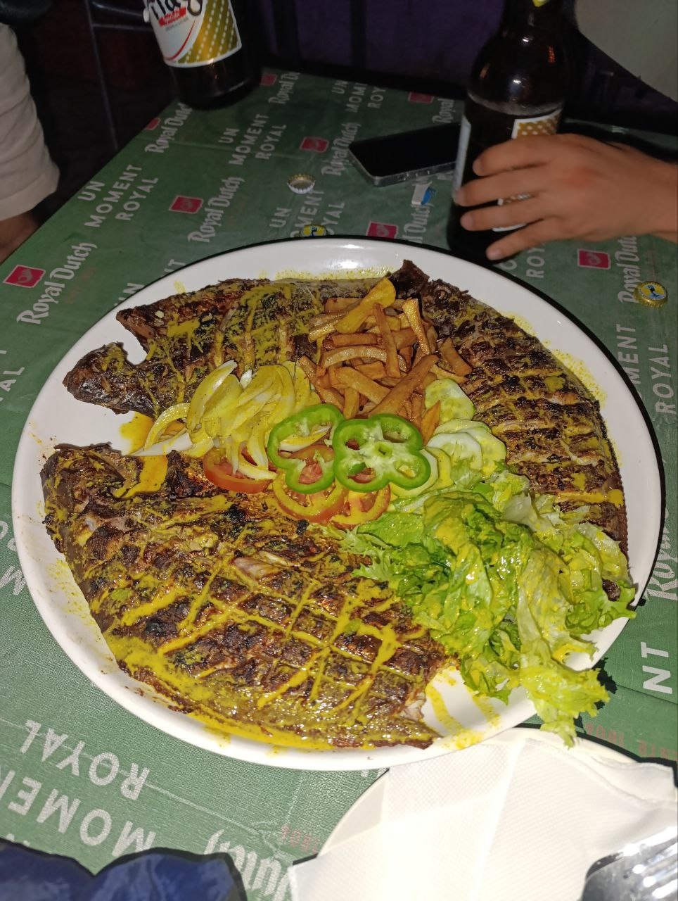

Today, Wednesday, started with a shared breakfast under the typical heat of Senegal, but the team kept their spirits high and motivation strong to continue with the technical progress of the project.

## Future Plans with FDSUT

In the morning, Sergio met with Lorenzo to have a meeting with the [FDSUT](https://fdsut.sn/), explain the project we have been working on together, and explore possible avenues for future collaboration. The meeting was very positive, and many possibilities for future projects in the region were opened.

## Network Advances and Firewall Optimization

Joan and Jaume took a short break from their work with Zabbix to focus on improving the network configuration. They worked on centralizing the firewall rules of the routers with internet access so that, in some Hahatay centers, there would be no internet during non-working hours, and in the residence, from 11:00 PM to 8:00 AM. This implementation had already been done on the master of each mesh, but it had one issue: by blocking the internet access, we couldn’t access routers from other areas when we needed to make configurations. Now, with this new solution, we can access the routers without any problem as we only block internet access.

## The Challenge of Xiaomi Routers

Meanwhile, Roger and Aitor decided to stay in Sunukeur, as yesterday's return left them exhausted. They encountered some problems when trying to configure the Xiaomi routers, which were not receiving OpenWISP commands well. It turns out that Xiaomi released two versions of these routers with minimal hardware differences, causing incompatibilities with the firmware needed to install OpenWISP. The installation and update process continued to be a challenge, but it was a good opportunity to prepare spare routers or replace those that had not yet been reviewed.

## New Ideas and Challenges with Zabbix

After lunch, Joan and Jaume returned to work with Zabbix. Although they did not make significant progress today, they discussed some ideas and began implementing new strategies to optimize network monitoring in the coming days.

## Solving the Problem of Turned Off Radios

In the afternoon, Roger and Aitor focused on a problem that had arisen in several new routers: the radios were turned off. This prevented the routers from broadcasting Wi-Fi and communicating with the mesh network. After several attempts, they found some lines of code in the OpenWISP documentation that could apparently solve the problem, but when implemented, they disabled other necessary interfaces. After much trial and error, they managed to solve the problem, and now the templates for configuring slave and master routers are ready.

## New Server in JangKom

After their workday at Ndar Weesul, Sergio and Lorenzo went to JangKom to install a new server that will allow monitoring and managing the networks of JangKom and Weesul using Zabbix and OpenWISP. The installation was somewhat unorthodox, but everything was finally stable.

## Evening of Football and a Memorable Dinner

At 6:30 PM, Aitor, Jaume, Joan, and Roger took a taxi to Saint Louis to watch the many Champions League matches being played that evening. They went to a very peculiar place called *Le Montagne*. There, they had a big screen where they showed different matches, about 20 minutes each, as they were played simultaneously.

Later, Javier, one of Lorenzo and Pablo's friends who are staying at Hahatay these days, also came. It turned out that Javi works on various cooperation projects and has traveled across half of Africa and many other countries. We spent much of the night listening to his experiences, things he had seen, lived, that had led him to think and believe in a particular way, and he told us with humility and a smile on his face.

The night culminated with a spectacular dinner: three grilled *poissons* that were undoubtedly the best of the day. To finish, we saw many locals with a white concoction that they bought in bulk at the restaurant, and Jaume couldn't resist buying a bottle. It didn't smell or taste very good, but we all tried it, and no one felt bad the next day.

