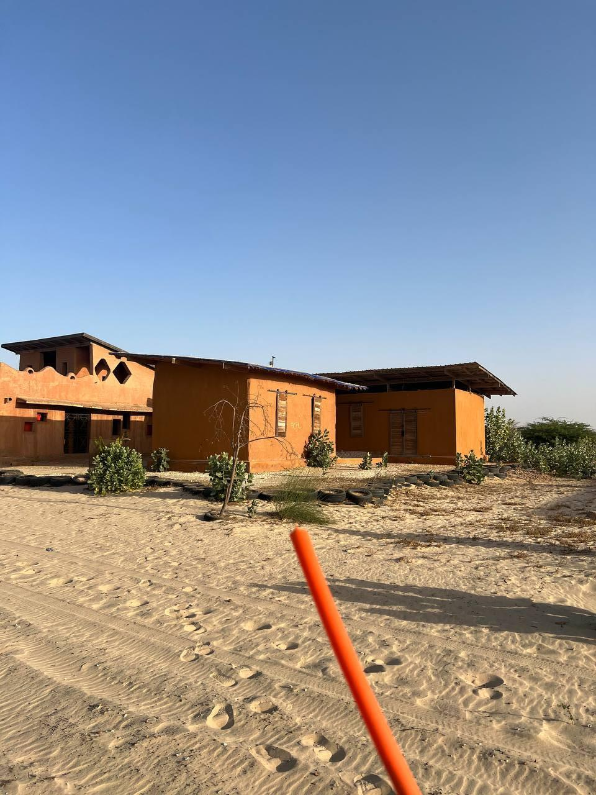

Hoy ha sido un día de avances importantes en la infraestructura de la red, con visitas a centros locales y soluciones a problemas técnicos clave.  

## Actualización de un router en Defaratt  
Por la mañana, Joan y Jaume fueron a **Defaratt**, un centro de reciclaje vinculado a Hahatay, ubicado en el mismo pueblo de Gandiol, cerca de las instalaciones de Aminata. Allí se dispusieron a reconfigurar un router antiguo que necesitaba una actualización completa del firmware para poder integrarse en nuestra red. Se pusieron manos y despues de un buen rato consiguieron dejarlo operativo.  

## Creación de un servicio de reportes diarios  
Por la tarde, Jaume y Joan empezaron a trabajar en uno de los objetivos definidos el día anterior: crear un servicio automatizado que envíe cada mañana a las 8 un mensaje por Telegram con un pequeño informe del estado de la red. Este resumen diario será de gran utilidad para Pablo, alias *el manitas de Hahatay*, ya que le permitirá tener toda la información centralizada y detectar rápidamente qué router está fallando y cuál es la causa.  

## Configuración en la sala informática y problemas con el cableado  
Mientras tanto, Aitor y Roger se dedicaron a reconfigurar el router de la sala informática y a preparar el nodo principal para **Keru Jiggen** (*Casa de la Mujer* en wolof). Durante la espera de las llaves para acceder y configurar los otros routers de la red mesh, avanzaron en la configuración.  

Una vez obtuvieron acceso y lograron configurar la red, se toparon con un problema inesperado: **el cable que conecta el nodo principal con los servidores no funcionaba**. Esto los llevó a cambiar de plan y analizar la infraestructura de red para encontrar la causa del fallo.

## Un cambio de look  
Después de comer, Roger le hizo a Jaume un nuevo corte de pelo, un cambio de look que, según el grupo, ya era más que necesario.

Con la sesión de peluquería terminada, Pablo y Roger se dirigieron a **Tabax Nite** para investigar por qué el cableado de **Keru Jiggen** no estaba funcionando.

## Solucionando el misterio del ethernet que no funcionaba 
Tras identificar todos los cables que salían desde el servidor, se dedicaron a seguir las zanjas que llevaban el cableado desde el servidor hasta **Aula 1** y, desde allí, hasta **Keru Jiggen**. Finalmente, descubrieron que **el cable estaba cortado entre Aula 1 y Keru Jiggen**, resolviendo así el misterio.  

La solución fue clara: **desenterrar el cable, redirigirlo directamente al servidor y crimpar un nuevo cable Ethernet**. Una vez terminado el trabajo, todo funcionó a la perfección y **Keru Jiggen quedó conectado a la red**.  

## Cena saludable y descanso merecido  
Para cerrar el día, disfrutamos de una **buena y saludable ensalada para cenar**, un respiro después de una jornada intensa de trabajo. Con el estómago lleno y la satisfacción de haber resuelto varios problemas importantes, nos fuimos a dormir, listos para enfrentar un nuevo día en Gandiol.  

