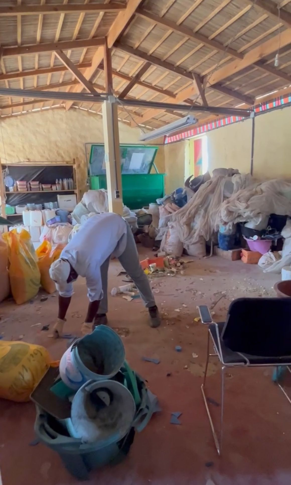
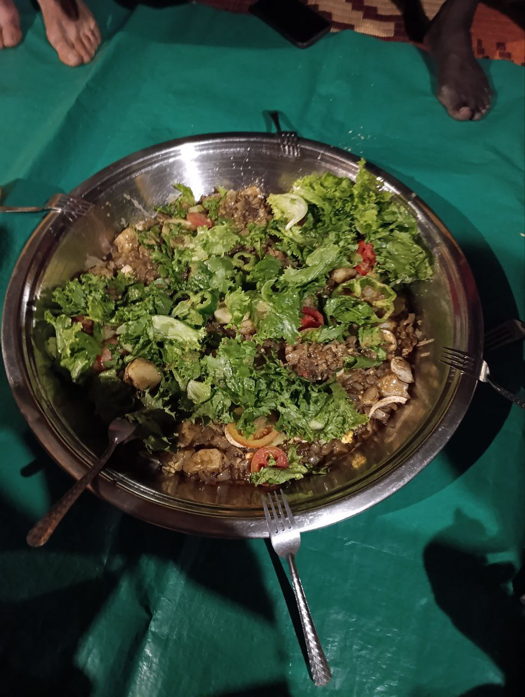

Today was a day of significant progress, with visits to local centers and solutions to key technical problems.  

## Updating a Router at Defaratt  
In the morning, Joan and Jaume went to **Defaratt**, a recycling center linked to Hahatay, located in the village of Gandiol near the Aminata facilities. There, they set out to reconfigure an old router that required a complete firmware update to be integrated into our network. After a good while of work, they finally managed to get it up and running.  
  

## Creating a Daily Report Service  
In the afternoon, Jaume and Joan began working on one of the goals set the previous day: creating an automated service that sends a **daily report** via Telegram at 8 AM, summarizing the network’s current status. This daily summary will be highly useful for Pablo, aka *Hahatay’s handyman*, as it will centralize all information and help quickly identify which router is malfunctioning and why.  

## Configuring the Computer Lab and Cable Issues  
Meanwhile, Aitor and Roger worked on reconfiguring the router in the **computer lab** and preparing the main node for **Keru Jiggen** (*House of Women* in Wolof). While waiting for the keys to access and configure the other routers in the mesh network, they proceeded with the setup.  
  

Once they gained access and configured the network, they encountered an unexpected issue: **the cable connecting the main node to the servers was not working**. This forced them to adjust their plan and analyze the network infrastructure to pinpoint the problem.  

## A New Look  
After lunch, Roger gave Jaume a fresh haircut, a **new look** that, according to the group, was long overdue.  
  
  

With the haircut session finished, Pablo and Roger headed to **Tabax Nite** to investigate why the **Keru Jiggen** cable was not functioning.  

## Solving the ethernet non working mistery
After identifying all the cables coming from the server, they traced the underground wiring from the server to **Aula 1**, and from there to **Keru Jiggen**. Eventually, they discovered that **the cable was cut between Aula 1 and Keru Jiggen**, solving the mystery.  

The solution was clear: **dig up the cable, reroute it directly to the server, and crimp a new Ethernet cable**. Once the work was completed, everything functioned perfectly, and **Keru Jiggen was successfully connected to the network**.  
  

## A Healthy Dinner and Well-Deserved Rest  
To end the day, we enjoyed a **delicious and healthy salad for dinner**, a refreshing break after an intense day of work. With full stomachs and the satisfaction of having solved several important issues, we went to bed, ready to take on a new day in Gandiol.  
  

