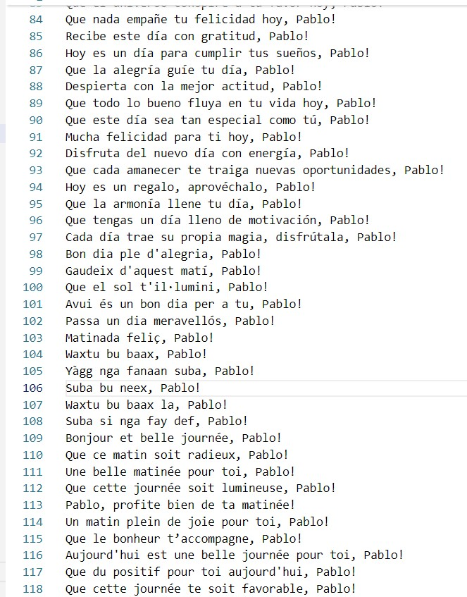
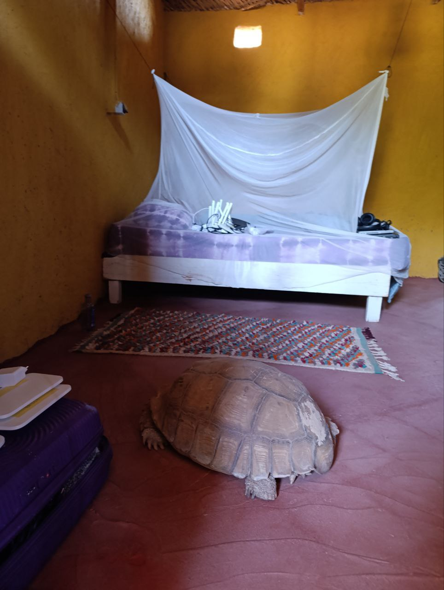
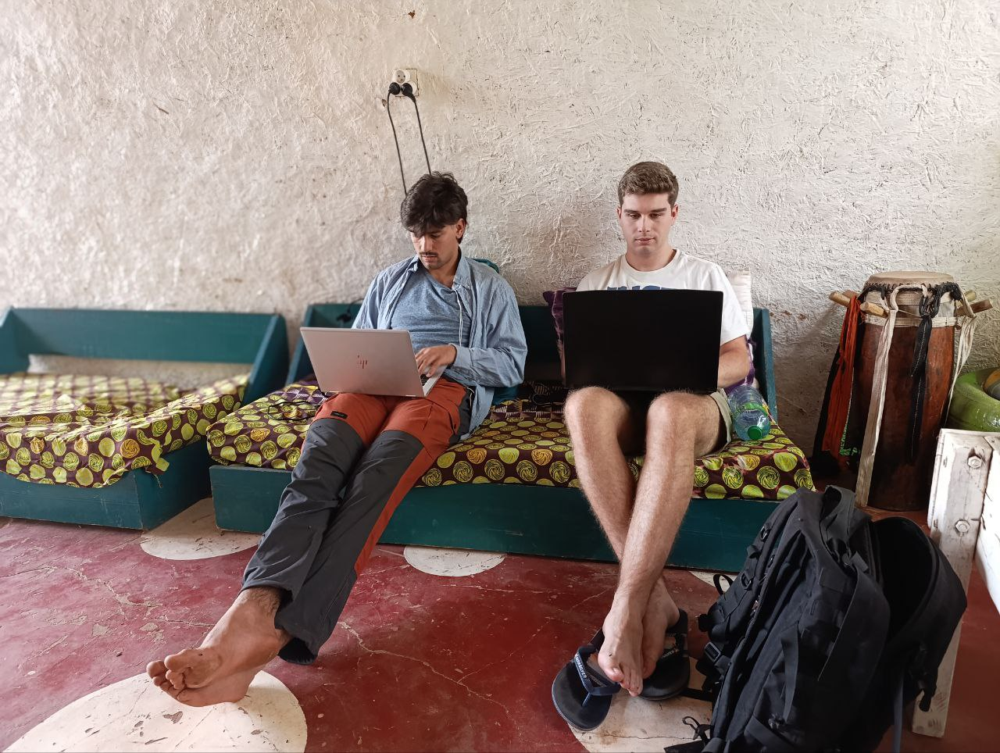

Por la mañana, como de costumbre, nos hemos dividido en dos grupos para abordar las tareas pendientes del día:

## Finalización del script de reportes diarios  
El equipo de monitoreo (**Joan y Jaume**) dedicó la mañana a finalizar el script que enviará un reporte diario del estado de la red.  

Como detalle curioso, le añadimos un **easter egg**: cada mañana, el mensaje de reporte saludará a Pablo de manera aleatoria entre cinco idiomas diferentes (*español, francés, inglés, catalán y wolof*).

## Avances en OpenWISP y problemas inesperados  
**Aitor y Roger** pasaron la mañana configurando **OpenWISP**, creando distintas organizaciones para los routers con el objetivo de tener la distintas instalaciones de Hahatay perfectamente organizadas. Sin embargo, al realizar este cambio, algunas configuraciones de routers se **borraron accidentalmente**.  

Este problema sirvió como aprendizaje: se dieron cuenta de que debían ser extremadamente rigurosos con la **estructura de organizaciones, grupos y dispositivos** dentro de OpenWISP para evitar errores en el futuro.  

## Una visita inesperada  
Por la tarde, mientras trabajaban, **Joan y Aitor** recibieron una visita sorpresa: una **tortuga de casi 100 años y más de 50 kg**, residente de las instalaciones de Hahatay, se infiltró inesperadamente en su habitación.  

## Café con Lorenzo y trabajo en equipo  
Después de un agradable café con Lorenzo, cada equipo retomó sus tareas:  

- **Joan** intentó añadir a la red de monitoreo todos los dispositivos virtuales desplegados en **Proxmox**.  
- **Jaume** trabajó en la configuración de **servicios de la página web**.  
- **Aitor, Roger y Sergio** definieron la estructura ideal de **organizaciones, grupos y dispositivos** en **OpenWISP** para que el cambio de contraseñas se pueda realizar de manera global y con un solo clic.  

## Cierre del día en Teranga  
Para finalizar la jornada, nos fuimos a nuestro querido **Teranga**, esta vez acompañados por **Salif**. Sin embargo, es posible que no vuelva con nosotros después de haberlo aburrido con **charlas filosóficas, matemáticas, informáticas y, sobre todo, muy frikis**. 😆  
