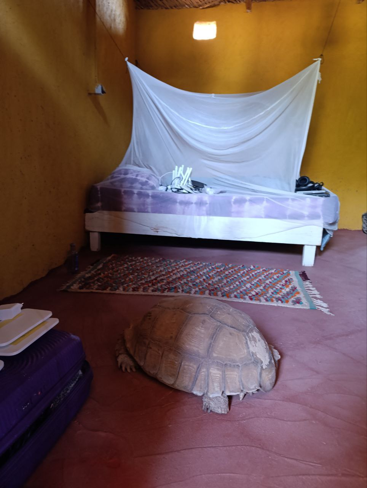

In the morning, as usual, we split into two groups to tackle the day's tasks:

## Completion of the Daily Report Script  
The **monitoring team (Joan and Jaume)** spent the morning finalizing the script that will send a daily report on the network's status.  

As a fun detail, we added an **easter egg**: each morning, the report message will randomly greet Pablo in one of five different languages (*Spanish, French, English, Catalan, and Wolof*).  

## Progress in OpenWISP and Unexpected Issues  
**Aitor and Roger** spent the morning configuring **OpenWISP**, creating different organizations for the routers to keep the various Hahatay installations well-organized. However, during this process, some router configurations were **accidentally deleted**.  

This issue turned into a valuable learning experience: they realized the importance of being extremely **strict with the structure of organizations, groups, and devices** within OpenWISP to prevent future errors.  

## An Unexpected Visitor  
In the afternoon, while working, **Joan and Aitor** received a surprise visit: a **nearly 100-year-old, 50+ kg tortoise**, a resident of the Hahatay facilities, unexpectedly wandered into their room.  

## Coffee with Lorenzo and Teamwork  
After an enjoyable coffee break with Lorenzo, each team resumed their tasks:  

- **Joan** worked on adding all the virtual devices deployed in **Proxmox** to the monitoring network.  
- **Jaume** focused on configuring **web services**.  
- **Aitor, Roger, and Sergio** defined the ideal structure of **organizations, groups, and devices** in **OpenWISP** so that password changes could be applied globally with a single click.  

## Wrapping Up the Day at Teranga  
To end the day, we headed to our beloved **Teranga**, this time joined by **Salif**. However, it’s unlikely he’ll come with us again after we overwhelmed him with **philosophical, mathematical, IT-related, and, above all, extremely geeky discussions**. 😆  
