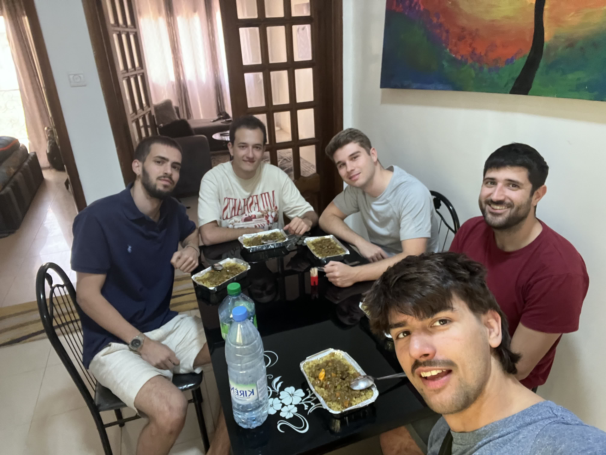
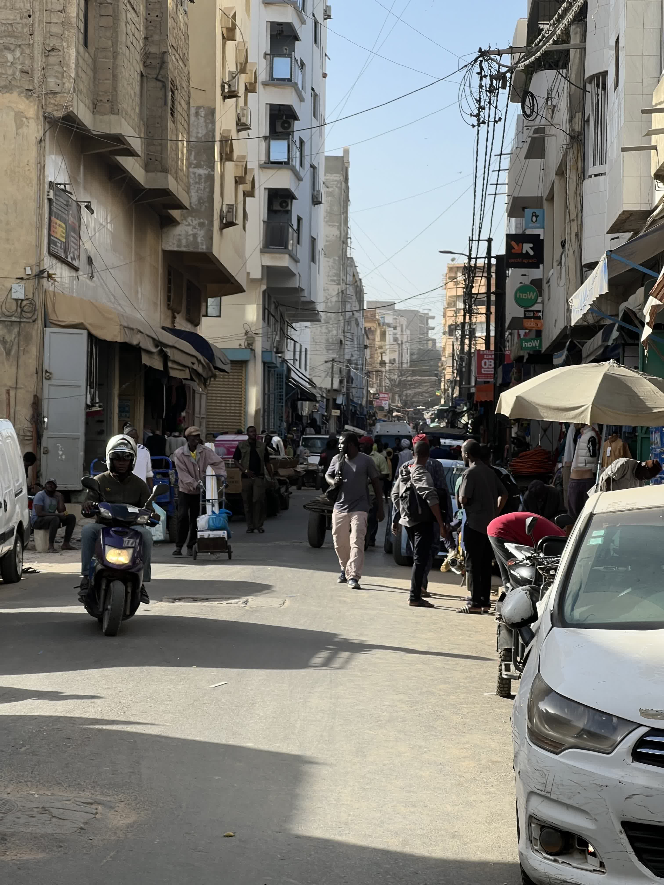
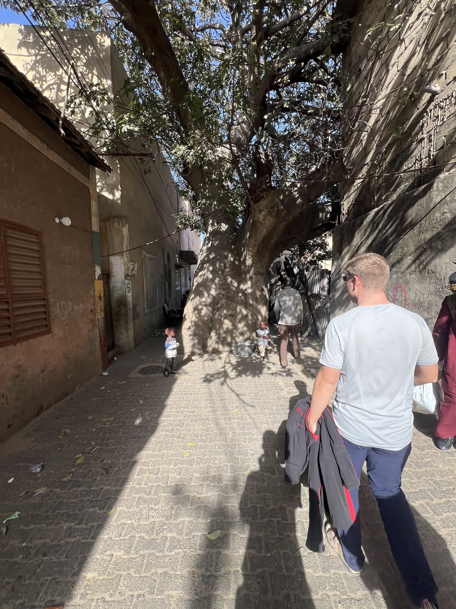
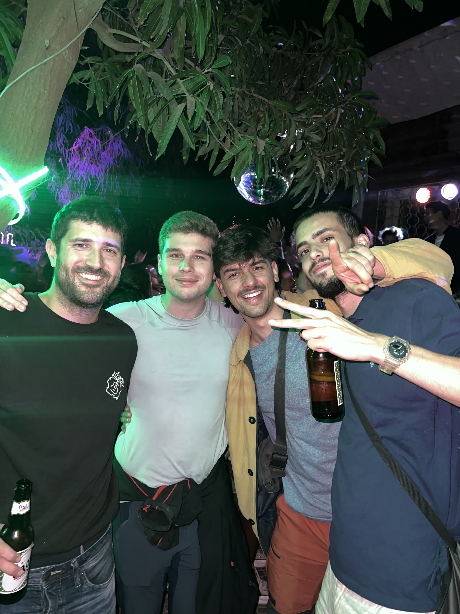

Nos levantamos muy pronto. Assane Bodge nos recoge en Hahatay a las 6:00 de la mañana para llevarnos a Saint-Louis, donde tomaremos el bus Dem Dikk hacia Dakar. Assane, con una puntualidad no especialmente propia de los senegaleses, se presenta a la hora acordada.

El viaje es rápido, con muy poco tráfico, y en poco tiempo nos deja a la entrada de Saint-Louis. Aprovechamos la espera para tomar un vaso de azúcar con café en un pequeño puesto callejero mientras hacemos tiempo. Nos subimos al autobús, que resulta ser muy cómodo. Sale de Saint-Louis con destino a Dakar.


Esperando a subir al autobús. Vamos como los guays del colegio. Los 5 detrás.


Durante el trayecto, hacemos una parada técnica en Thiès. Nos comemos una fataya, una especie de empanadilla frita rellena de carne o pescado. Poco después, llegamos a Dakar a las 12:00.

Una vez en la ciudad, nos dirigimos al apartamento. Tras instalarnos y charlar con algunos lugareños, nos recomiendan un pequeño local donde preparan platos del día. Nos acercamos y nos sirven unos Theiu Bou Yapp absolutamente deliciosos.

Después de un breve descanso, tomamos un taxi hacia la mezquita de Dakar. Paseamos por el mercado "Sandanga", 
sumergiéndonos en la ajetreada y vibrante atmósfera de la ciudad, hasta llegar a la Place de l'Indépendance. Tras el largo paseo, nos sentamos en un bar para tomar algo y compartir nuestras primeras impresiones sobre Dakar.

Algo que nos pareció muy curioso es este Baobab en medio de una callejuela en el mercado. El baobab es un árbol sagrado par los senegaleses, y nunca osan cortarlo. En este caso, hay un baobab que crece en medio de la calle.

Por la noche, nos encontramos con Pablo y Rober, quienes también están en Dakar. Rober parte mañana hacia Bilbao, y Pablo lo ha acompañado para despedirlo. Deciden aprovechar el fin de semana para quedarse en casa de Joaquín "Giby", el primer voluntario que estuvo en Hahatay desde sus inicios.

Nos reunimos unas nueve personas y nos dirigimos a cenar a un restaurante diola. La comida es exquisita, con platos sabrosos y a un precio muy asequible. Luego, nos encaminamos a una fiesta para cerrar la noche con buena compañía y ambiente festivo.

