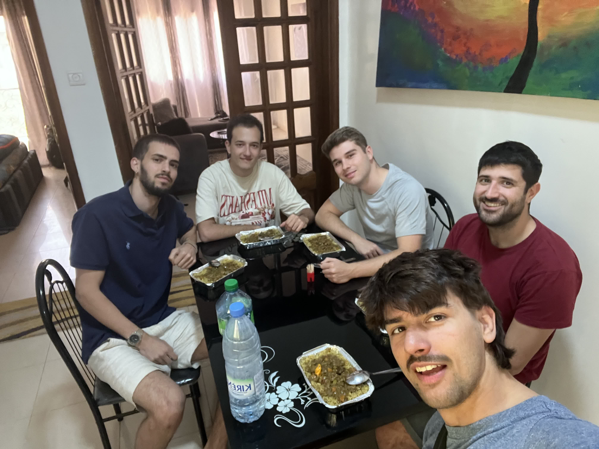
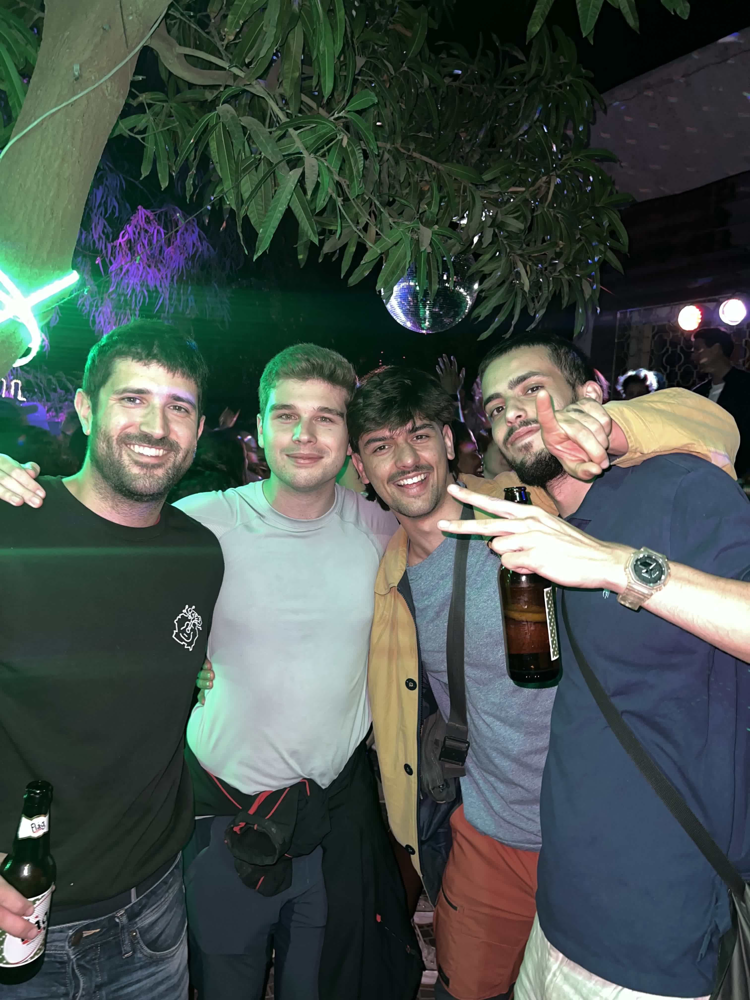

We woke up very early. Assane Bodge picked us up in Hahatay at 6:00 AM to take us to Saint-Louis, where we would catch the Dem Dikk bus to Dakar. Assane, with a punctuality not particularly common among Senegalese people, arrived right on time.

The trip was quick, with very little traffic, and before long, we arrived at the entrance of Saint-Louis. While waiting, we had a glass of sugar with coffee at a small street stall. Soon after, we boarded the bus, which turned out to be very comfortable. It departed from Saint-Louis towards Dakar.


Esperando a subir al autobús. Vamos como los guays del colegio. Los 5 detrás.


During the journey, we made a technical stop in Thiès. We had a fataya, a type of fried pastry filled with meat or fish. Shortly after, we arrived in Dakar at noon.

Once in the city, we headed to the apartment. After settling in and chatting with some locals, they recommended a small eatery that serves daily specials. We went there and were served some absolutely delicious Theiu Bou Yapp.

After a brief rest, we took a taxi to the Dakar mosque. We walked through the Sandanga market, immersing ourselves in the bustling and vibrant atmosphere of the city, until we reached Place de l'Indépendance. After the long walk, we sat at a bar to have a drink and share our first impressions of Dakar.

One particularly interesting sight was a baobab tree standing in the middle of a narrow market street. The baobab is a sacred tree for Senegalese people, and they never dare to cut it down. In this case, a baobab was growing right in the middle of the street.

In the evening, we met up with Pablo and Rober, who were also in Dakar. Rober was leaving for Bilbao the next day, and Pablo had accompanied him to say goodbye. They decided to stay the weekend at Joaquín "Giby’s" house, the first volunteer who had been with Hahatay since its inception.

About nine of us gathered and went to dine at a Diola restaurant. The food was exquisite, with delicious dishes at a very reasonable price. Later, we headed to a party to wrap up the night with great company and a festive atmosphere.

