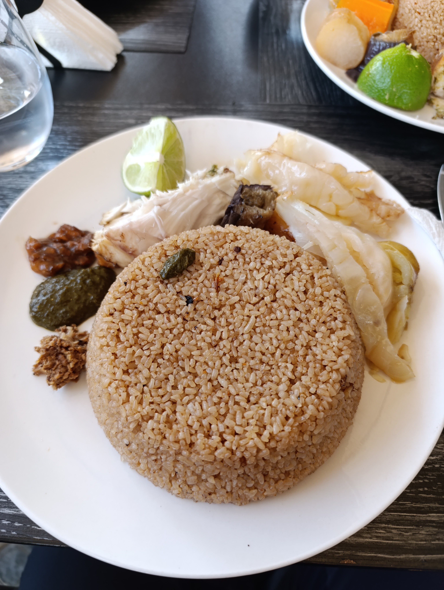
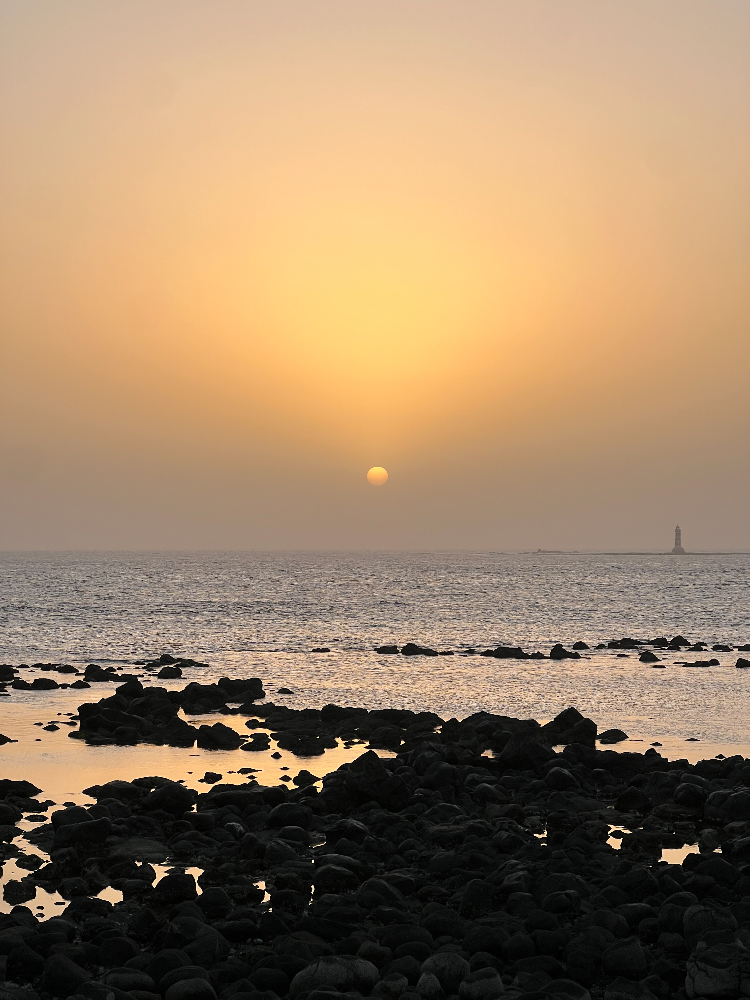

Esta mañana nos hemos levantado sin ninguna prisa, ya que la fiesta de anoche se alargó más de lo esperado. Dimos un paseo por el barrio con la intención de comer en el mismo sitio que ayer, pero al ser domingo, las mujeres habían cerrado el puesto.

El dueño del quiosco nos indicó que al final de la calle había un lugar abierto, así que decidimos acercarnos. Comimos todos juntos un *Thie Bou Djen Rouge*, que, aunque sabroso, no le hace sombra al que nos suele cocinar Daba en Hahatay.

Con el estómago lleno, volvimos a descansar un rato en casa para evitar las horas de mayor calor. Todos, excepto Sergio, quien prefirió quedarse descansando, se dirigieron a la lavandería para lavar la ropa y luego a cambiar algunos CFAS extras para los días venideros.


La ropa sucia de Jaume, Roger y Aitor cruzó Senegal para ser lavada en Dakar.


Más tarde, nos reencontramos en un bar con vistas al océano y pudimos presenciar otro atardecer africano digno de admiración.

Allí, los más jóvenes matemáticos nos hicieron una demostración formal de la siguiente afirmación:

"*Un mono escribiría infinitas veces el Quijote si aporreara el teclado durante un tiempo infinit*o".

Roger, Sergio y Jaume quedaron maravillados con el pensamiento abstracto de los jóvenes matemáticos. Este tipo de intercambios de conocimiento entre todos los miembros del equipo permite que entre todos aprendamos cosas nuevas, tanto los más veteranos como los más jóvenes.


Demostración de la afirmación de los jóvenes matemáticos.

