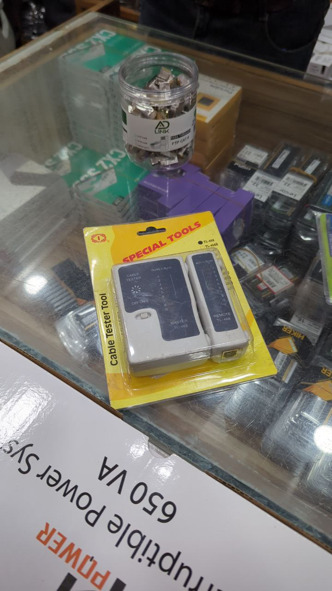
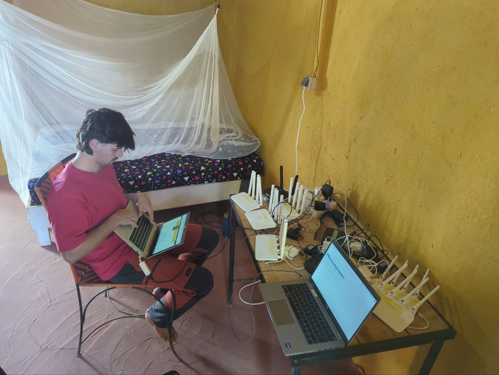

Hoy nos hemos levantado sin mucha prisa, disfrutando de la calma matutina antes de empezar con los planes del día. Roger y Jaume han salido temprano a comprar los billetes de los ferries que usarán la semana que viene para viajar a Casamance, asegurando así su movilidad en el próximo tramo del viaje. Mientras tanto, Aitor, Joan y Sergio han visitado una tienda bien conocida para adquirir material imprescindible: cabezales ethernet y un tester de cables, elementos clave para continuar con nuestro trabajo.

A media mañana, nos hemos reunido con Pablo en el barrio de Plateau para salir todos juntos en coche rumbo a Gandiol. El viaje ha sido tranquilo y sin complicaciones.


De camino a Gandiol. El trayecto nos deja regalos como este bosque de baobabs.


Al llegar nos esperaba un delicioso thieboudiene preparado por Daba. Como siempre, su sabor ha sido espectacular, un auténtico festín para el paladar. Durante la comida, hemos compartido mesa con toda la comunidad de Gandiol, incluido Mamadou, a quien aún no habíamos visto ya que estaba de viaje en España.

La tarde ha sido intensa y productiva. Nos dividimos en dos grupos para avanzar con las tareas pendientes. Roger y Aitor se dirigieron a Tabax Nité para reconfigurar OpenWISP con un nuevo diseño más adecuado a la estructura organizativa y técnica. Mientras tanto, Jaume, Joan y Sergio se dedicaron a hacer un inventario de los routers disponibles, con el objetivo de organizar y preparar los dispositivos necesarios para instalar nuevos puntos de acceso en JanKom y Weesul, en Saint-Louis.

Cerramos el día con una cena de cous cous, disfrutando de una amena sobremesa en la que aprovechamos para planificar la jornada de mañana. Se avecina un día de trabajo exigente, probablemente en Saint-Louis, donde continuaremos con nuestra labor. Con ese pensamiento en mente, nos retiramos a descansar para estar preparados para lo que viene.

