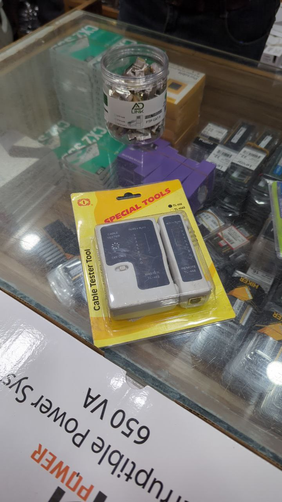
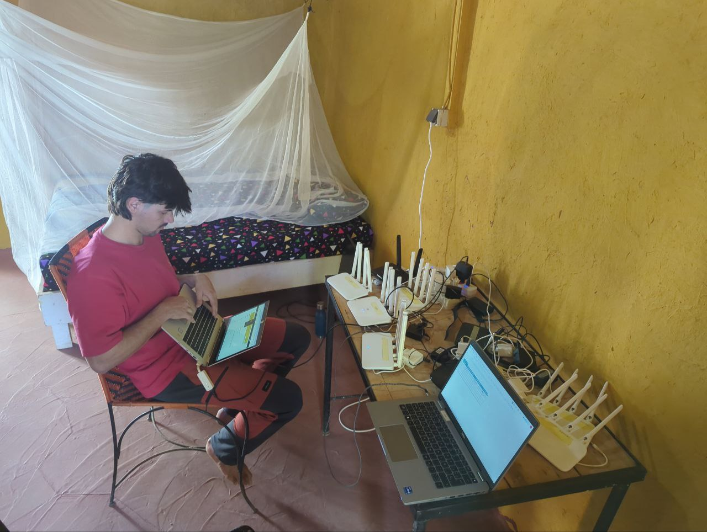

Today, we woke up without much hurry, enjoying the morning calm before starting the day's plans. Roger and Jaume went out early to buy ferry tickets for their trip to Casamance next week, ensuring their mobility for the next stage of the journey. Meanwhile, Aitor, Joan, and Sergio visited a well-known store to purchase essential materials: Ethernet heads and a cable tester, key elements for continuing our work.

By mid-morning, we met up with Pablo in the Plateau district to set off together by car towards Gandiol. The trip was smooth and without complications.


On the way to Gandiol. The journey rewards us with sights like this baobab forest.


Upon arrival, we were greeted with a delicious thieboudiene prepared by Daba. As always, its flavor was spectacular, a true feast for the palate. During lunch, we shared the table with the entire Gandiol community, including Mamadou, whom we hadn’t seen yet as he had been traveling in Spain.

The afternoon was intense and productive. We split into two groups to tackle pending tasks. Roger and Aitor headed to Tabax Nité to reconfigure OpenWISP with a new design better suited to the organizational and technical structure. Meanwhile, Jaume, Joan, and Sergio took inventory of the available routers, aiming to organize and prepare the necessary devices for installing new access points in JanKom and Weesul, in Saint-Louis.

We ended the day with a couscous dinner, enjoying a pleasant after-dinner conversation where we took the opportunity to plan for the next day. A demanding workday is ahead, likely in Saint-Louis, where we will continue our efforts. With that in mind, we retired to rest and prepare for what’s to come.
