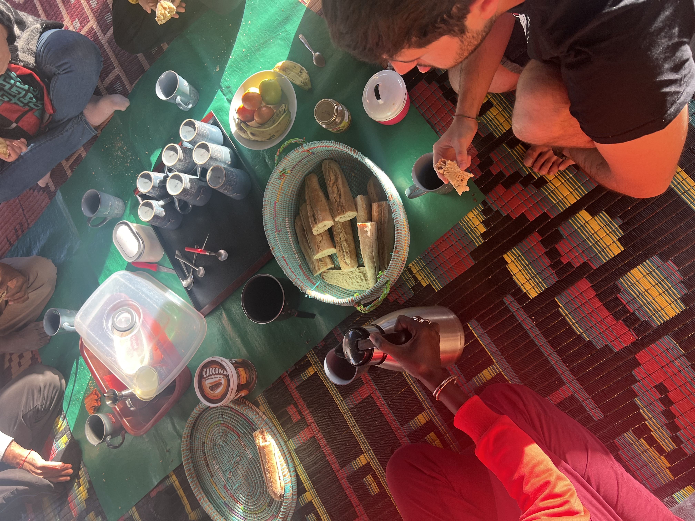
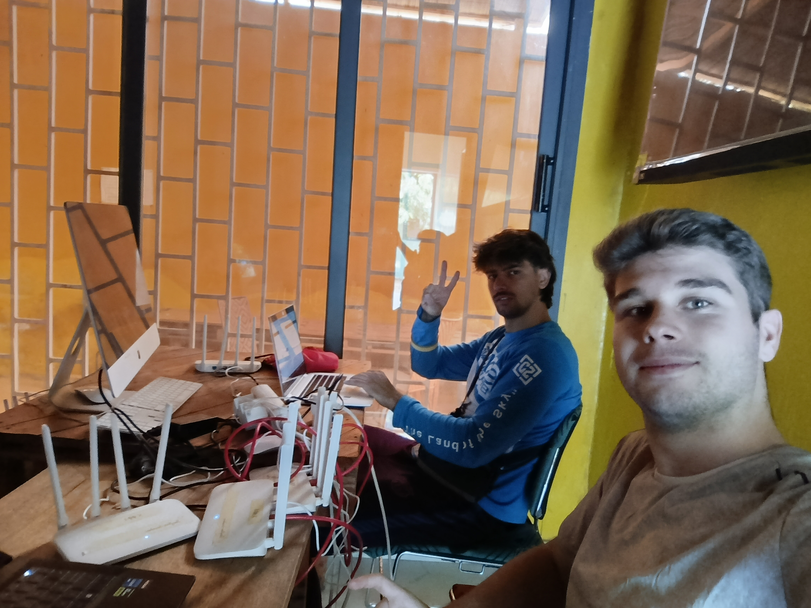
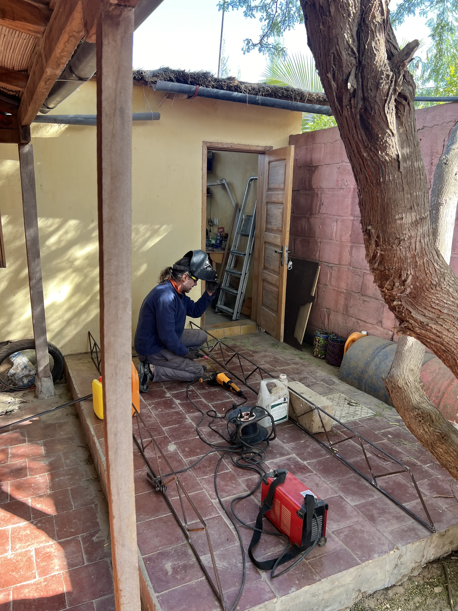
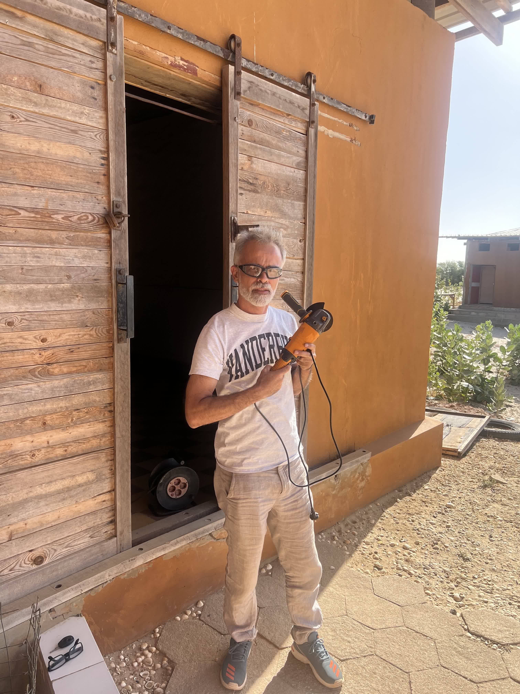
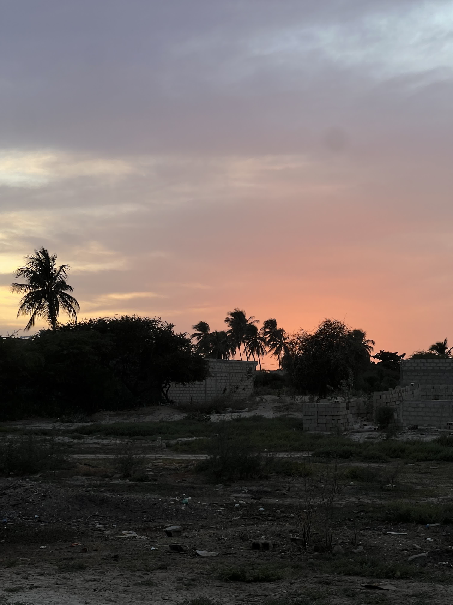

El martes comenzó con una larga lista de tareas, ya que queríamos acabar todo lo que teníamos pendiente antes de irnos. Después de desayunar, nos dividimos en grupos y nos pusimos manos a la obra.  

  

### Jaume y Joan: Actualización de routers en Saint-Louis  

Jaume y Joan viajaron a Saint-Louis para trabajar en JangKom, una de las instalaciones de Hahatay en la ciudad. Su objetivo principal era actualizar el firmware de varios routers rusos que estaban dando problemas. Además, planearon integrar un par de routers a la red mesh para garantizar una buena conexión en todo el recinto.  

  

A la hora de comer, pararon en un bar cercano para disfrutar del plato del día: arroz con pescado típico. De regreso, vieron un futbolín y no pudieron resistirse a echar una partida. Rápidamente, dos niños locales se acercaron y no dudaron en invitarlos a jugar. El partido estuvo muy reñido, con un empate 3-3 hasta que Jaume y su compañero marcaron el gol decisivo. Tras despedirse, volvieron a JangKom para terminar el trabajo.  

Sobre las 17:00, terminaron en JangKom y decidieron ir a Weesul, otra instalación de Hahatay en Saint-Louis. La misión era la misma: actualizar los routers rusos y añadir algunos a la red mesh. Sin embargo, tras un día largo, no tuvieron la misma suerte: la conexión del router principal no detectaba el internet por cable. Después de varios intentos, decidieron dejarlo para el día siguiente. Regresaron a casa sobre las 21:00, donde les esperaba una cena de pescado y ensalada que sus compañeros habían guardado para ellos.  

### Aitor y Roger: Estructuración de OpenWISP y Routers de Respaldo  

Mientras Jaume y Joan trabajaban en Saint-Louis, Aitor y Roger pasaron la mañana en casa de Pablo reestructurando la configuración de dispositivos en OpenWISP. Su objetivo era crear una plantilla global para la gestión de cambios de contraseña. También configuraron un nuevo router con la nueva estructura para sustituir el de la plaza de Sunukeur, que llevaba días fallando.  

Mientras tanto, Pablo estuvo soldando una estructura para una escalera que se instalaría en Tabax Nite, y Lorenzo trabajó con una sierra radial.  

  

  

Hacia el final de la mañana, Aitor y Roger comenzaron a configurar y subir a OpenWISP varios routers de respaldo. Esto permitirá reemplazar rápidamente cualquier router que falle, asegurando una transición fluida gracias a las plantillas de OpenWISP.  

### Tarde: Últimos Ajustes y Atardecer en Sunukeur  

Por la tarde, Roger continuó configurando routers de respaldo antes de dirigirse a Aminata para arreglar los routers esclavos y solucionar la conexión a internet del router maestro. Gracias a OpenWISP, la plantilla de configuración resolvió todo de manera eficiente. De regreso a Sunukeur, fue testigo de un precioso atardecer.  

  

Mientras tanto, Aitor se quedó en Sunukeur repasando con Sergio la estructura definitiva de OpenWISP. Tras confirmar que todo estaba en orden, replicaron la configuración en JangKom y Weesul. A diferencia de Sunukeur, estas instalaciones tendrían dos organizaciones separadas, cada una con solo dos grupos: maestros y esclavos.
Una vez que la estructura estuvo lista, intentaron añadir algunos routers al sistema, pero los problemas con la VPN les impidieron integrar ningún dispositivo. Al finalizar la tarde, junto con Roger, que ya había vuelto de Aminata, definieron las tareas del día siguiente y dieron la jornada por concluida, satisfechos con el progreso y listos para seguir avanzando.