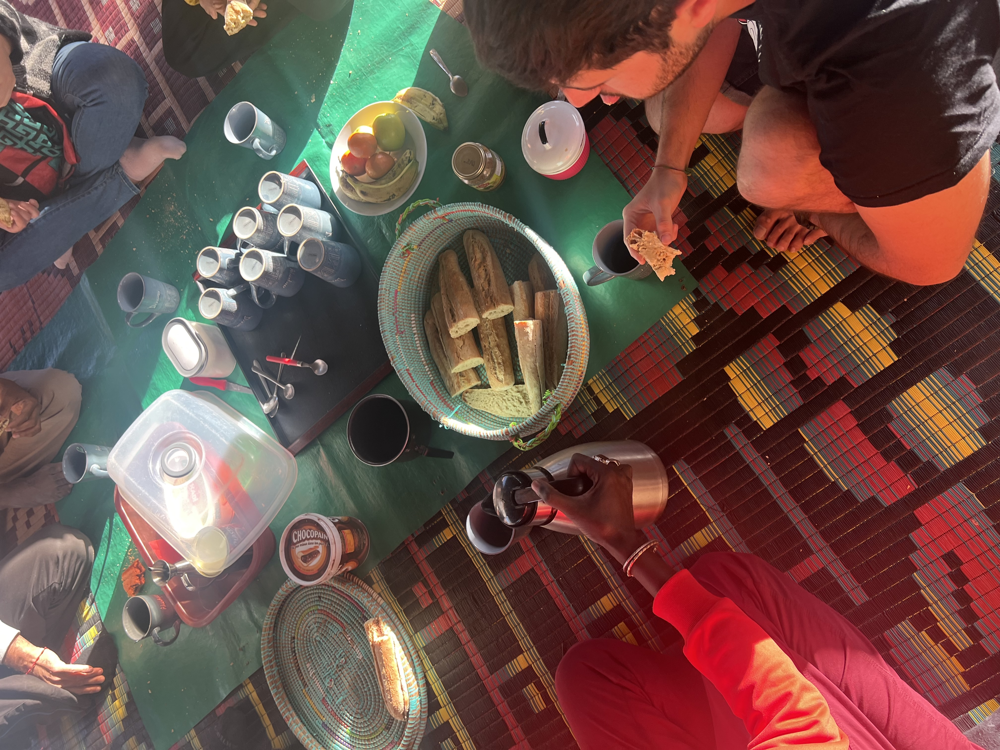
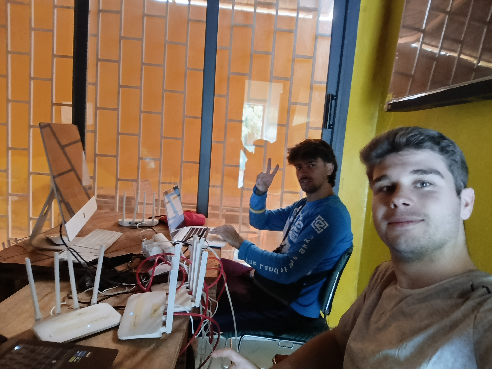
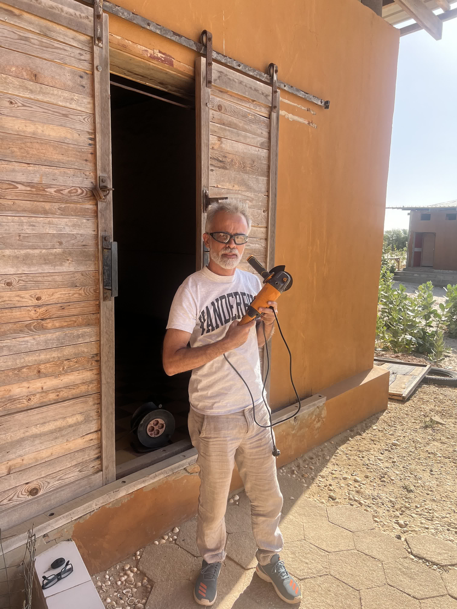

Tuesday started with a long list of tasks, as we wanted to finish everything we had pending before leaving. After breakfast, we divided into groups and got to work.

### Jaume and Joan: Router Update in Saint-Louis

Jaume and Joan traveled to Saint-Louis to work at JangKom, one of Hahatay's facilities in the city. Their main goal was to update the firmware of several Russian routers that had been causing issues. Additionally, they planned to integrate a couple of routers into the mesh network to ensure good connectivity throughout the facility.

At lunchtime, they stopped at a nearby bar to enjoy the dish of the day: rice with typical fish. On their way back, they saw a foosball table and couldn't resist playing a match. Quickly, two local kids approached and invited them to join. The match was very close, ending in a 3-3 tie until Jaume and his partner scored the decisive goal. After saying their goodbyes, they returned to JangKom to finish their work.

Around 5:00 PM, they finished at JangKom and decided to go to Weesul, another Hahatay facility in Saint-Louis. The mission was the same: update the Russian routers and add some to the mesh network. However, after a long day, they weren't as lucky: the main router's connection didn't detect the wired internet. After several attempts, they decided to leave it for the next day. They returned home around 9:00 PM, where a fish and salad dinner, saved for them by their teammates, was waiting.

### Aitor and Roger: OpenWISP Structuring and Backup Routers

While Jaume and Joan worked in Saint-Louis, Aitor and Roger spent the morning at Pablo's house restructuring the device configuration in OpenWISP. Their goal was to create a global template for password change management. They also configured a new router with the new structure to replace the one at Sunukeur Square, which had been failing for days.

Meanwhile, Pablo was welding a structure for a ladder that would be installed at Tabax Nite, and Lorenzo worked with a radial saw.

By the end of the morning, Aitor and Roger began configuring and uploading several backup routers to OpenWISP. This will allow for the quick replacement of any router that fails, ensuring a smooth transition thanks to the OpenWISP templates.

### Afternoon: Final Adjustments and Sunset in Sunukeur

In the afternoon, Roger continued configuring backup routers before heading to Aminata to fix the slave routers and resolve the internet connection issue with the master router. Thanks to OpenWISP, the configuration template solved everything efficiently. On his way back to Sunukeur, he witnessed a beautiful sunset.

Meanwhile, Aitor stayed in Sunukeur reviewing the final structure of OpenWISP with Sergio. After confirming everything was in order, they replicated the setup at JangKom and Weesul. Unlike Sunukeur, these facilities would have two separate organizations, each with only two groups: masters and slaves. Once the structure was set, they tried to add some routers to the system, but VPN issues prevented them from integrating any devices. By the end of the day, along with Roger, who had returned from Aminata, they defined the tasks for the following day and concluded the day, satisfied with the progress and ready to continue moving forward.
