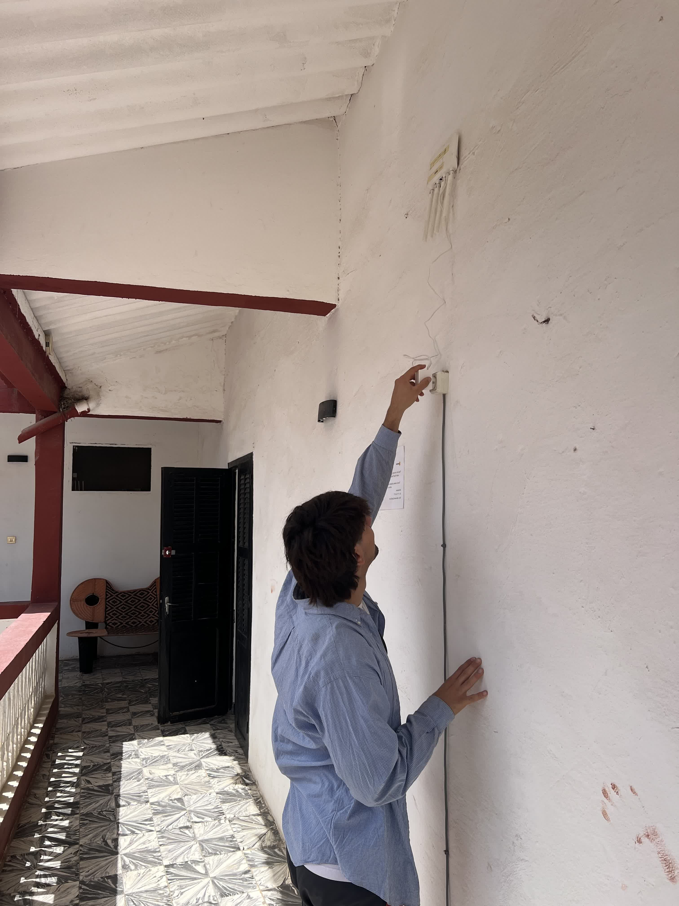
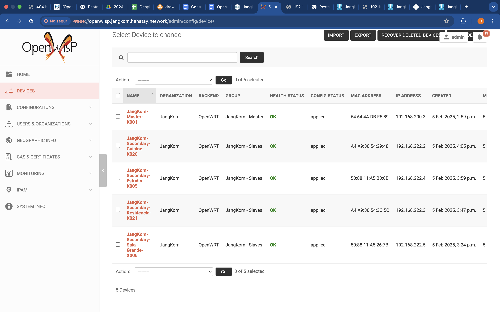
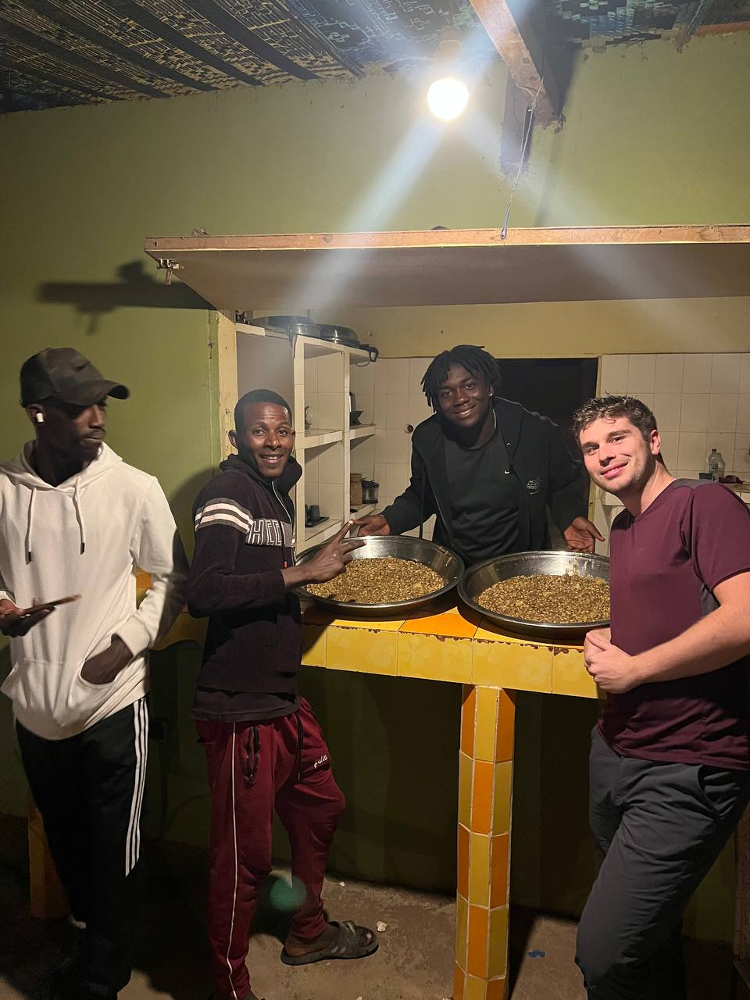

Nos despertamos sabiendo que nos esperaba otro día intenso lleno de trabajo y mejoras en la red.  

### Aitor y Sergio: Pruebas Finales con OpenWISP  

Aitor y Sergio se dirigieron a Fess para realizar varias pruebas y asegurarse de que todo quedara funcionando correctamente. Simularon la caída de OpenWISP para comprobar que los routers no se desconfiguraban, lo cual confirmó la solidez del sistema. Luego, probaron el cambio de contraseñas en toda la red, y fue un éxito total.  

Simplemente cambiaron la variable global `password_wifi` en OpenWISP, y en cuestión de minutos, todos los puntos de acceso en los diferentes espacios de Gandiol actualizaron su contraseña de forma automática. Con esto, se completó uno de los principales objetivos del proyecto.  

Aprovecharon para modificar las plantillas y actualizar los DNS, algo que antes habría requerido cambiar manualmente cada router, pero ahora se hizo en minutos gracias a OpenWISP.  

### Joan y Pablo: Configuración de Nuevas Antenas  

Joan y Pablo trabajaron en la configuración de unas antenas nuevas para mejorar el enlace Sunukeur-Aminata, que había estado dando problemas. Dejaron todo preparado para que, si se decide cambiar el enlace, solo haga falta instalar y alinear las antenas.  

Después, Joan se encargó de añadir a Zabbix todos los routers configurados el día anterior y fijar sus IPs.  

  

### Jaume y Roger: Mejoras en la Red de Weesul y JangKom  

Jaume y Roger volvieron a Weesul para solucionar los problemas del día anterior. Inicialmente, intentaron recrear la red con el OpenWISP alojado en JangKom, pero la VPN no funcionaba. Finalmente, decidieron rehacer toda la red mesh desde cero, añadiendo un par de nodos extra para mejorar la cobertura. El esfuerzo valió la pena y todo quedó perfectamente configurado.  

  

A la hora de comer, se fueron a un bar con terraza y vistas al río Senegal y Saint-Louis, donde disfrutaron de un buen taco de pollo con queso y picante.  

  

Después, se dirigieron a JangKom para añadir todos los routers a OpenWISP y configurarlos con los templates. Mientras trabajaban, les ofrecieron una bebida local: un yogur caliente con fideos y mucho azúcar, que resultó estar delicioso. Quizás gracias a ese impulso de energía lograron terminar el trabajo rápida y eficientemente.  

Para despedirse del centro, también les ofrecieron Attaya, esta vez con un toque de menta. Al regresar, tomaron el autobús número 8, un bus local muy curioso y barato (el trayecto costó solo 100 CFAS). Lo más llamativo fue que el cobrador del bus iba dentro de una especie de celda.  

  
  

### Tarde: Partido en Sunukeur  

Por la tarde, Jaume fue a jugar un partido de fútbol con los locales. Esperaba un partido amistoso, pero terminó jugando un encuentro clave donde Hahatay se jugaba la clasificación a las semifinales de la liga local.  

El partido tenía árbitro y dos jueces de línea para marcar los fueras de juego. Jaume entró en la segunda parte y, nada más pisar el campo, resbaló y cayó al suelo. Tras ese inicio desastroso, logró recuperarse y asistió a Salif para un golazo que lamentablemente fue anulado por un fuera de juego inexistente (el árbitro más corrupto que los que contrata el Real Madrid).  

A pesar de todo, Hahatay ganó el partido por dos goles y avanzó a las semifinales.  

### Joan, Pablo y Roger: Más Pruebas con Antenas  

Mientras tanto, Joan y Pablo probaron la compatibilidad entre las nuevas antenas y las antiguas para evitar tener que reemplazar ambas en caso de fallo. Subieron al tejado de Mamadou para alinear una antena nueva con una vieja, pero descubrieron que no eran compatibles debido a diferencias en los protocolos de radio, a pesar de ser de la misma marca.  

Roger, al llegar de Saint-Louis y verlos en el tejado, no dudó en subir a ayudar.  

  

### Atardecer en Zebra Bar y Cena Especial  

Para cerrar el día, decidimos ir al Zebra Bar a ver la puesta de sol. Al regresar, nos esperaba un delicioso Ndiebe, uno de los platos favoritos del equipo.  

  
  

Fue un día de grandes avances y experiencias inolvidables. ¡Mañana más!  