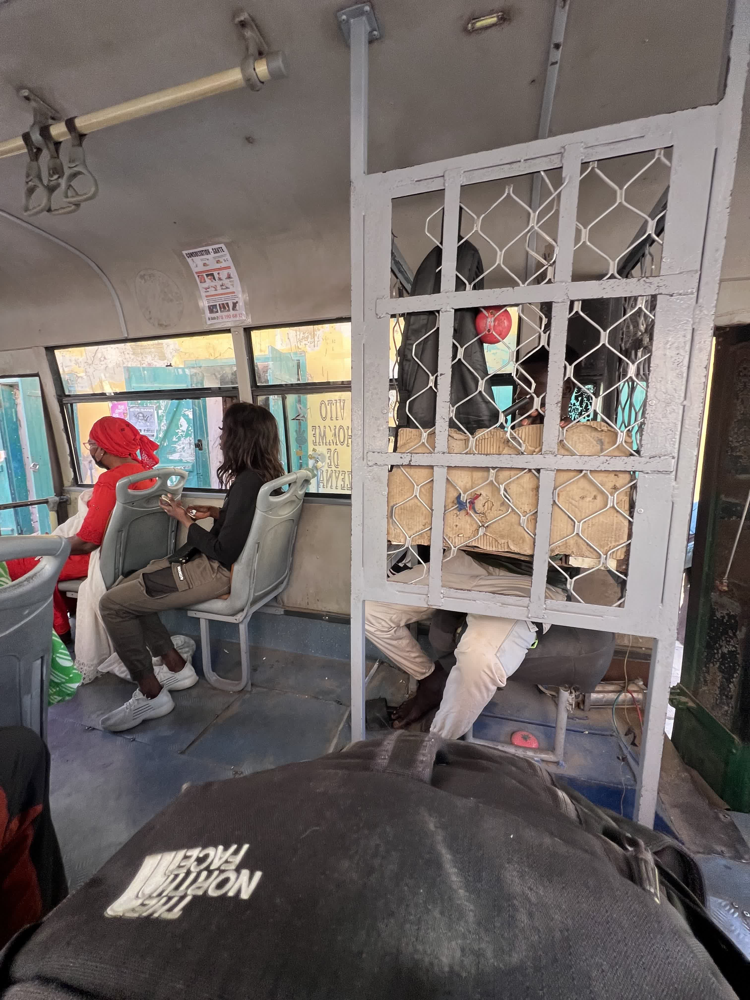

We woke up knowing it was going to be another intense day full of work and network improvements.  

### Aitor & Sergio: Final OpenWISP Tests  

Aitor and Sergio headed to Fess to run several tests and ensure everything was working correctly. They simulated an OpenWISP failure to check if the routers would lose their configuration, but everything remained stable, proving the reliability of the system.  

Then, they tested the long-awaited **password change feature**, and it was a total success. They simply modified the global variable `password_wifi` in OpenWISP, and within minutes, all WiFi access points in different Gandiol locations had updated their passwords automatically.  

With this, one of the main objectives of the OpenWISP project was officially completed.  

They also tweaked the templates to update the DNS settings, which Sergio had recently changed. What would have previously been a tedious and manual task—logging into each router individually—was now done in a matter of minutes.  

### Joan & Pablo: Configuring New Antennas  

Joan and Pablo worked on configuring new antennas to improve the Sunukeur-Aminata connection, which had been unreliable. They prepared everything so that, if needed, replacing the old link would be as simple as installing and aligning the antennas.  

After that, Joan added all the routers from the previous day to Zabbix and assigned them fixed IPs.  

  

### Jaume & Roger: Fixing Weesul & JangKom Networks  

Jaume and Roger returned to Weesul to fix the issues from the day before. Initially, they tried to recreate the network using OpenWISP hosted in JangKom, but the VPN wasn’t working. In the end, they **rebuilt the entire mesh network from scratch**, adding a couple of extra nodes to improve coverage. The effort paid off, and everything was running smoothly.  

  

At lunchtime, they went to a bar with a terrace overlooking the **Senegal River and Saint-Louis**, where they enjoyed a delicious **spicy chicken and cheese taco**.  

  

After that, they headed to JangKom to add all the routers to OpenWISP and configure them using its templates. While working, they were offered a **hot yogurt with noodles and lots of sugar**, which turned out to be surprisingly good. Maybe that energy boost helped them finish their work quickly and efficiently.  

As a farewell from the center, they were also offered **Attaya**, this time with a hint of mint.  

To get back to the taxi stop, they took **bus number 8**, a very curious and cheap local bus—the ride only cost **100 CFAS**. Interestingly, the bus cashier was locked inside a small cage.  

  
 
  

### Afternoon: Football Match in Sunukeur  

In the afternoon, Jaume went to play a football match with the locals. He expected a **casual friendly game**, but instead found himself in a **serious tournament match** where Hahatay was fighting for a spot in the local league semifinals.  

The game had an official **referee and two linesmen** to call offsides! Jaume was subbed in during the second half, and as soon as he stepped onto the field, he slipped and fell. After that embarrassing moment, he recovered well and even assisted Salif for an amazing goal—**but it was ruled offside** (a clear mistake by the referee, **worse than the ones Real Madrid pays for!**).  

Despite this, **Hahatay won by two goals** and advanced to the semifinals!  

### Joan, Pablo & Roger: More Antenna Testing  

Meanwhile, Joan and Pablo tested the **compatibility between new and old antennas** to avoid having to replace both in case of failure. They climbed **Mamadou’s rooftop**, aligned a new antenna with an old one, and tried to link them. Unfortunately, they discovered they were **not compatible** due to different radio protocols, despite being from the same brand.  

When Roger arrived from Saint-Louis and saw them on the roof, he immediately **climbed up to help**.  

  

### Sunset at Zebra Bar & Special Dinner  

To end the day, we decided to go to **Zebra Bar** to watch the sunset. When we returned, a delicious **Ndiebe** was waiting for us—one of the team's favorite meals!  

  
  

It was a day of great progress and unforgettable experiences. **More adventures await tomorrow!**  