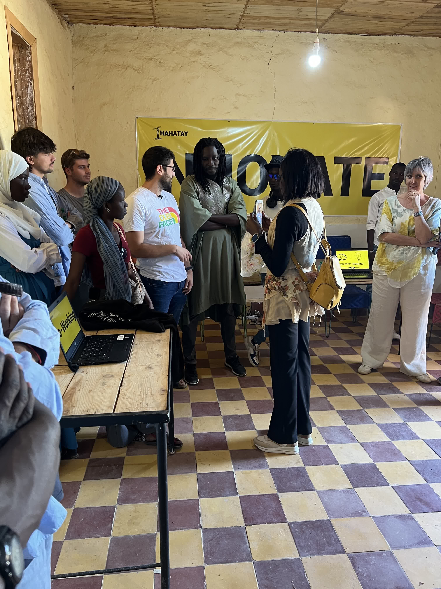
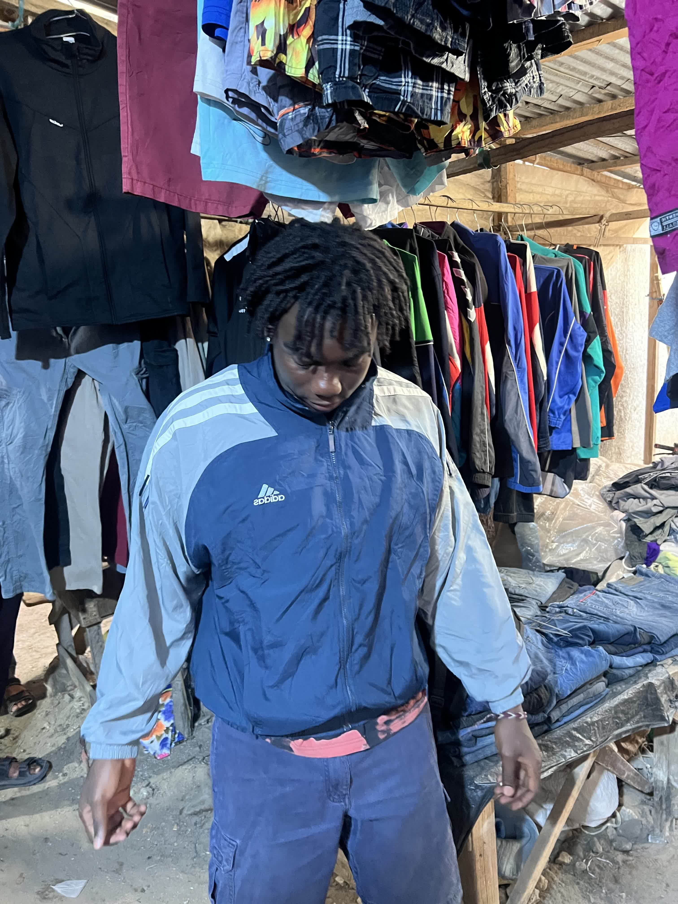

Hoy nos despertamos con más tranquilidad, sabiendo que todo iba viento en popa. Desayunamos tranquilamente y nos ponemos manos a la obra.

Roger pasó la mañana ultimando detalles en OpenWISP, centrado en analizar las gráficas de tráfico de la red: tanto en la red interna en Gandiol, como en la *mesh* y hacia internet, además de revisar el volumen de usuarios conectados por WiFi en todo Gandiol. Jaume, por su parte, estuvo resolviendo algunos problemas en Zabbix, identificando fallos en ciertos switches. Mientras tanto, Joan se unió a Lorenzo para ir a Tabax Nité, donde trabajaron en los últimos preparativos para la inauguración de la sala de informática.


Sala de informática de *Tabax Nité* lista para la inauguración



El equipo al completo y las entidades que representamos: AUCOOP, CCD UPC y Labdoo


Alrededor del mediodía, nos reunimos todos para asistir a la inauguración de la sala de informática. Durante el evento, hablaron brevemente todos los actores que han participado o participarán en el desarrollo del proyecto. Entre ellos estaban AUCOOP, Hahatay, el director del Liceo de Tassinere (instituto público local), Amidou (periodista senegalés), Estrella (profesora del Kings College), KCD y la Diputación Foral de Gipuzkoa, que ha contribuido económicamente al proyecto. Sergio hizo una breve presentación sobre el trabajo que AUCOOP ha realizado en la red a lo largo de los años. Mamadou, como maestro de ceremonias, dirigió el acto y dio paso a las intervenciones de todas las entidades involucradas.

Por la tarde, Jaume, Roger y Aitor se dirigieron a Saint Louis con la intención de encontrar alguna joya escondida en las tiendas de la friperie. Esta vez contaban con la ayuda de Salif, un experto en la materia. La tarde fue un éxito: consiguieron varias prendas a precios muy competitivos gracias a la palabra clave "*guañi guañi*" (que significa "baja, baja" en wolof). Sin embargo, Jaume salió un poco decepcionado, ya que esperaba aún más de la experiencia.

Más tarde, tomaron un taxi hacia La Source, donde el resto del equipo les esperaba para compartir una última cena. La comida (¡Phaco!) estuvo deliciosa y la conversación aún mejor. La noche culminó en casa de Pablo, donde, acompañados por su batería y la guitarra de Sergio, cantamos algunos clásicos. Sin duda, una gran manera de cerrar el día.