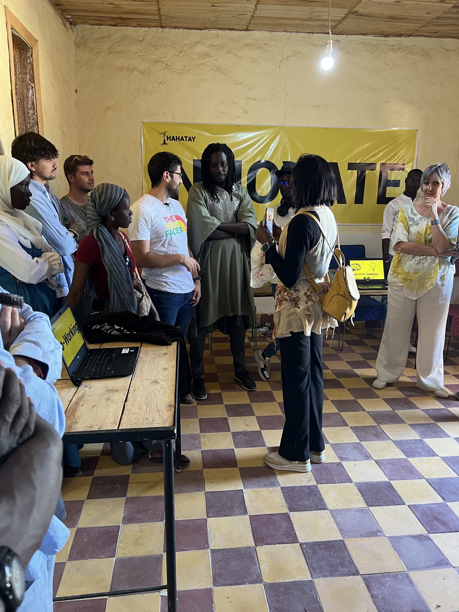
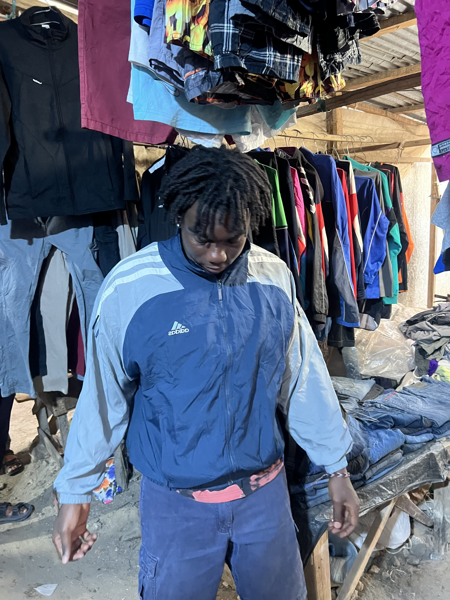

We woke up more calmly today, knowing that everything was going smoothly. We had a relaxed breakfast and got to work.

Roger spent the morning finalizing details in OpenWISP, focusing on analyzing network traffic graphs—both within Gandiol's internal network, the mesh, and the internet—as well as reviewing the number of WiFi users connected throughout Gandiol. Jaume, meanwhile, was troubleshooting some issues in Zabbix, identifying failures in certain switches. At the same time, Joan joined Lorenzo to go to Tabax Nité, where they worked on the final preparations for the inauguration of the computer room.


Computer room at *Tabax Nité* ready for the inauguration



The entire team and the organizations we represent: AUCOOP, CCD UPC, and Labdoo


Around midday, we all gathered to attend the inauguration of the computer room. During the event, all the key players who have contributed or will contribute to the development of the project gave brief speeches. Among them were AUCOOP, Hahatay, the director of the Tassinere High School (a local public institution), Amidou (a Senegalese journalist), Estrella (a professor at Kings College), KCD, and the Diputación Foral de Gipuzkoa, which provided financial support for the project. Sergio gave a short presentation on the work AUCOOP has done on the network over the years. Mamadou, as the master of ceremonies, led the event and introduced the different speakers.

In the afternoon, Jaume, Roger, and Aitor went to Saint Louis in search of hidden treasures in the friperie shops. This time, they had the help of Salif, an expert in the field. The trip was a success—they managed to get several items at very competitive prices thanks to the magic words "guañi guañi" (which means "lower, lower" in Wolof). However, Jaume was a little disappointed, as he had expected even more from the experience.

Later, they took a taxi to La Source, where the rest of the team was waiting for them to share one last dinner together. The food (Phaco!) was delicious, and the conversation was even better. The night ended at Pablo’s house, where, accompanied by his drum and Sergio’s guitar, we sang some classics. Definitely a great way to close the day.

