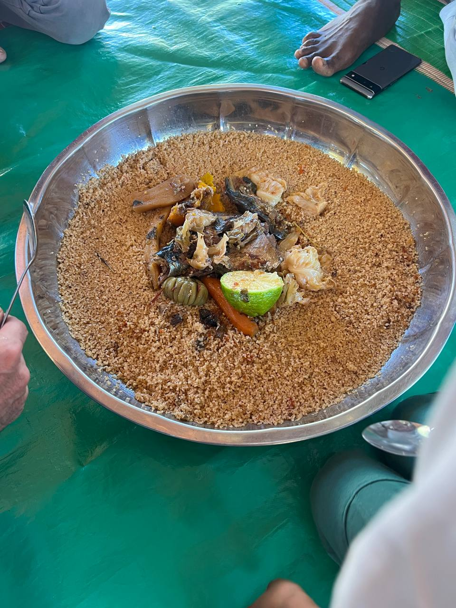
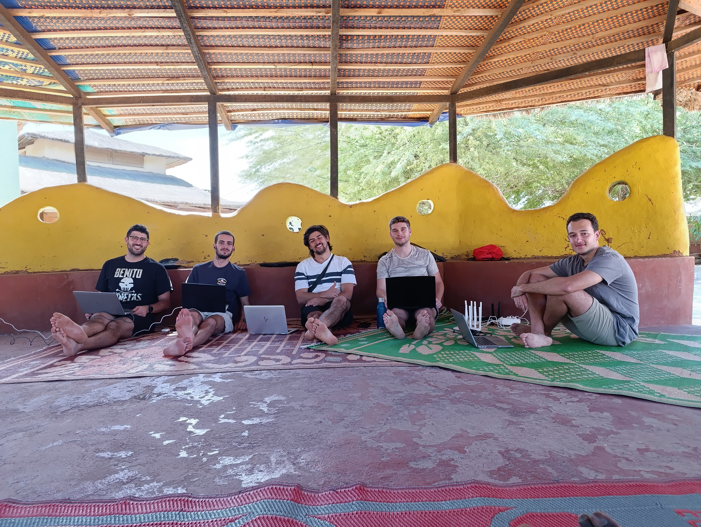
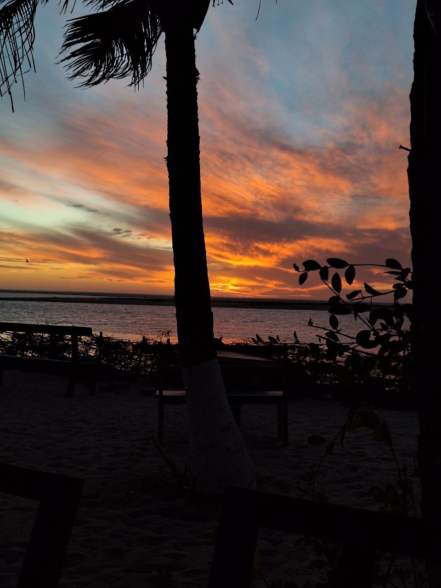
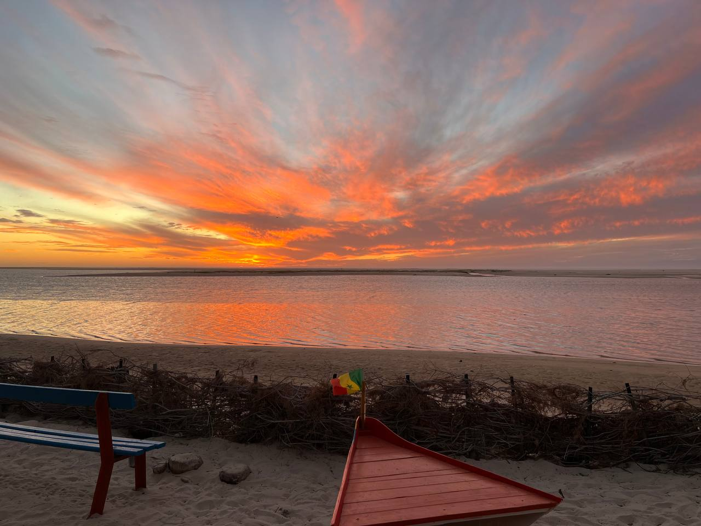

Por la mañana nos hemos dividido en dos grupos para abordar diferentes tareas relacionadas con la red y el proyecto. Un grupo (Roger y Sergio) se ha desplazado a Tabax Nité, donde se encuentran los servidores y routers que utilizamos. Durante la revisión, verificamos que todo sigue en orden y discutimos cómo mejorar la resiliencia de la red mediante:

* **Un sistema de gestión**: Este sistema permitirá cambiar automáticamente las contraseñas de los puntos de acceso. La herramienta es de código abierto y se llama [OpenWisp](https://openwisp.io) Llevamos tres años sin cambiar la contraseña, y básicamente medio Senegal ya la conoce. Este simple cambio podría reducir significativamente el número de usuarios "no deseados" en la red.

* **Un sistema de monitoreo**: Planeamos implementar [Zabbix](https://zabbix.com) para que nos avise cuando algo falle en la red. Este sistema se integra bien con nuestros routers (OpenWRT) y puede monitorizar también otros equipos, como radioenlaces y servidores. Además, podría notificarnos directamente en el chat de Telegram del proyecto, facilitando que todos estemos informados en tiempo real.

El otro grupo fue a investigar qué estaba sucediendo con la red de Aminata, que llevan unas semanas sin internet. Lamentablemente, al llegar al pueblo nos encontramos con un corte de electricidad, lo que imposibilitó diagnosticar el problema. Queda pendiente volver mañana para resolver esta situación.

Mientras tanto, Jaume se quedó con Joan y Aitor, enseñándoles cómo montar redes mesh. Aprovecharon para actualizar la documentación del proceso y cambiaron un nodo de la mesh en Sunukeur, sustituyendo el antiguo que había en casa de Pablo.

Luego, comimos el plato más típico de Senegal: *Thie bou diene*, un arroz con pescado y verduras.

Por la tarde, trabajamos todos juntos en el patio. El viento giró y una brisa agradable proveniente del Atlántico hizo que el ambiente fuera perfecto para trabajar al aire libre.

Más tarde, nos separamos para disfrutar de un momento de descanso. Fuimos al bar Teranga, conocido por sus vistas impresionantes al atardecer. La puesta de sol fue espectacular, posiblemente una de las más bonitas que hemos visto en Senegal. Los colores cambiaban de forma hipnótica durante casi 30 minutos, hasta que todo el rastro de luz desapareció en el horizonte.

Para cerrar el día, cenamos *ñepe* (no tengo ni idea de como se escribe), una especie de alubias deliciosas que son uno de los mejores menús para la cena. Después, disfrutamos de un rato de charla con la gente hospedada en Hahatay antes de irnos a descansar.

