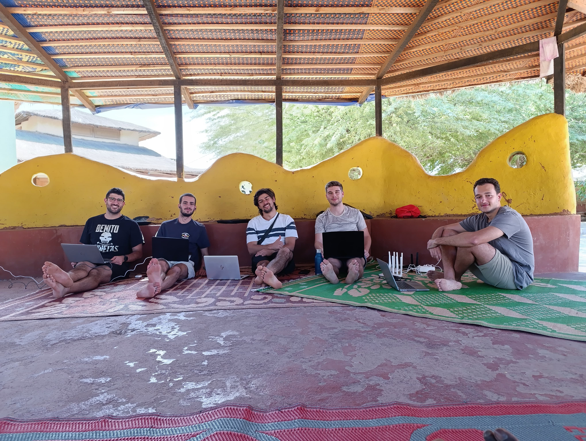
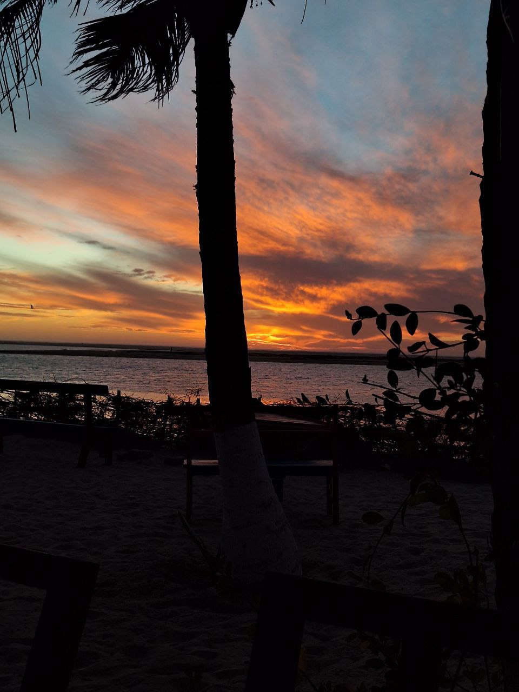

This morning, we split into two groups to tackle different tasks related to the network and the project. One group (Roger and Sergio) headed to Tabax Nité, where our servers and routers are located. During the review, we ensured everything was running smoothly and discussed ways to improve the network’s resilience by implementing:

- **A management system**: This system will allow us to automatically change the access point passwords. The tool is open-source and called [OpenWisp](https://openwisp.io). It’s been three years since we last changed the password, and by now, half of Senegal probably knows it. This simple change could significantly reduce the number of "unwanted" users on the network.

- **A monitoring system**: We plan to implement [Zabbix](https://zabbix.com), which will alert us when something in the network fails. This system integrates well with our routers (OpenWRT) and can also monitor other equipment, such as radio links and servers. Additionally, it could send notifications directly to the project’s Telegram chat, keeping everyone informed in real time.

The other group went to investigate what was happening with Aminata’s network, which has been without internet for a few weeks. Unfortunately, when we arrived at the village, there was a power outage, making it impossible to diagnose the issue. We’ll need to return tomorrow to resolve this situation.

Meanwhile, Jaume stayed with Joan and Aitor, teaching them how to set up mesh networks. They took the opportunity to update the process documentation and replaced a mesh node in Sunukeur, swapping out the old one at Pablo’s house.

---

In the afternoon, we all worked together in the courtyard. The wind shifted, and a pleasant breeze from the Atlantic created the perfect environment for outdoor work.

Later, we took some time to relax and headed to Teranga bar, known for its stunning sunset views. The sunset was spectacular—possibly one of the most beautiful we’ve seen in Senegal. The colors shifted hypnotically for almost 30 minutes until all traces of light disappeared over the horizon.

To end the day, we had *ñepe* (not sure about the spelling), a type of delicious bean dish that’s one of the best dinner options. Afterward, we enjoyed chatting with the guests staying at Hahatay before calling it a night.
