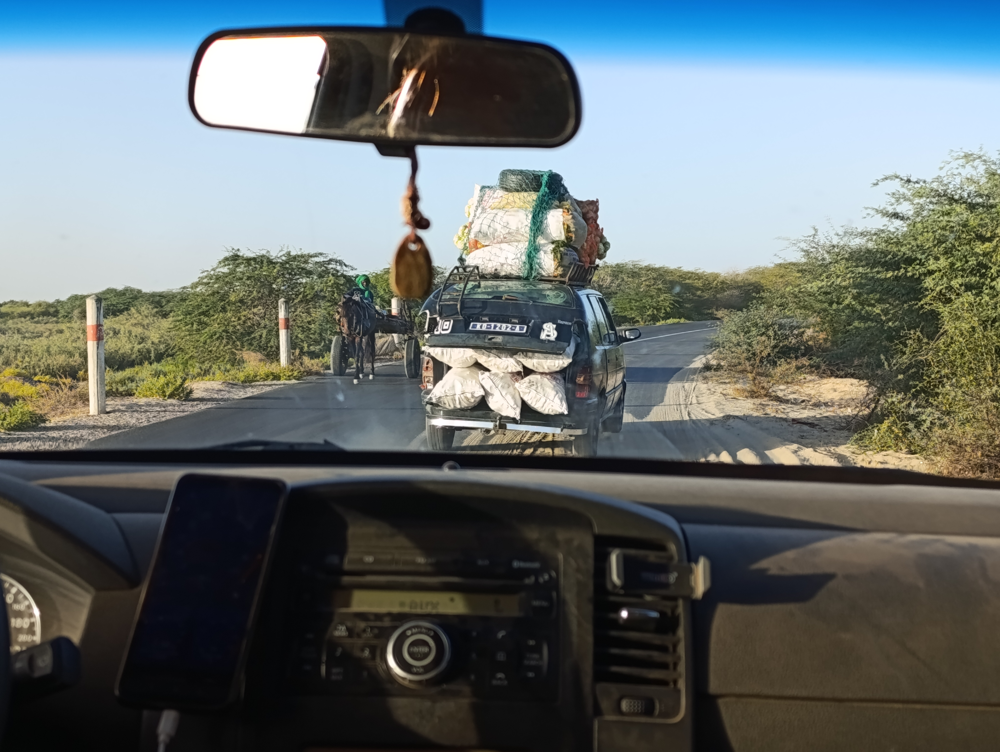

Hoy costó despertarse a todo el equipo ya que la cena se nos alargó un poco, así que fue una mañana un poco de relax.

Sergio se dirigió a Saint Louis para visitar un antiguo proyecto en el que colaboró en 2020 en el centro "Mame Fatime Konté". Aprovechó también para comprar algunos souvenirs para sus allegados. Mientras tanto, Jaume estuvo ayudando a Pablo con el pozo y la bomba. Aitor dedicó la mañana a repasar para un examen que tiene justo al volver, y Joan aprovechó para recuperar un par de clases que se ha perdido este cuatrimestre. Más tarde, se reunieron con Pablo para redactar adecuadamente el problema de la salinidad en el pozo de agua y poder presentarlo a algún experto que les indique posibles soluciones.

Por la tarde, Aitor y Joan fueron a ver a los pescadores en Gen’dar, en la lengua de tierra de Saint Louis. Fue impactante presenciar la llegada de los pescadores en sus enormes cayucos tras una jornada de trabajo. Luego, dieron un paseo por la isla antes de reunirse con el resto del equipo en Tabax Nite.

Mientras tanto, Jaume, Roger y Sergio estuvieron en Tabax Nite ultimando los últimos detalles antes de partir de Gandiol. Primero, Jaume y Roger perforaron un boquete en la pared de Fess con un taladro, varillas metálicas y un martillo para pasar el cable Ethernet que venía desde la casa de la mujer. Más tarde, Sergio llegó con una vieja caja de ordenador vacía, que se utilizaría como "rack" improvisado.

Hasta el momento, el "centro de datos" había estado bastante desprotegido y expuesto a agentes externos como el polvo. Además, este año la época de lluvias fue especialmente fuerte y una parte del tejado se vino abajo. Para evitar que los principales componentes de la red sufrieran daños, decidimos reciclar la vieja caja de ordenador, desmantelarla y usarla como "rack" para proteger los equipos. Además, le añadimos un ventilador para garantizar una adecuada refrigeración. El resultado nos dejó muy satisfechos.


Sergio y Roger montando todos los elementos de la red en el nuevo "rack"



Y así quedó al final :)
