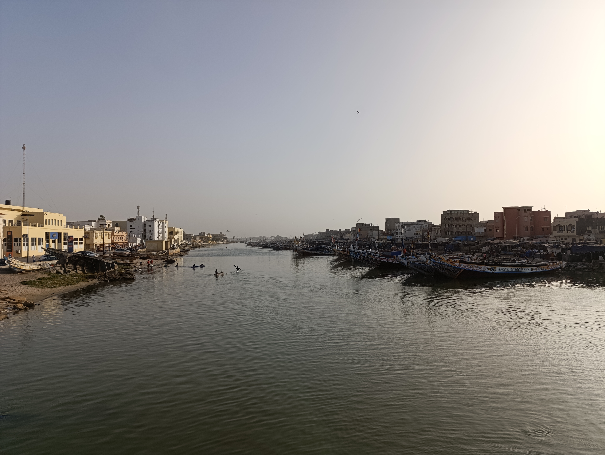
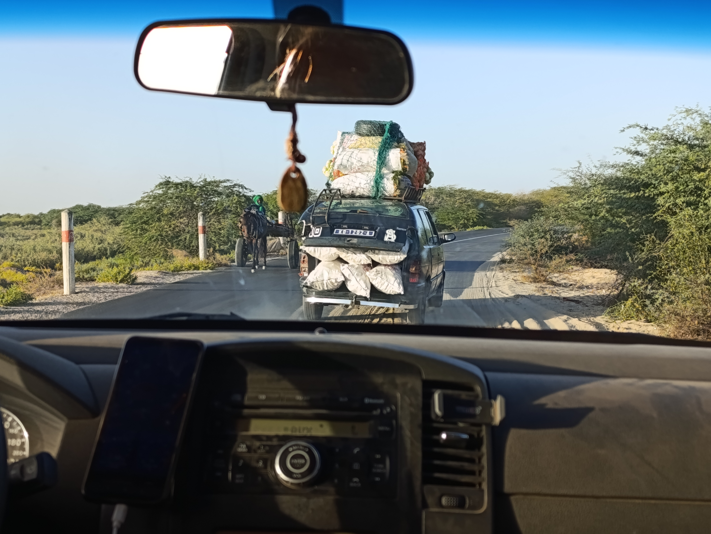
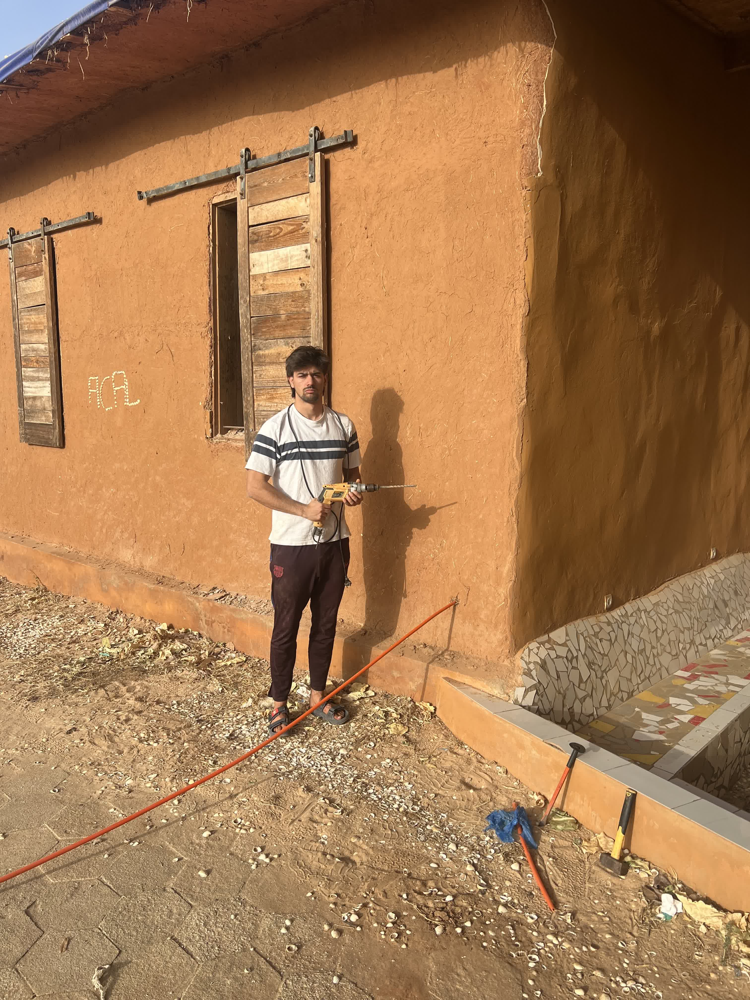

Today, the whole team struggled to wake up since dinner went on a bit late, so the morning was a bit more relaxed.

Sergio headed to Saint Louis to visit an old project he collaborated on in 2020 at the Mame Fatime Konté center. He also took the opportunity to buy some souvenirs for his loved ones. Meanwhile, Jaume helped Pablo with the well and the pump. Aitor spent the morning studying for an exam he has right after returning, and Joan caught up on a couple of classes he missed this semester. Later, they joined Pablo to properly document the salinity problem in the well so they could present it to an expert who might suggest possible solutions.

In the afternoon, Aitor and Joan went to see the fishermen in Gen’dar, on the Saint Louis peninsula. Witnessing the arrival of the fishermen in their enormous cayucos after a long day of work was quite an impact. Then, they took a walk around the island before meeting up with the rest of the team at Tabax Nite.

Meanwhile, Jaume, Roger, and Sergio stayed in Tabax Nite, finishing the last details before leaving Gandiol. First, Jaume and Roger drilled a hole in the Fess wall using a drill, metal rods, and a hammer to pass through the Ethernet cable coming from the woman’s house. Later, Sergio arrived with an old empty computer case, which would serve as an improvised "rack."

Until now, the "data center" had been quite exposed and unprotected from external factors like dust. Additionally, this year’s rainy season was particularly strong, causing part of the roof to collapse. To prevent the main network components from being damaged, we decided to repurpose the old computer case, dismantle it, and use it as a "rack" to protect the equipment. We also added a fan to ensure proper cooling. The final result left us very satisfied.


Sergio and Roger assembling all the network elements in the new 'rack'



Y así quedó al final :)
