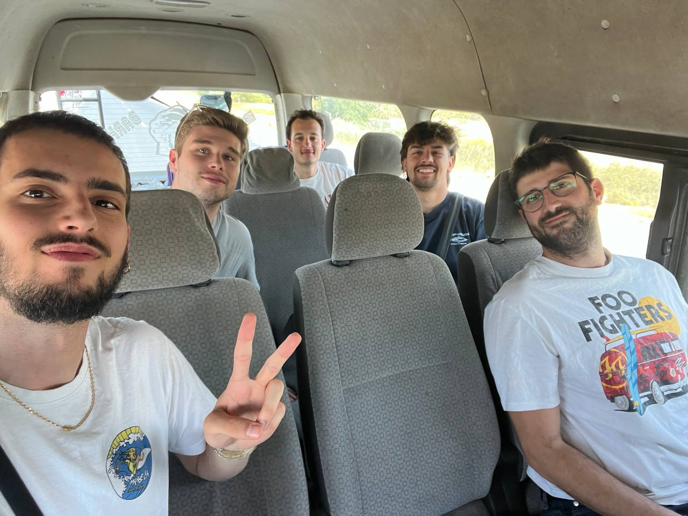
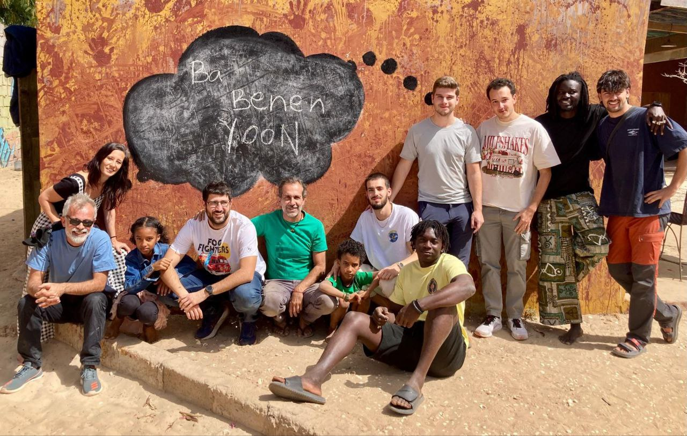

Hoy llegó nuestro último día en Gandiol, marcado por la despedida.

Nos levantamos sin prisa y disfrutamos de un desayuno tranquilo. Como ya sabréis si habéis leído los posts anteriores, es el mejor momento del día: café, café Touba, bocadillos de aceite y sal picante, y para los más goloses, chocopain. Pero lo mejor, como siempre, fue la compañía y la conversación.

Lorenzo vino expresamente para pasar la mañana con nosotros y despedirnos. Pasamos el tiempo haciendo maletas, dejando todo en orden y preparándonos para la despedida, que tuvo un sabor agridulce. Nos sentimos satisfechos con el trabajo realizado: cumplimos los objetivos propuestos, fortalecimos la red y mejoramos su resiliencia y estabilidad, algo que era muy necesario. Pero, como siempre, las despedidas son difíciles, porque este proyecto ha tejido lazos emocionales muy fuertes a lo largo de los años.

Hoy no pudimos compartir la comida con todos, ya que había un evento en Hahatay sobre TODO. Para comer, Salif nos preparó unos bocadillos de huevo duro y *petit pois* que hace su tía. Algunos los disfrutaron antes de subir al taxi, mientras que otros, entre las despedidas, se quedaron sin ellos con las prisas de recoger todo :(.

Por la tarde, Bachir, el mismo taxista que nos trajo, nos recogió para llevarnos a Saint Louis. Durante el trayecto, hicimos una breve parada en Louga para entrenar a las palomas mensajeras que nos dejó Salif, las cuales, en unas horas, deberían regresar solas a Saint Louis.

En el aeropuerto, el grupo se separó. Aitor, Joan y Sergio regresaron a Barcelona con las maletas llenas de recuerdos, souvenirs, camisetas de fútbol, ropa de la friperie y el corazón bien lleno. Por otro lado, Jaume y Roger se quedarán una semana más para hacer una ruta en bici por Casamance. Quizás haya algún bonus track del blog, quién sabe.

Con esto nos despedimos, esperando que este blog haya logrado transmitir un poco de lo que sentimos y hacemos cuando estamos en este maravilloso pueblo.

Ba benen Yoon!

