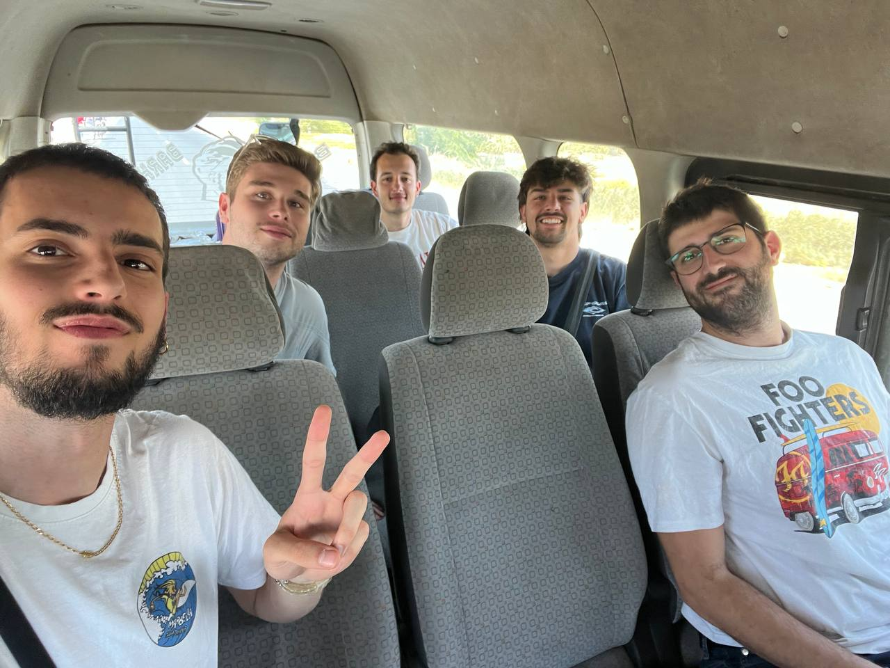
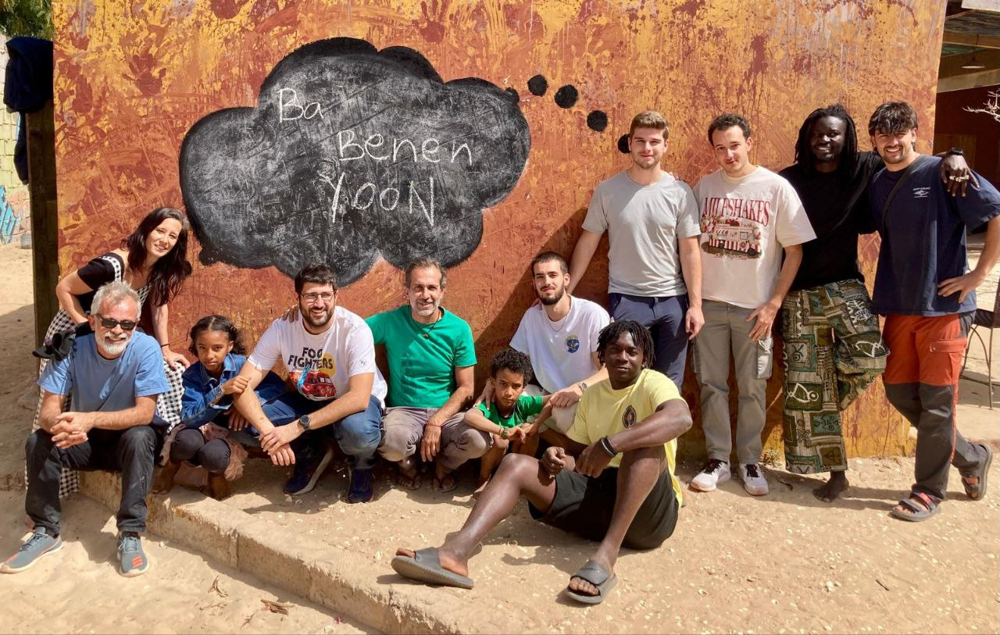

Today marked our final day in Gandiol, filled with goodbyes.

We woke up without rushing and enjoyed a peaceful breakfast. As you may already know from previous posts, this is the best part of the day: coffee, Touba coffee, sandwiches with oil and spicy salt, and for those with a sweet tooth, chocopain. But, as always, the best part was the company and the conversation.

Lorenzo came specifically to spend the morning with us and say goodbye. We spent the time packing, organizing everything, and preparing for the farewell, which was bittersweet. We felt satisfied with the work we had done: we met our goals, strengthened the network, and improved its resilience and stability—something that was much needed. But, as always, goodbyes are hard because this project has created strong emotional bonds over the years.

Unfortunately, we couldn't have lunch with everyone today since there was an event at Hahatay about TODO. Instead, Salif prepared us some sandwiches with boiled eggs and *petit pois*, made by his aunt. Some of us enjoyed them before getting into the taxi, while others, caught up in the rush of saying goodbye and packing, missed out on them. :(

In the afternoon, Bachir, the same taxi driver who brought us here, picked us up to take us to Saint Louis. Along the way, we made a brief stop in Louga to train the carrier pigeons that Salif had left us. In a few hours, they should find their way back to Saint Louis on their own.

At the airport, the group split up. Aitor, Joan, and Sergio returned to Barcelona with their suitcases full of memories, souvenirs, football jerseys, friperie clothes, and hearts full of emotions. Meanwhile, Jaume and Roger will stay for another week to go on a cycling trip through Casamance. Maybe there will be a bonus track on the blog—who knows?

With this, we say goodbye, hoping that this blog has managed to convey a little of what we feel and do when we are in this wonderful place.

Ba benen Yoon!

