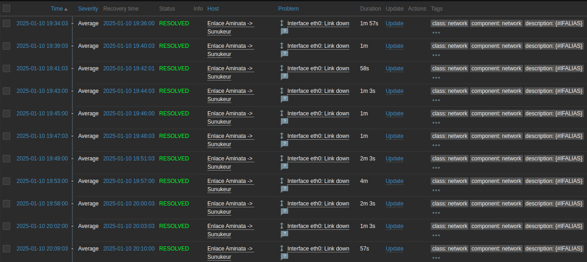
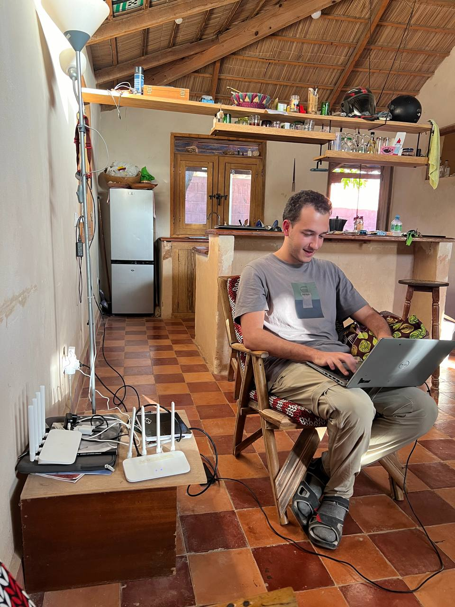
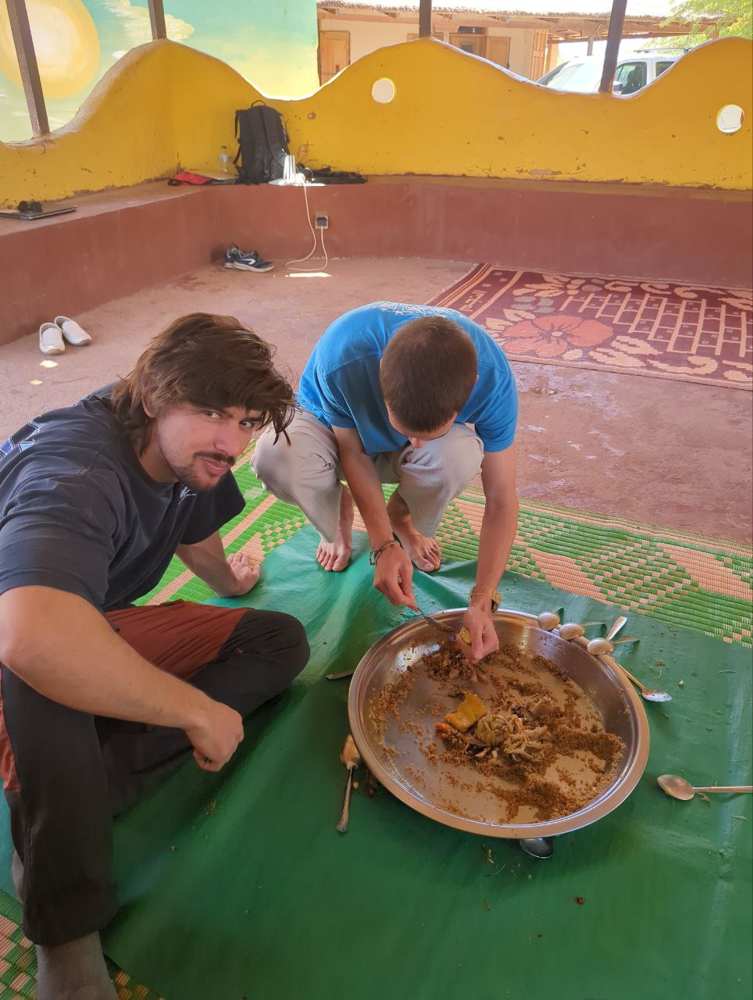
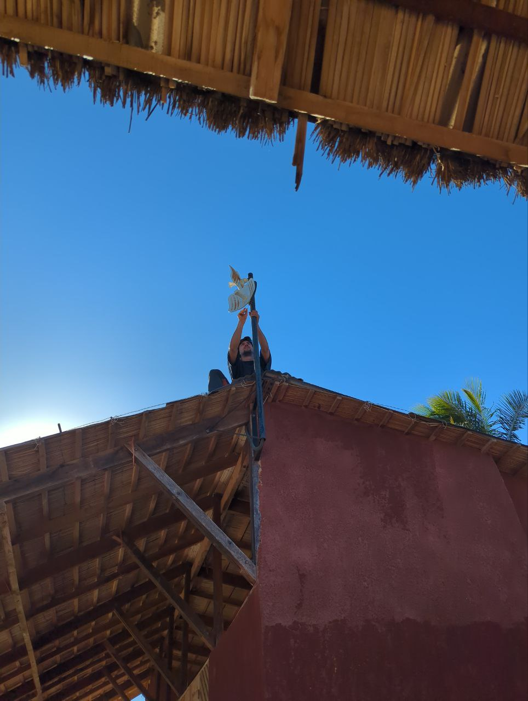
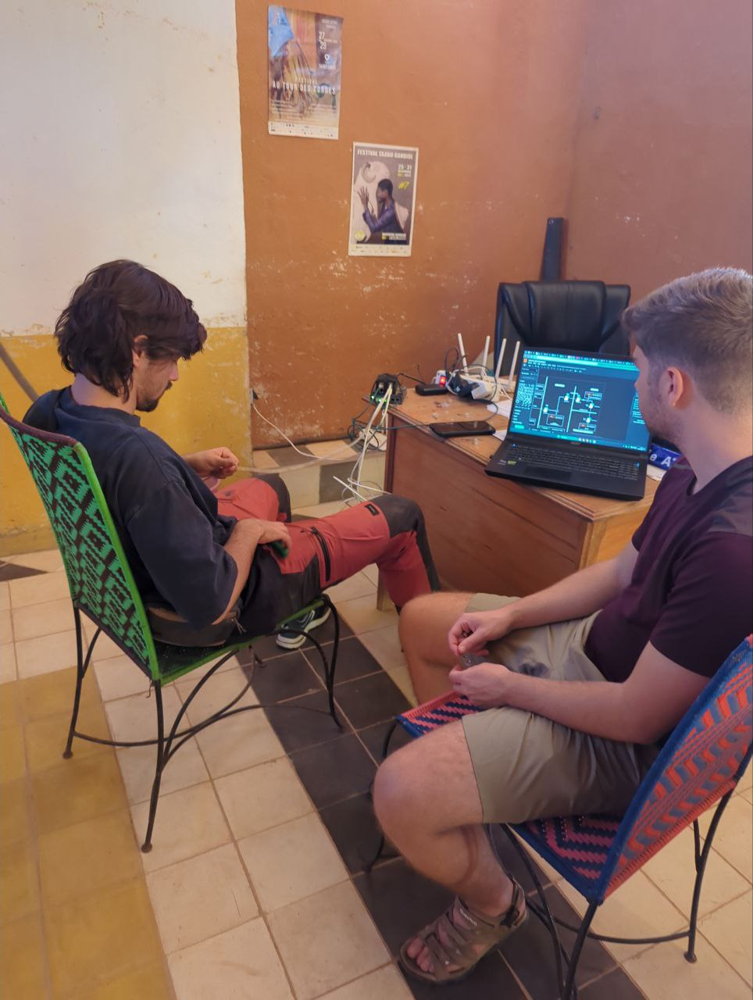

Hoy comenzamos el día con un buen desayuno y dividiéndonos en dos grupos para abordar las tareas programadas. Sergio, Jaume y Joan nos dirigimos a Aminata para intentar solucionar los problemas de conectividad en la red.

Desde el principio, nuestro objetivo fue diagnosticar por qué la red no estaba funcionando. Tras varias pruebas, confirmamos que tanto el router, con su sistema de wifi mesh, como el switch funcionaban correctamente. Sin embargo, los logs de monitoración revelaron que la antena llevaba varios días reiniciándose de forma intermitente. Con un poco de suerte, el problema podría estar relacionado con un mal contacto en el cable ethernet, lo que podría explicar los reinicios continuos de la antena.

Mientras tanto, Roger y Aitor, al no poder trabajar en Aminata debido a la falta de red, volvieron a Sunukeur. Sin embargo, al llegar, se encontraron con otro obstáculo: un corte de luz que también dejó sin conexión la red. Decidieron dirigirse a Fess (2km andando), pero al solicitar las llaves a Pablo, descubrieron que estaban con Sergio en Aminata. Optaron por quedarse en casa de Pablo, donde, tras un rato, la conexión volvió y pudieron avanzar en sus tareas.

Luego comimos Thiebou djen *rouge* en casa, una pequeña variación del Thiebou djen que incluye tomate en la salsa.

---

El objetivo principal de esta semana es automatizar el cambio de contraseñas del wifi. Creemos que con cambios de contraseñas periódicos, podremos reducir substancialmente el número de usuarios que no están vinculados de alguna manera a Hahatay. Para ello, un primer paso es intentar registrar los dispositivos en OpenWISP. Conseguimos registrar dos usuarios de prueba, aunque ambos presentaron algunos problemas. Debido a las fluctuaciones de tensión eléctrica, la conexión se perdió por la tarde, lo que limitó nuestro progreso en la solución de estos inconvenientes. A pesar de ello, avanzamos en la redacción de templates NetJSON para OpenWISP y planeamos probar primero el cambio de contraseña en un router cuando volviera la corriente a Sunukeur.

Por la tarde, Sergio, Jaume y Joan continuamos trabajando en Aminata. Realizamos un test del cable ethernet y confirmamos que los pines 3 y 6 de la antena estaban fallando, lo que explica los problemas recurrentes. Uno de los mejores fallos que podría haber dado :). Intentamos crimpar el nuevo cable, pero no dió tiempo a terminarlo, así que queda para mañana.

Finalmente, a las 18:30, dimos por concluida la jornada laboral y nos unimos a Lorenzo y Pablo para cenar en La Source. Disfrutamos de un delicioso Faco, cerrando el día con una buena comida y grandes conversaciones.

Aunque el día estuvo lleno de retos, seguimos avanzando y confiamos en resolver los problemas en Aminata y el registro de los routers en OpenWISP probablemente mañana.

