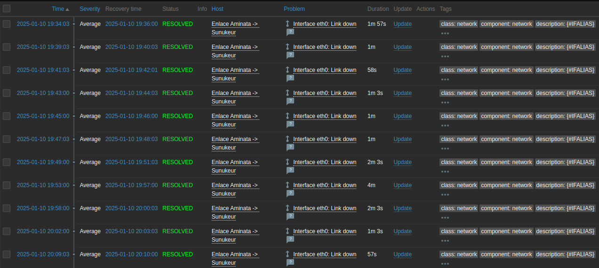
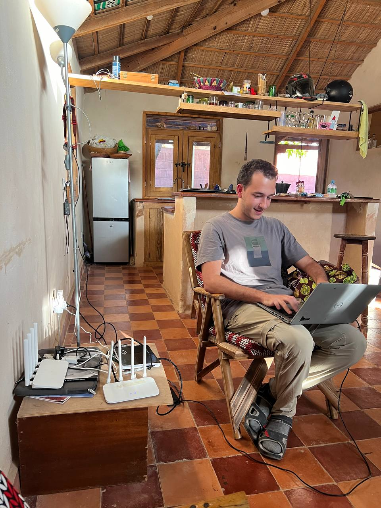
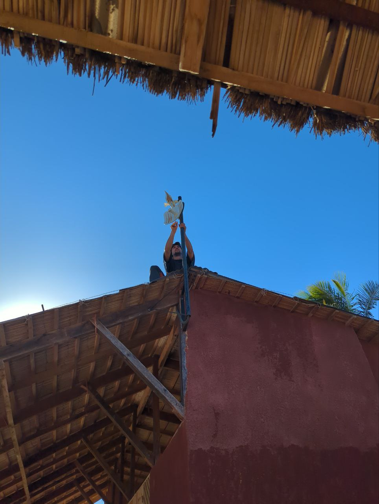

We started the day with a good breakfast and divided into two groups to tackle the planned tasks. Sergio, Jaume, and Joan headed to Aminata to try to solve the connectivity issues in the network.

From the beginning, our goal was to diagnose why the network wasn’t working. After several tests, we confirmed that both the router, with its mesh wifi system, and the switch were working correctly. However, the monitoring logs revealed that the antenna had been rebooting intermittently for several days. With some luck, the problem could be related to a poor connection in the ethernet cable, which might explain the continuous reboots of the antenna.

Meanwhile, Roger and Aitor, unable to work at Aminata due to the lack of network, returned to Sunukeur. However, upon arrival, they encountered another obstacle: a power outage that also took down the network. They decided to head to Fess (2km on foot), but when asking Pablo for the keys, they found out that Sergio had them at Aminata. They opted to stay at Pablo’s house, where, after a while, the connection returned, and they were able to make progress on their tasks.

Later, we had Thiebou djen *rouge* for lunch at home, a small variation of Thiebou djen that includes tomato in the sauce.

The main goal for this week is to automate the wifi password changes. We believe that with periodic password changes, we can significantly reduce the number of users who are not connected in some way to Hahatay. To achieve this, the first step is to try registering devices in OpenWISP. We managed to register two test users, although both presented some issues. Due to electrical fluctuations, the connection was lost in the afternoon, which limited our progress in solving these issues. Nevertheless, we advanced in drafting NetJSON templates for OpenWISP and plan to first test the password change on a single router once power is restored at Sunukeur.

In the afternoon, Sergio, Jaume, and Joan continued working at Aminata. We tested the ethernet cable and confirmed that pins 3 and 6 of the antenna were faulty, which explains the recurring problems. One of the best possible faults it could have been :). We attempted to crimp the new cable but didn’t have enough time to finish, so that task remains for tomorrow.

Finally, at 6:30 PM, we called it a day and joined Lorenzo and Pablo for dinner at La Source. We enjoyed a delicious Faco, ending the day with good food and great conversations.

Although the day was full of challenges, we’re making progress and are confident we’ll resolve the issues at Aminata and successfully register the routers in OpenWISP, hopefully tomorrow.

