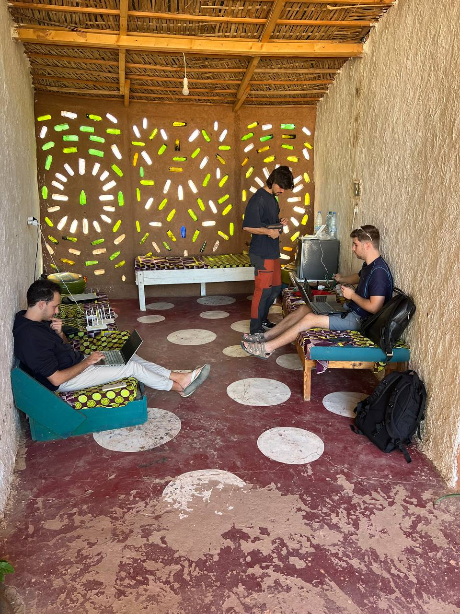
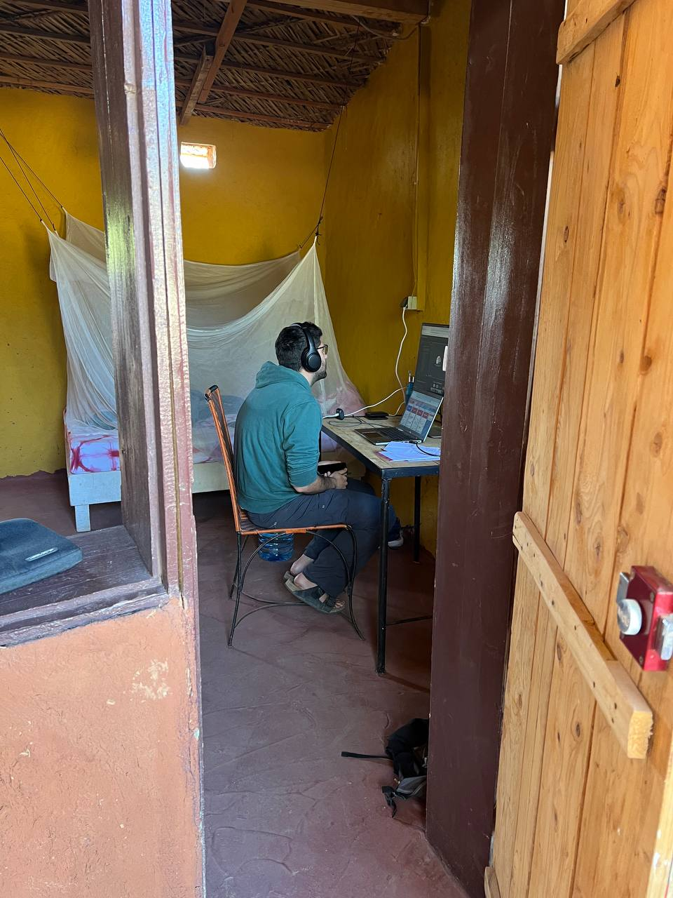
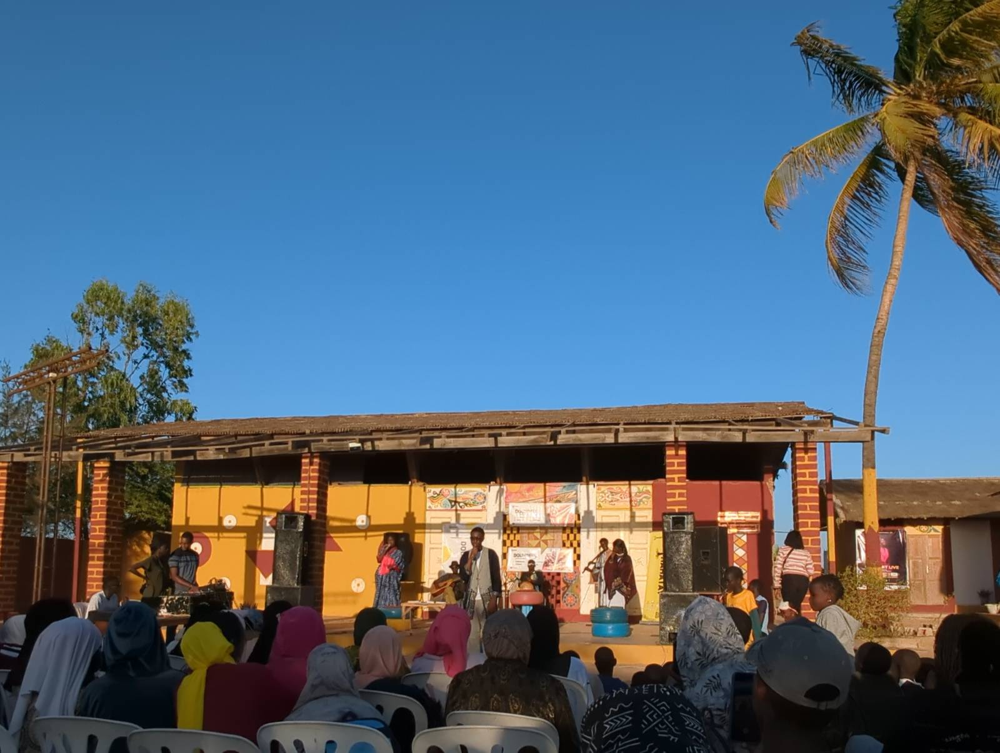
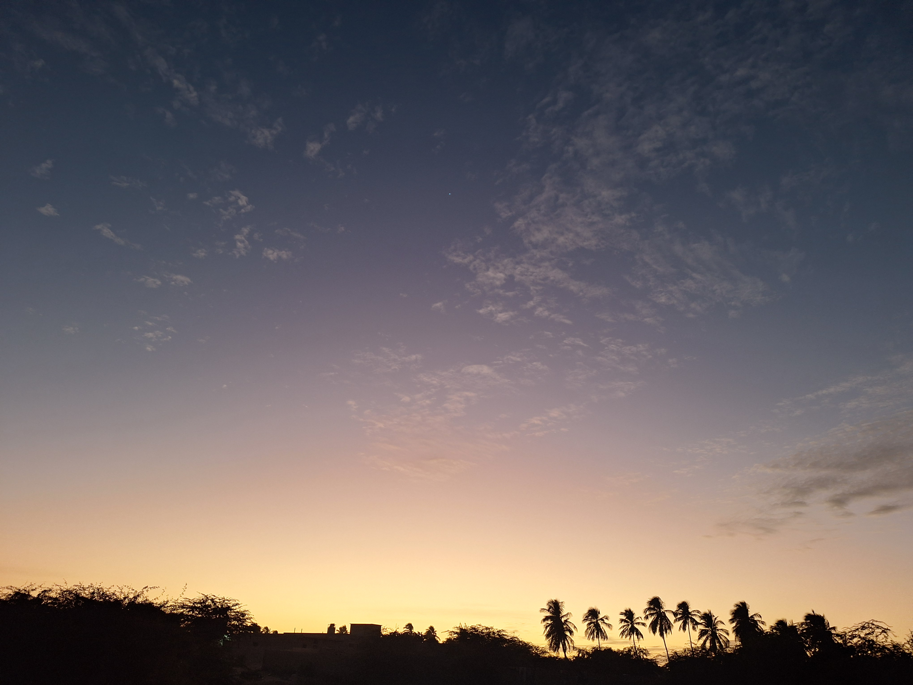
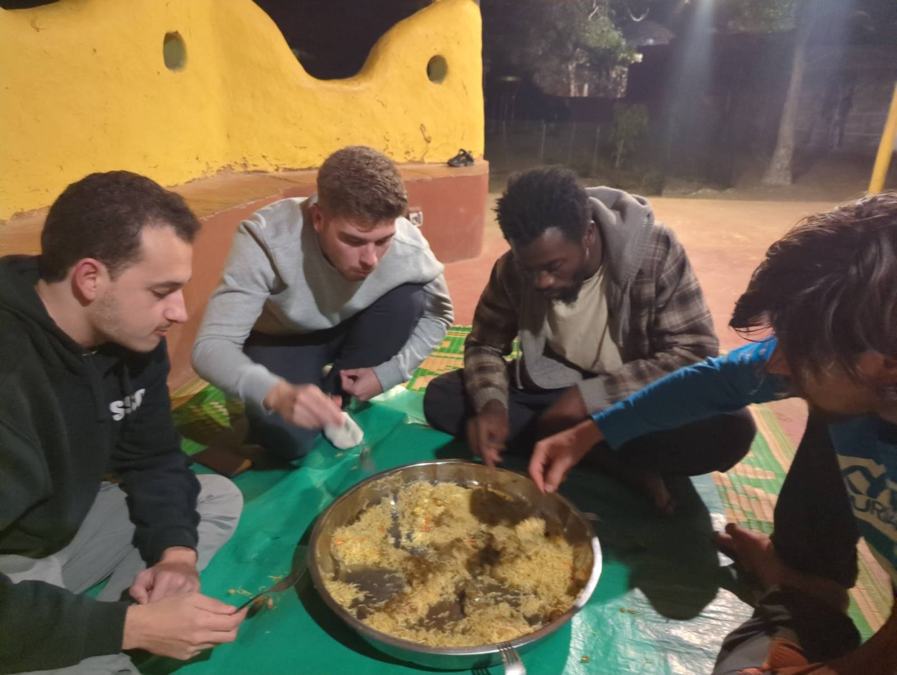

Por la mañana, nos hemos dividido en dos grupos para abordar las tareas pendientes del día:

### Jaume y Joan para arreglar Aminata y pimeros pasos con Zabbix

Jaume y Joan nos dirigimos a Aminata con la intención de resolver los problemas con las antenas que no se lograron solucionar ayer. La sorpresa fue que al llegar nos informaron que no habría luz hasta las 17:00, lo que nos obligó a posponer algunas tareas para mañana. Sin embargo, aprovechamos el tiempo para instalar un cable ethernet, que quedó perfectamente fijado, mientras que otro se resistió por razones que aún no entendemos del todo.

De regreso a Sunukeur, nos enfocamos en instalar un nuevo nodo en la red mesh. Este nodo lo integramos al servidor Zabbix, creado por Sergio el primer día. Tras configurarlo correctamente, realizamos algunas pruebas de notificación a través de Telegram, lo cual resultó exitoso.

### Roger y Aitor avanzan con OpenWISP

Mientras tanto, Roger y Aitor permanecieron en Sunukeur para solucionar los problemas con OpenWISP. Consiguieron registrar casi todos los routers de la zona y, lo más destacado, lograron cambiar la contraseña del WiFi en un router de prueba usando OpenWISP. Este era uno de los principales objetivos del día. Mañana planeamos probar el cambio simultáneo de contraseñas en varios routers para confirmar que el sistema funciona de manera eficiente.

### Concierto de Slam en Aminata

A las 17:00, asistimos a un concierto organizado en Aminata por residentes de Hahatay. Fue una experiencia única disfrutar de música autóctona en un ambiente tan especial. Al finalizar, compartimos una pequeña merienda que hizo el momento aún más agradable.

Estos días hay muy poco polvo en el ambiente, lo que es poco común, pero hace que las puestas de sol sean espectaculares. Esto es lo que vemos desde casa.

Terminamos el día cenando juntos, revisando los logros del día y planificando las tareas de mañana. Nos acostamos temprano, satisfechos con lo conseguido y llenos de energía para seguir adelante. Ha sido un día productivo y lleno de buenos momentos. Mañana, más.

