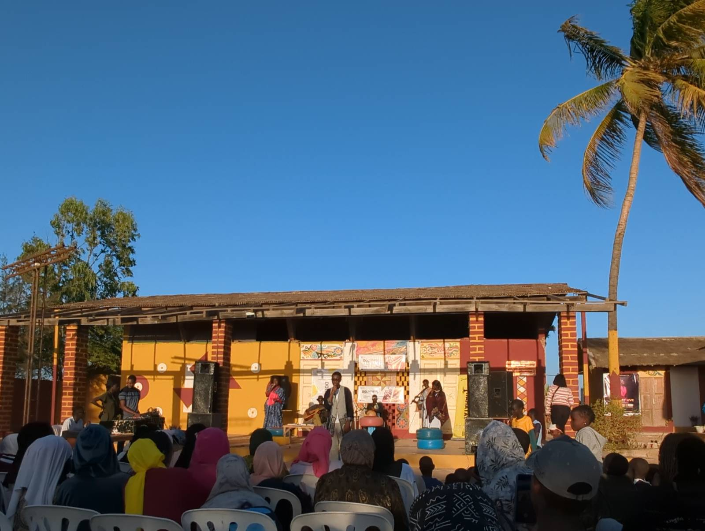
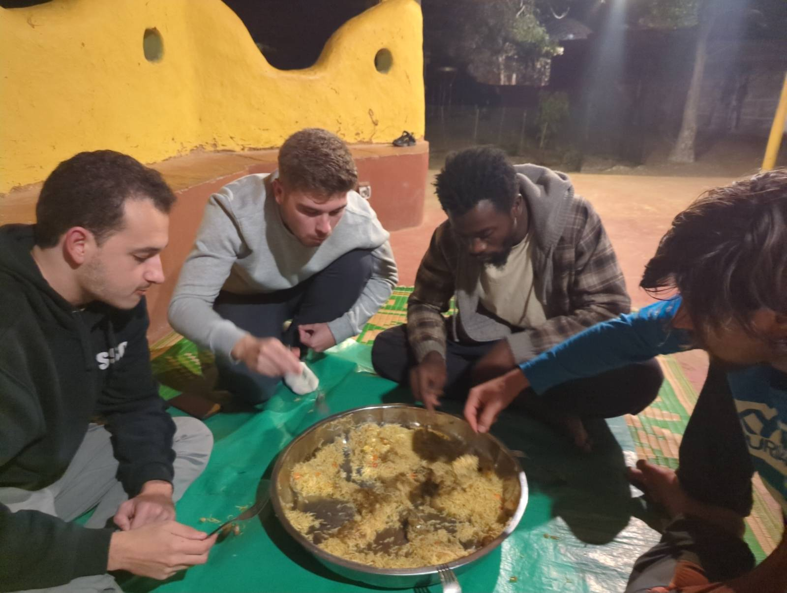

In the morning, we split into two groups to tackle the day’s tasks:

### Jaume and Joan Fix Aminata and Take First Steps with Zabbix

Jaume and Joan headed to Aminata with the goal of resolving the issues with the antennas that remained unsolved from the previous day. However, upon arrival, we were informed that there would be no power until 5:00 PM, forcing us to postpone some tasks until tomorrow. Nevertheless, we used the time to install an ethernet cable, which was perfectly secured, while another cable resisted for reasons we still don’t fully understand.

Back in Sunukeur, we focused on setting up a new node in the mesh network. This node was integrated into the Zabbix server created by Sergio on the first day. After configuring it correctly, we ran some notification tests via Telegram, which proved successful.

### Roger and Aitor Advance with OpenWISP

Meanwhile, Roger and Aitor stayed in Sunukeur to address issues with OpenWISP. They managed to register nearly all the routers in the area and, most notably, successfully changed the WiFi password on a test router using OpenWISP. This was one of the day’s main objectives. Tomorrow, we plan to test changing the passwords of multiple routers simultaneously to confirm that the system works efficiently.

### Slam Concert in Aminata

At 5:00 PM, we attended a concert organized in Aminata by residents of Hahatay. It was a unique experience to enjoy traditional music in such a special setting. After the concert, we shared a small snack that made the moment even more enjoyable.

These days, there is very little dust in the air, which is uncommon but makes the sunsets spectacular. This is the view from our house.

We ended the day with a group dinner, reviewing the day’s achievements and planning for tomorrow’s tasks. We went to bed early, satisfied with what we accomplished and full of energy to keep moving forward. It was a productive day filled with great moments. More tomorrow.

