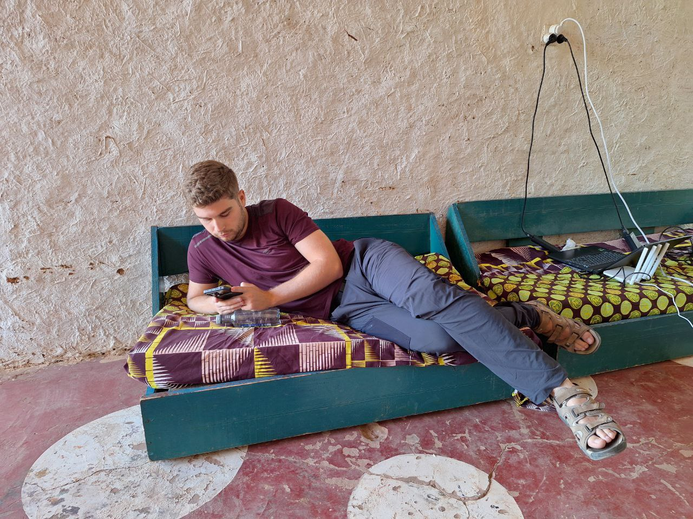
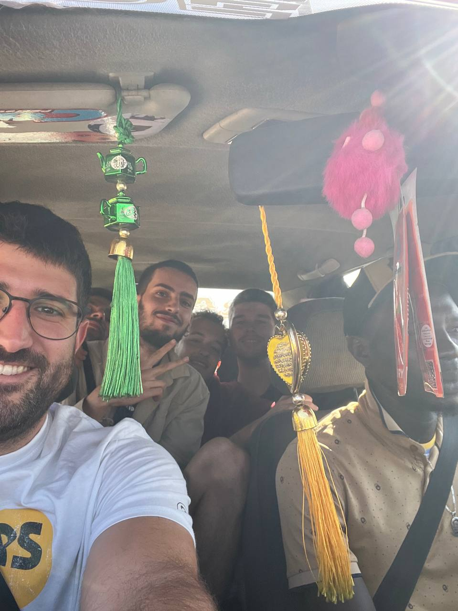
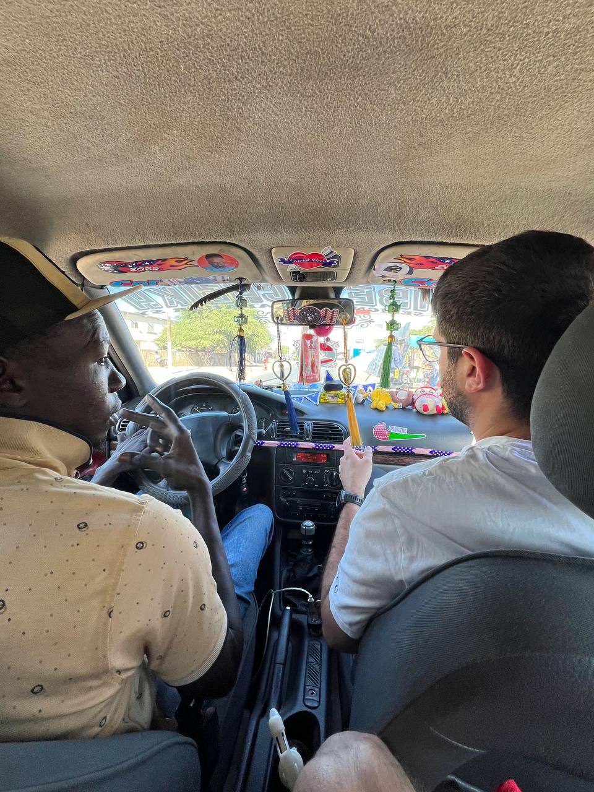
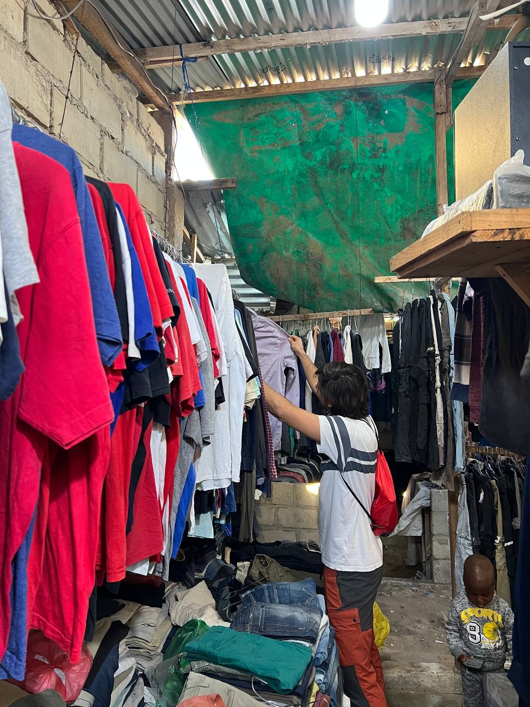
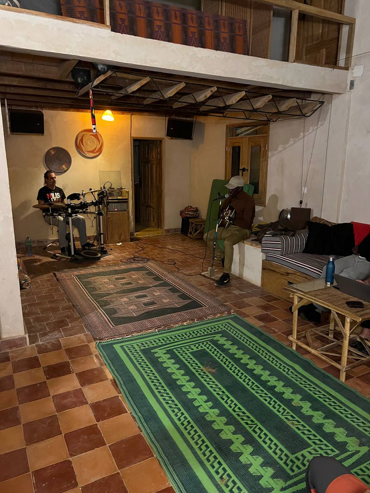
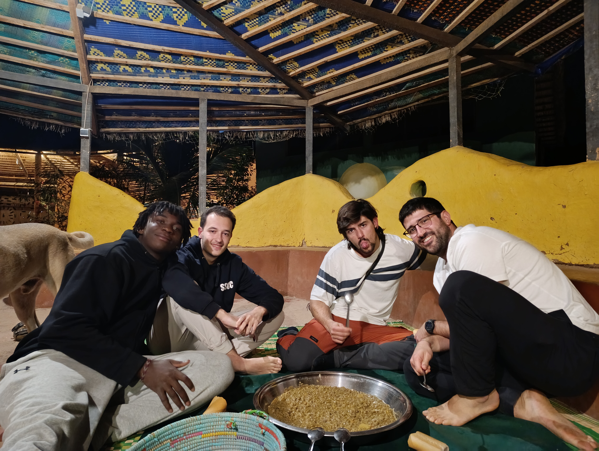

El día comenzó temprano en Sunukeur, con un desayuno que nos sirvió para arrancar con energía. Nos dividimos en los mismos equipos de dos del día anterior y dedicamos la mañana a avanzar en las tareas técnicas que teníamos pendientes.  

### Jaume y Joan: Avances en Zabbix y mantenimiento de la red  

Jaume y Joan se enfocaron en organizar y actualizar el registro de routers en el Excel mientras instalaban los paquetes necesarios para Zabbix. Aprovecharon el tiempo para añadir todos los routers y antenas disponibles al servidor Zabbix y realizaron pruebas para configurar un template con los triggers necesarios. Esto nos permitirá recibir solo las notificaciones más relevantes, optimizando la gestión de la red. También reemplazaron el router Linksys de la residencia por un Xiaomi nuevo, una mejora notable en la estabilidad de la conexión. Además, flashearon dos routers más que pronto se integrarán en la red.  

### Aitor y Roger: Soluciones con OpenWISP y actualización de firmware  

Por su parte, Aitor y Roger trabajaron en la integración de nuevos routers en el servidor OpenWISP. Durante la mañana, actualizaron el firmware de dos routers Linksys que llevaban tres años con una versión obsoleta de OpenWRT. Fue un proceso delicado, ya que cualquier error podría inutilizar los dispositivos ("brickearlos", como lo llamamos), pero todo salió bien. También repararon un router de la malla de Sunukeur que había perdido su configuración durante su integración con OpenWISP. Por último, avanzaron en la creación de un template de configuración NetJSON que permitirá automatizar el proceso de configuración de routers maestros en el futuro.  

### Tarde en Saint-Louis: Centros de Hahatay y exploración local  

Por la tarde, nos dirigimos en taxi a Saint-Louis. Aquí es donde comenzó una pequeña anécdota: éramos cinco personas y el taxi estaba diseñado para cuatro. Decidimos apretarnos un poco para no dividirnos, pero la policía nos detuvo durante el trayecto y nos multó con 1.000 francos CFA por exceder el límite permitido de pasajeros. A pesar del contratiempo, seguimos nuestro camino y aprovechamos el resto de la tarde.  

  
  

Aitor, Sergio y Joan, junto a Lorenzo, visitaron los dos centros de Hahatay en la isla. Allí tomaron medidas para evaluar cuántos routers son necesarios para optimizar la conectividad en esas instalaciones. Mientras tanto, Jaume y Roger aprovecharon para explorar la friperie, un mercado de ropa de segunda mano con una variedad increíble y precios económicos. Fue una experiencia interesante y útil, especialmente para quienes necesitaban reponer ropa para el resto del viaje.  

  

Antes de regresar, hicimos una parada para comprar todo lo necesario para la barbacoa que tenemos planeada para mañana.  

### Concierto improvisado en Hahatay  

De vuelta en Hahatay, nos esperaba una sorpresa inesperada: un concierto improvisado. Tafa apareció con su guitarra, y Pablo lo acompañó con la batería. La música llenó el ambiente, creando una atmósfera mágica. Más tarde se unió X, una joven cantante de Dakar que está en Hahatay como parte de una residencia artística. Su voz añadió un toque especial, y poco a poco nos fuimos sumando todos, algunos con palmas, otros con pequeños intentos de canto. Fue un momento inolvidable que reforzó los lazos entre todos los presentes.  

  

### Cena y puesta de sol  

La cena fue otro momento destacado del día. Disfrutamos de *petit pois*, un plato local similar a los garbanzos, que se ha convertido en uno de nuestros favoritos aquí. La velada continuó con más música y buenas conversaciones, mientras repasábamos los logros del día y planificábamos las tareas para mañana.  

  

Finalmente, nos retiramos a descansar, satisfechos con todo lo conseguido y listos para afrontar un nuevo día lleno de retos y sorpresas.  