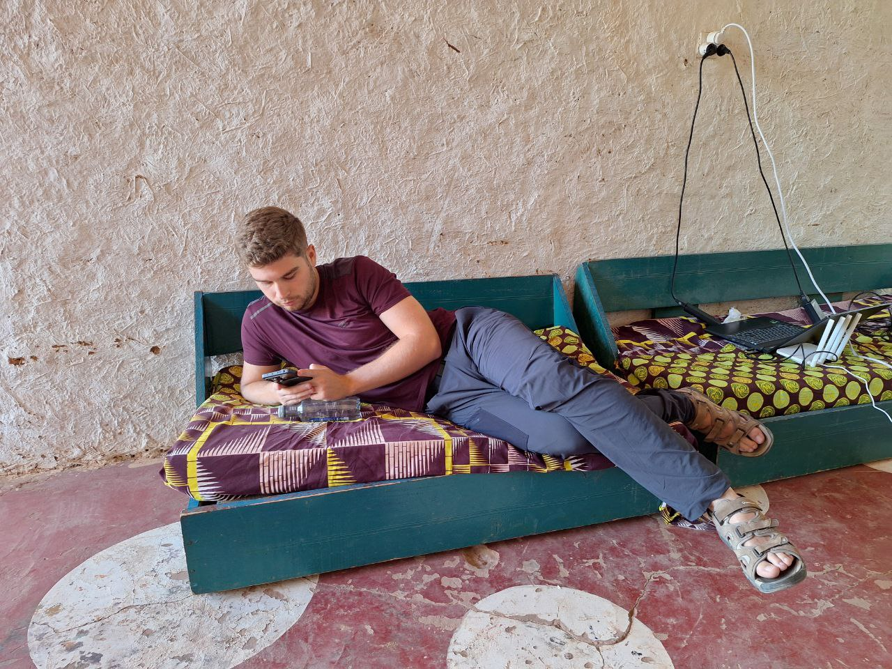
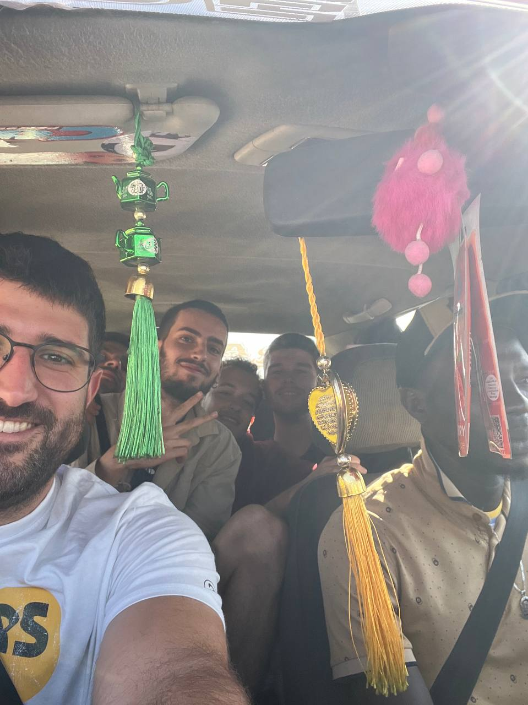
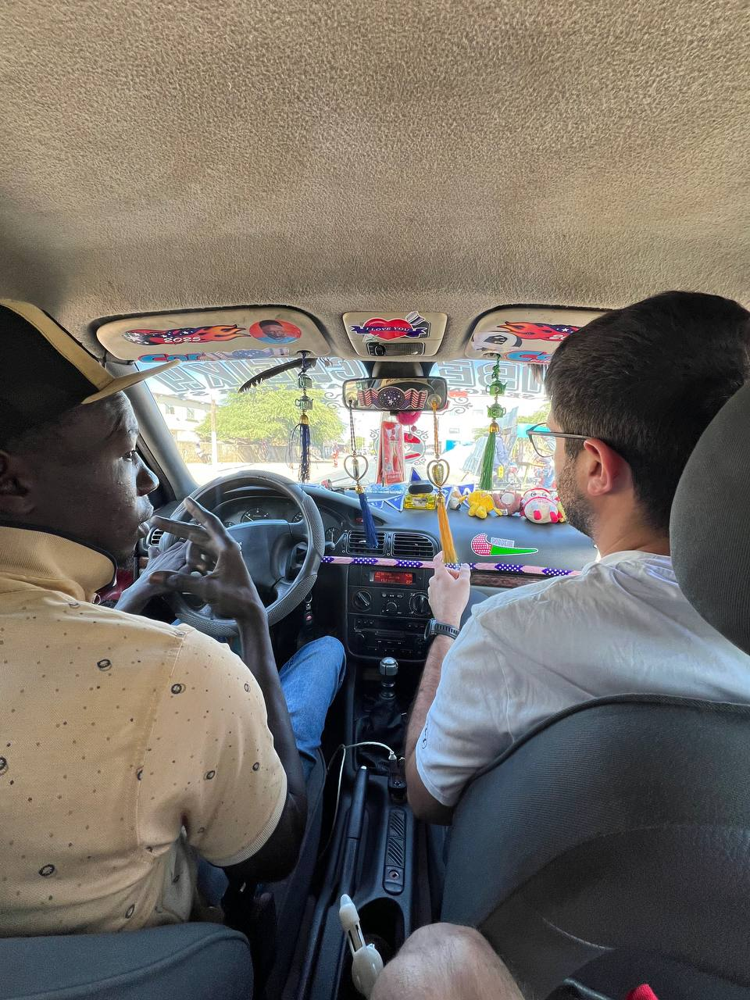
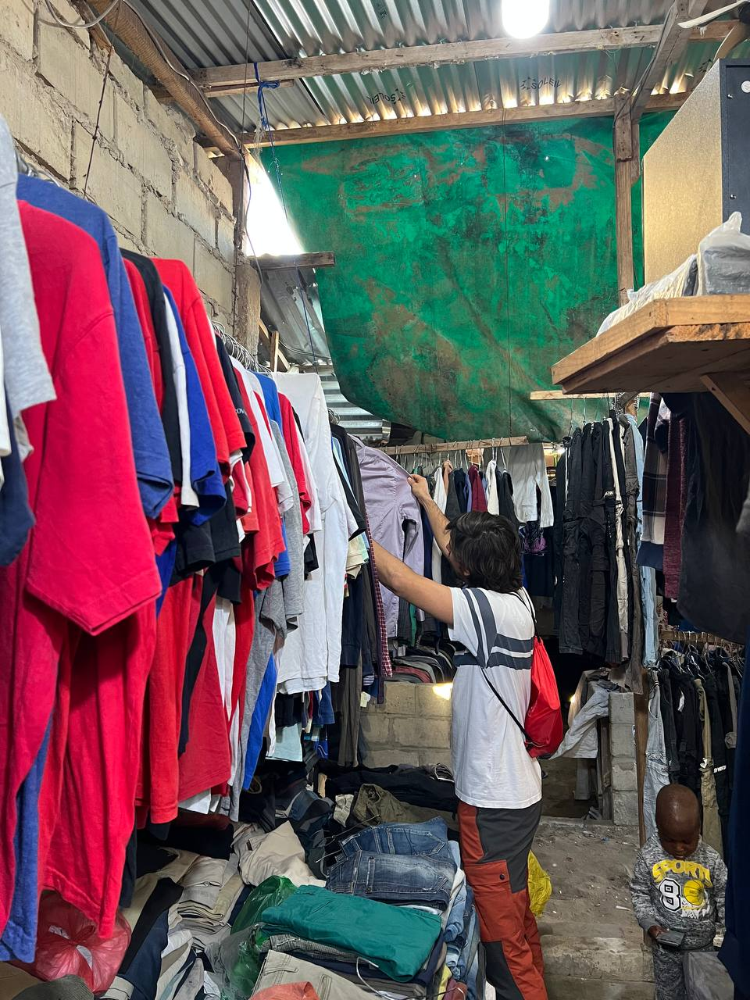
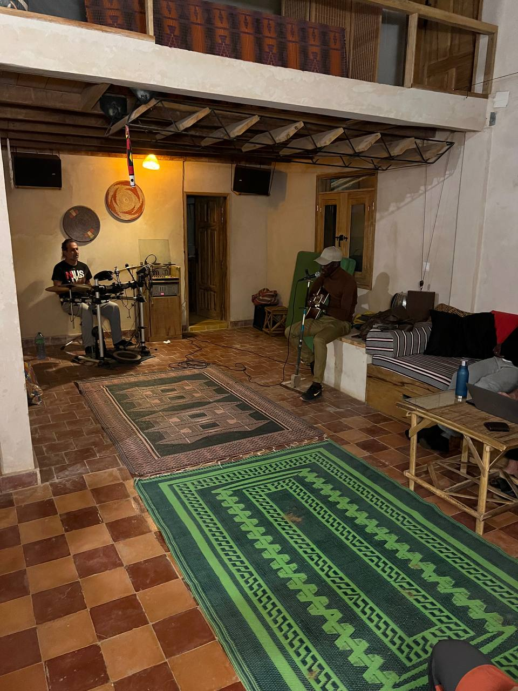
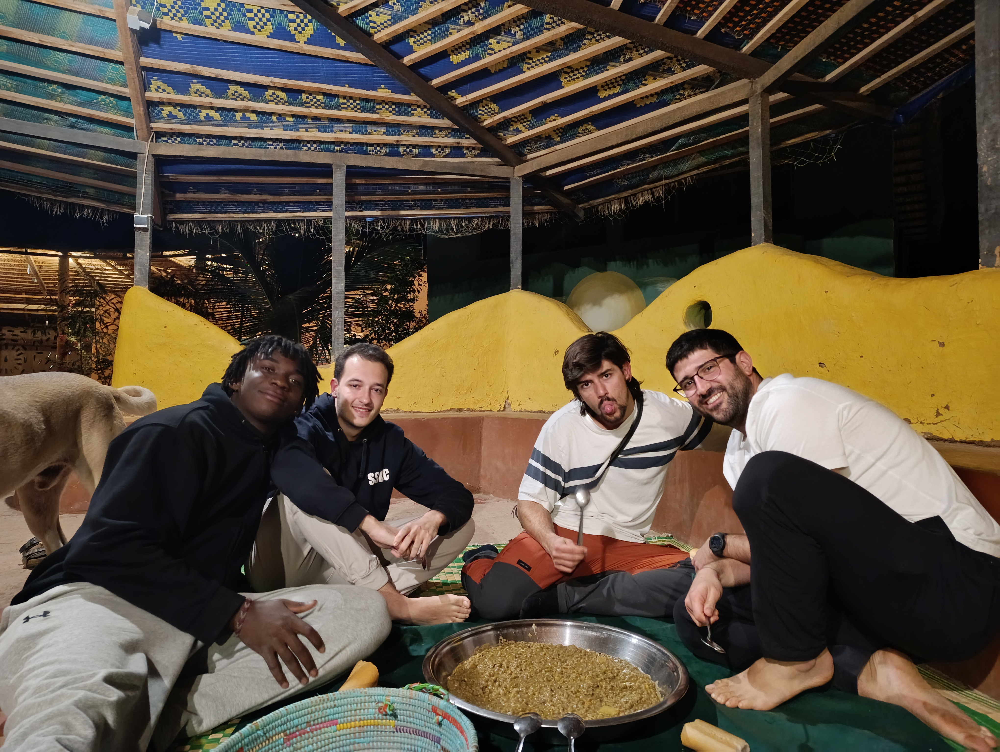

The day began early in Sunukeur, with breakfast giving us the energy to get started. We split into the same pairs as the previous day and spent the morning tackling the technical tasks on our agenda.  

### Jaume and Joan: Progress with Zabbix and Network Maintenance  

Jaume and Joan focused on organizing and updating the router registry in Excel while installing the necessary Zabbix packages. They also added all available routers and antennas to the Zabbix server and conducted tests to set up a template with the desired triggers. This will allow us to receive only the most relevant notifications, optimizing network management. They also replaced the Linksys router in the residence with a new Xiaomi router, significantly improving connection stability. Additionally, they flashed two more routers that will soon be integrated into the network.  

### Aitor and Roger: OpenWISP Solutions and Firmware Updates  

Meanwhile, Aitor and Roger worked on integrating new routers into the OpenWISP server. During the morning, they updated the firmware on two Linksys routers that had been running an outdated OpenWRT version for three years. The process was delicate since any mistake could render the devices unusable (or "bricked," as we call it), but everything went smoothly. They also repaired a router in Sunukeur’s mesh network that lost its configuration during OpenWISP integration. Lastly, they made progress on creating a NetJSON configuration template to automate the process of configuring master routers in the future.  

### Afternoon in Saint-Louis: Hahatay Centers and Local Exploration  

In the afternoon, we headed to Saint-Louis by taxi. This is where a little anecdote began: there were five of us, but the taxi was designed for four. We decided to squeeze in to avoid splitting up, but the police stopped us during the ride and fined us 1,000 CFA francs for exceeding the passenger limit. Despite this hiccup, we continued on our way and made the most of the afternoon.  

  
  

Aitor, Sergio, and Joan, along with Lorenzo, visited the two Hahatay centers on the island. There, they took measurements to assess how many routers are needed to optimize connectivity at those facilities. Meanwhile, Jaume and Roger explored the *friperie*, a second-hand clothing market with an impressive variety and affordable prices. It was an interesting and useful experience, especially for those who needed to replenish their wardrobe for the rest of the trip.  

  

Before heading back, we made a stop to buy everything needed for tomorrow’s barbecue.  

### Improvised Concert at Hahatay  

Back at Hahatay, we were surprised by an impromptu concert. Tafa brought his guitar, and Pablo joined in on the drums. The music filled the air, creating a magical atmosphere. Later, X, a young singer from Dakar currently doing an artist residency at Hahatay, joined in. Her voice added a special touch, and little by little, we all got involved—some clapping, others attempting to sing. It was an unforgettable moment that strengthened the bonds between everyone present.  

  

### Dinner and Sunset  

Dinner was another highlight of the day. We enjoyed *petit pois*, a local dish similar to chickpeas, which has become one of our favorites here. The evening continued with more music and good conversations as we reviewed the day’s achievements and planned the tasks for tomorrow.  

  

These days, the sky is especially clear, making the sunsets spectacular. At the end of the day, we spent some time admiring the landscape from Hahatay, another reminder of how lucky we are to be experiencing this adventure.  

Finally, we went to bed, satisfied with everything we accomplished and ready to face a new day full of challenges and surprises.  