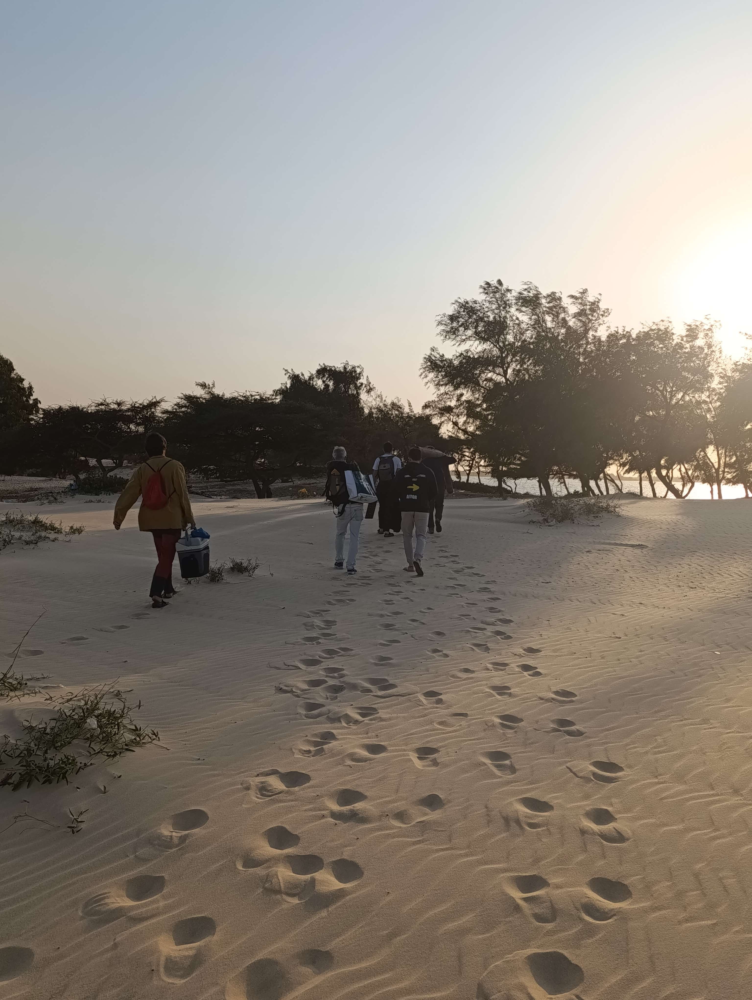
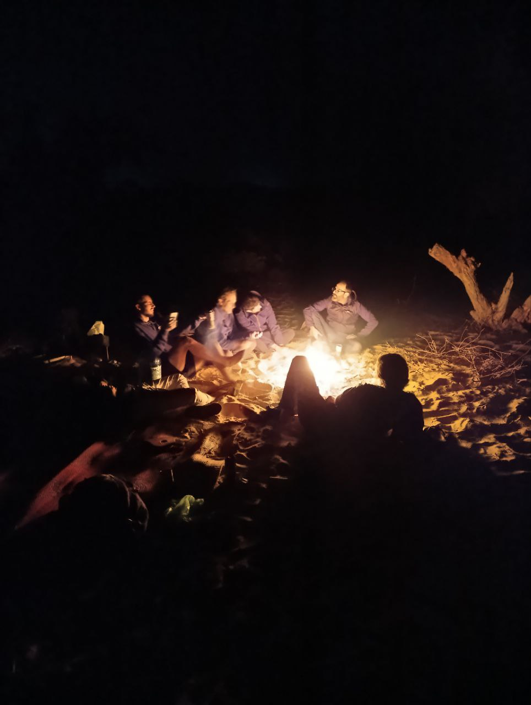

Hoy hemos continuado con las tareas que teníamos planificadas, y cada equipo ha avanzado significativamente en sus objetivos.

## Avances con OpenWisp

El equipo OpenWISP decidió desplazarse hasta Fess para cambiar de ambiente y aprovechar la oportunidad de resolver problemas en los routers de la zona. Después de superar algunas dificultades, lograron acceder a todas las salas necesarias y arreglaron varios dispositivos clave:

* Repararon el router de la sala de Informática.
* Solucionaron problemas en los dos routers de la radio.
Además, configuraron una pequeña red mesh de dos nodos que hay en la radio, únicamente usando OpenWisp. Aunque uno de los routers más antiguos quedó inutilizable (bricked), lo positivo es que pudimos validar OpenWISP como herramienta para crear redes mesh de manera sencilla.

Próximos pasos:

* Utilizar OpenWisp para reconstruir todos los nodos mesh. 
* Verificar que los servidores DNS estén correctamente configurados en tods los routers.
* Verificar que la configuración de firewall esté correcta en todos los routers.

## Avances con Zabbix

Buenas noticias: Zabbix está funcionando perfectamente. Este sistema nos ha notificado errores en algunos routers que, de otra manera, habrían pasado desapercibidos. Hemos documentado estos problemas en el sistema de gestión de tareas y seguimos trabajando para dejar la red de Aminata lista.

Además:

* Personalizamos los mensajes de error de Zabbix para reducir las alertas innecesarias y asegurarnos de que las notificaciones sean claras y relevantes.
* Flasheamos dos routers adicionales que se destinarán al espacio *Ndar Weesul* en Saint Louis.

## Una tarde en la playa de Lakhrar

Por la tarde, nos dirigimos a la playa de Lakhrar, un lugar espectacular rodeado de belleza natural, ideal para relajarnos y celebrar los avances logrados durante la semana con una barbacoa. La jornada estuvo llena de actividad: mientras Joan, Sergio y Aitor se aventuraban al mar en busca de ostras, que más tarde cocinaríamos al fuego, Jaume, Roger y otros voluntarios de Hahatay –Lorenzo, Pablo y Rober– preparaban el área para encender la hoguera y cocinar las ostras, junto con patatas y solomillos.

El atardecer en Lakhrar fue un espectáculo inolvidable. Al caer la noche, disfrutamos de una cena deliciosa: Rober había preparado una tortilla como aperitivo, y las ostras frescas, recién recogidas del mar, se asaron al fuego, seguidas de los solomillos que completaron un festín inigualable.

Después de cenar, nos quedamos junto a la hoguera, compartiendo historias y disfrutando de la tranquilidad de la noche en un entorno idílico. Cuando la leña se agotó, recogimos nuestras cosas y regresamos a casa, satisfechos y listos para descansar tras un día perfecto.

