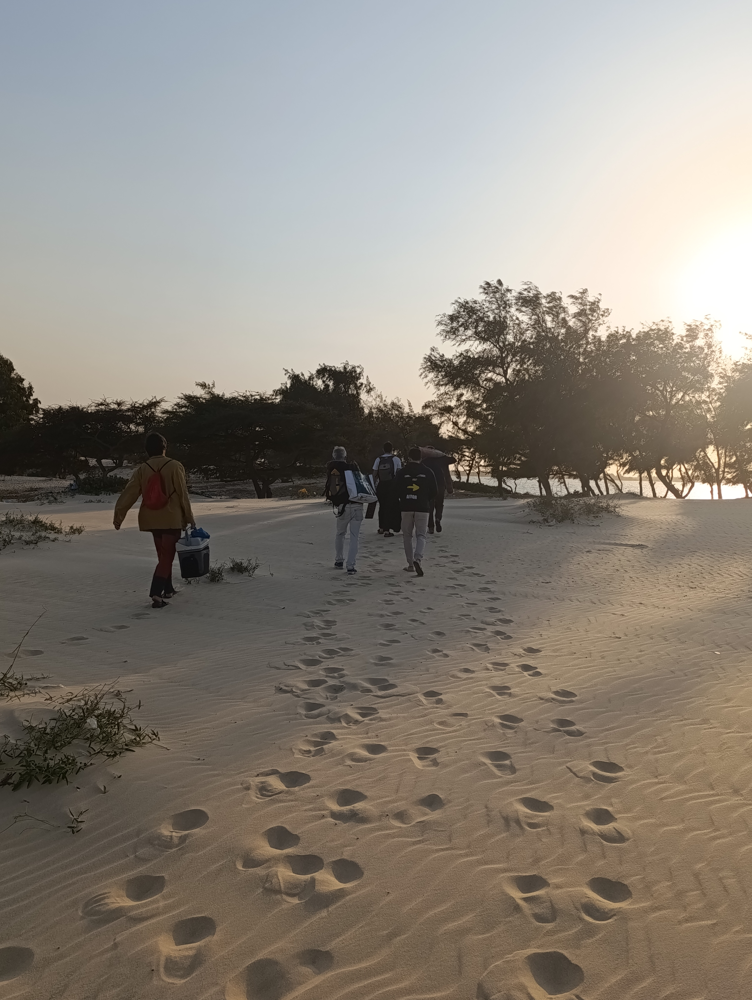
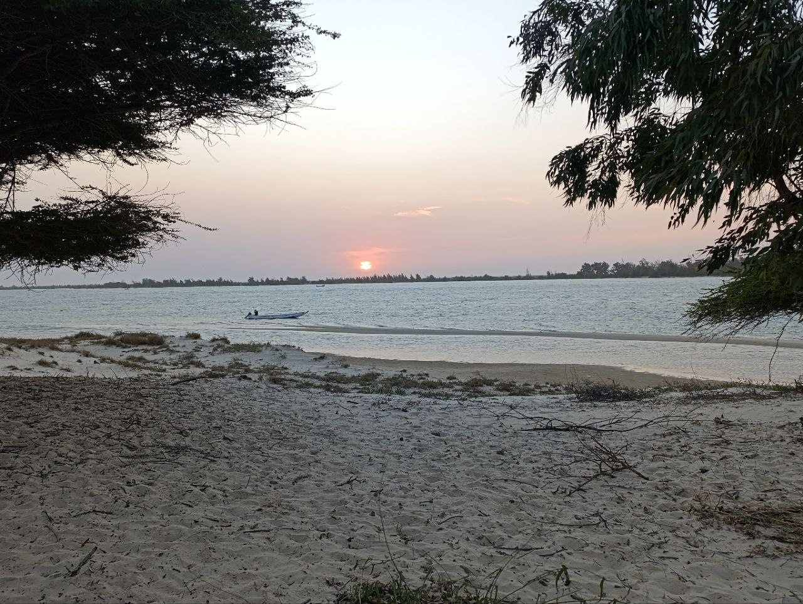
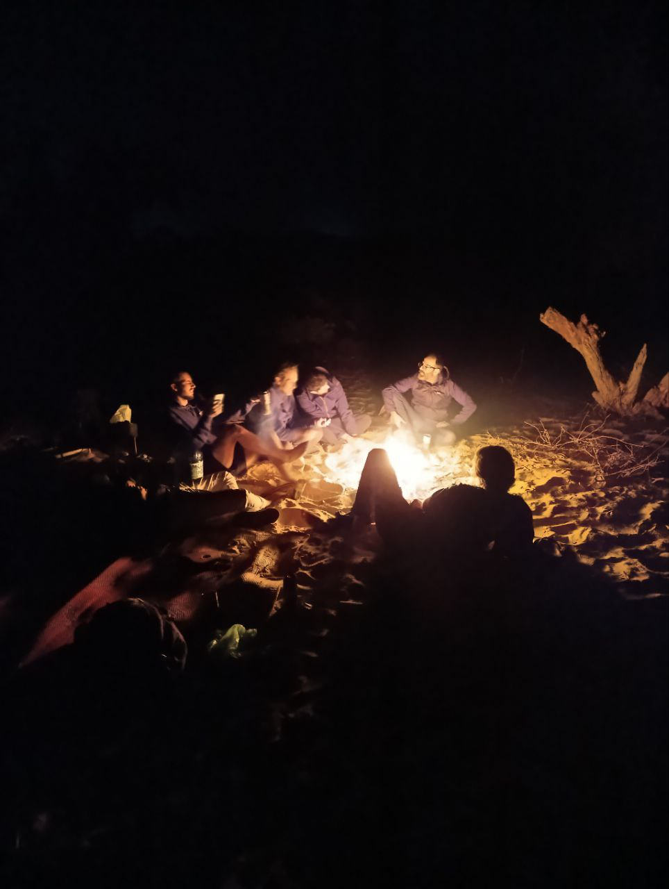

Today we continued with the tasks we had planned, and each team made significant progress toward their goals.

## Progress with OpenWISP

The OpenWISP team decided to head to Fess to change the environment and take the opportunity to solve some router issues in the area. After overcoming some difficulties, they managed to access all the necessary rooms and fix several key devices:

* Repaired the router in the computer room.
* Solved problems with the two routers in the radio station.

Additionally, they configured a small two-node mesh network in the radio station, using only OpenWISP. Although one of the older routers became unusable (bricked), the positive takeaway is that we validated OpenWISP as a tool for creating mesh networks easily.

Next steps:

* Use OpenWISP to rebuild all mesh nodes.
* Verify that DNS servers are correctly configured on all routers.
* Ensure the firewall configuration is correct on all routers.

## Progress with Zabbix

Good news: Zabbix is working perfectly. The system has notified us about errors in some routers that would have otherwise gone unnoticed. We’ve documented these issues in the task management system and are continuing to work on finalizing Aminata’s network.

Additionally:

* We customized Zabbix error messages to reduce unnecessary alerts and ensure that notifications are clear and relevant.
* We flashed two additional routers that will be deployed to the *Ndar Weesul* space in Saint Louis.

## An Afternoon at Lakhrar Beach

In the afternoon, we headed to Lakhrar Beach, a spectacular location surrounded by natural beauty, perfect for relaxing and celebrating the progress made during the week with a barbecue. The day was full of activity: while Joan, Sergio, and Aitor ventured into the sea to gather oysters that we would later cook over the fire, Jaume, Roger, and other Hahatay volunteers – Lorenzo, Pablo, and Rober – prepared the area to light the fire and cook the oysters, along with potatoes and steaks.

The sunset at Lakhrar was an unforgettable sight. As night fell, we enjoyed a delicious dinner: Rober had prepared a tortilla earlier in the day as an appetizer, and the fresh oysters, gathered just hours before, were roasted over the fire, followed by steaks that completed an unparalleled feast.

After dinner, we stayed by the bonfire, sharing stories and enjoying the tranquility of the night in an idyllic setting. Once the firewood was used up, we packed our things and headed back home, satisfied and ready to rest after a perfect day.

