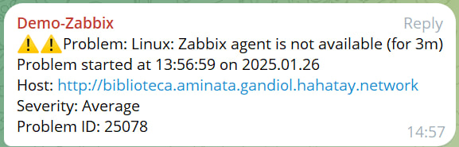

Amanecimos sin prisas y decidimos tomarnos la mañana con calma. Fue un lujo levantarse tarde y disfrutar de un desayuno relajado mientras recordábamos, entre risas, los momentos más divertidos de la noche anterior.

---

## Reflexionando sobre nuestros logros

Por la mañana, aprovechamos para hacer balance de los avances logrados durante la semana. Nos llenó de satisfacción darnos cuenta de cuánto habíamos progresado:

### Configuración de Zabbix
Conseguimos integrarlo con Telegram y añadir la mayoría de los elementos de la red.

### Implementación de OpenWISP
Lo desplegamos exitosamente, añadimos todos los routers de la red y ahora podemos configurar nodos mesh con una facilidad sorprendente. Con esto prácticamente concluido, solo nos falta preparar la documentación final y habremos cerrado este gran proyecto de integración.

---

## Explorando Saint Louis

Por la tarde, Jaume, Joan y Aitor se embarcaron en una escapada a Saint Louis. Se propusieron descubrir la auténtica esencia de la ciudad evitando la típica ruta turística de la isla de Saint Louis.

### El mercado local: un caos ordenado
La visita al mercado local fue una experiencia impactante. Nos encontramos con un entorno vibrante y caótico donde todo tipo de alimentos estaba expuesto de manera sorprendente. Entre colores, olores y voces, nos sumergimos en la cotidianidad de Saint Louis y quedamos alucinados con este bonito mercado.

### El bazar: bueno, bonito y barato
Tras el mercado, fuimos nuevamente al bazar de segunda mano, donde conseguimos gangas increíbles.  
- Jaume: se hizo con una chaqueta, una camisa y una camiseta por un precio espectacular.  
- Aitor: encontró un pantalón pirata que le quedó perfecto.  
- Joan: no tuvo tanta suerte en esta aventura y salió del bazar con las manos vacías, aunque se lo tomó con humor.

---

### Una vuelta diferente
La vuelta a Gandiol fue toda una aventura, ya que optamos por usar un taxi compartido, un sistema de transporte muy habitual en Senegal.  
Cómo funciona:
1. Te diriges a un punto específico donde sabes que los taxis que allí esperan tienen como destino Gandiol.
2. Debes esperar a que lleguen otros pasajeros que vayan en la misma dirección.
3. Una vez que el taxi está lleno, comienza el viaje.

Es una opción económica, práctica y, sobre todo, una experiencia cultural diferente que nos dejó otra anécdota para recordar.

---

## Un rato en Gandiol

Mientras tanto, Roger y Sergio decidieron quedarse en Gandiol. Trabajaron un poco en el tema de la VPN y luego fueron a ver la puesta de sol en el Teranga, nuestro bar preferido de los alrededores.

---

Cada día aquí en Senegal tiene su propio ritmo, una mezcla perfecta de logros, aprendizajes y descubrimientos que hacen que esta experiencia sea inolvidable.
