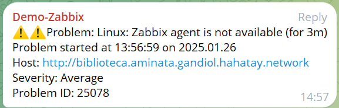
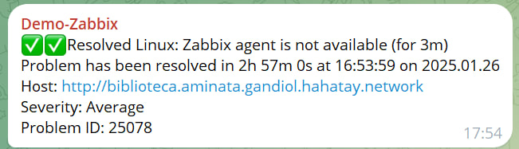
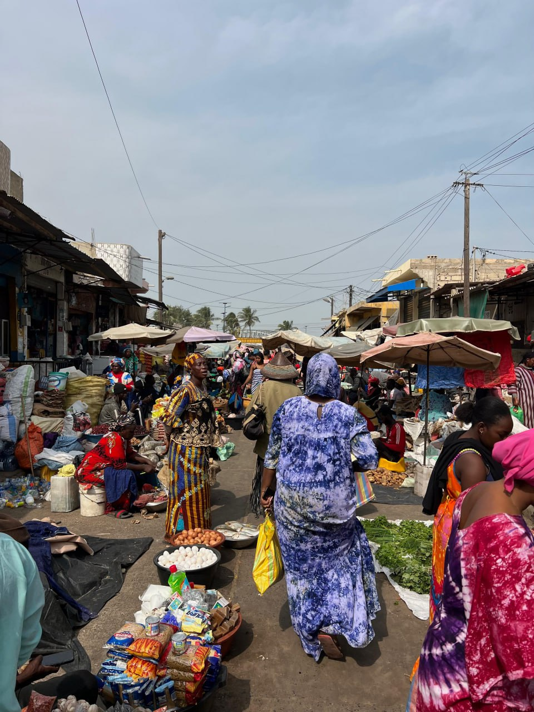
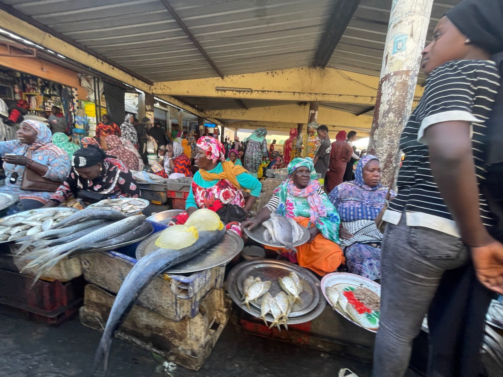

We started the day without rushing and decided to take a slow morning. It was such a luxury to sleep in, enjoy a relaxed breakfast, and share laughter while reminiscing about the funniest moments from the previous night.

---

## Reflecting on our Achievements  

In the morning, we took the opportunity to review the progress we had made throughout the week. It was deeply satisfying to realize just how far we had come:  

### Zabbix Configuration  
We managed to integrate it with Telegram and add most of the network elements.

  
  

### OpenWISP Deployment  
We successfully deployed OpenWISP, added all the network routers, and now can configure mesh nodes with surprising ease. With this nearly completed, we just need to finalize the documentation, and this major integration project will be done.  

---

## Exploring Saint Louis  

In the afternoon, Jaume, Joan, and Aitor went on a trip to Saint Louis, determined to experience the authentic essence of the city while avoiding the typical tourist route on the island of Saint Louis.  

### The Local Market: An Organized Chaos  
The visit to the local market was an eye-opening experience. We found ourselves in a vibrant and chaotic environment where all kinds of foods were displayed in fascinating ways. Among colors, smells, and voices, we immersed ourselves in the everyday life of Saint Louis and were captivated by the charm of this remarkable market.  

  
  

### The Bazaar: Good, Cheap, and Beautiful  
After the market, we visited the second-hand bazaar again, where we snagged some incredible bargains.  
- **Jaume**: scored a jacket, a shirt, and a t-shirt at a great price.  
- **Aitor**: found a pair of cropped pants that fit perfectly.  
- **Joan**: wasn’t as lucky this time and left the bazaar empty-handed, though he laughed it off.  

---

### A Different Way Back  
The return to Gandiol was an adventure in itself, as we chose to use a shared taxi, a common mode of transport in Senegal.  
How it works:  
1. Head to a specific spot where you know taxis are waiting to head to Gandiol.  
2. Wait for other passengers heading in the same direction.  
3. Once the taxi is full, the journey begins.  

It’s an economical, practical, and uniquely cultural experience that gave us yet another anecdote to cherish.  

---

## A Quiet Time in Gandiol  

Meanwhile, Roger and Sergio stayed in Gandiol. They spent some time working on the VPN project before heading to Teranga, our favorite local bar, to watch the sunset.  

---

Every day here in Senegal has its own rhythm, a perfect mix of accomplishments, learning, and discoveries that make this experience unforgettable.
