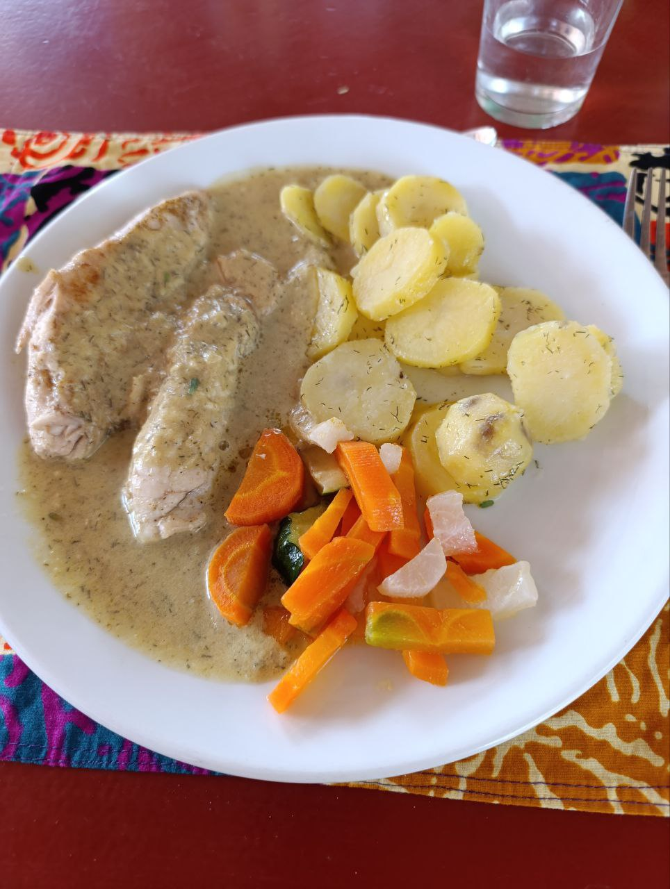
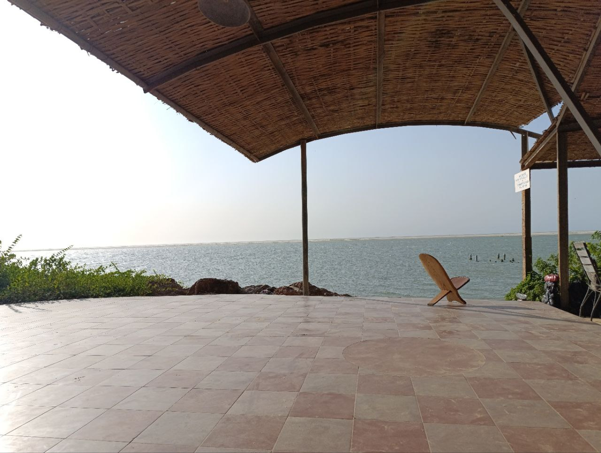
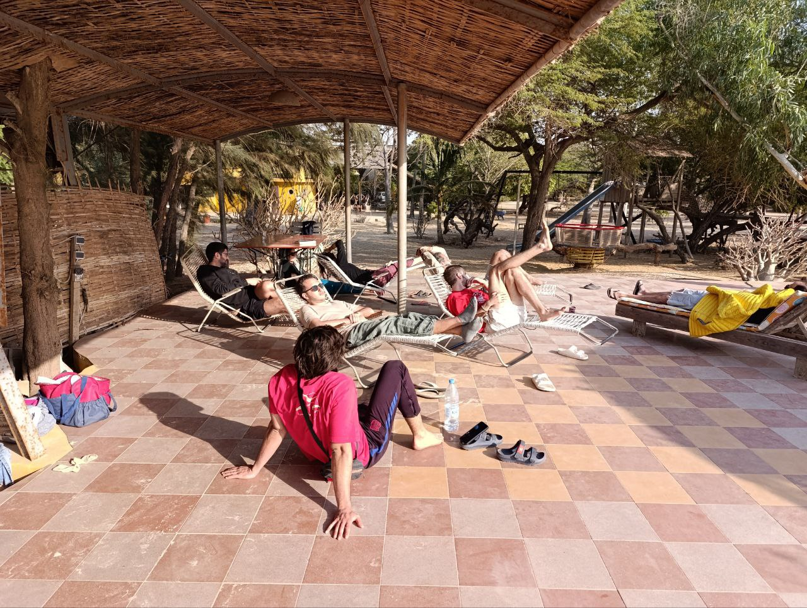
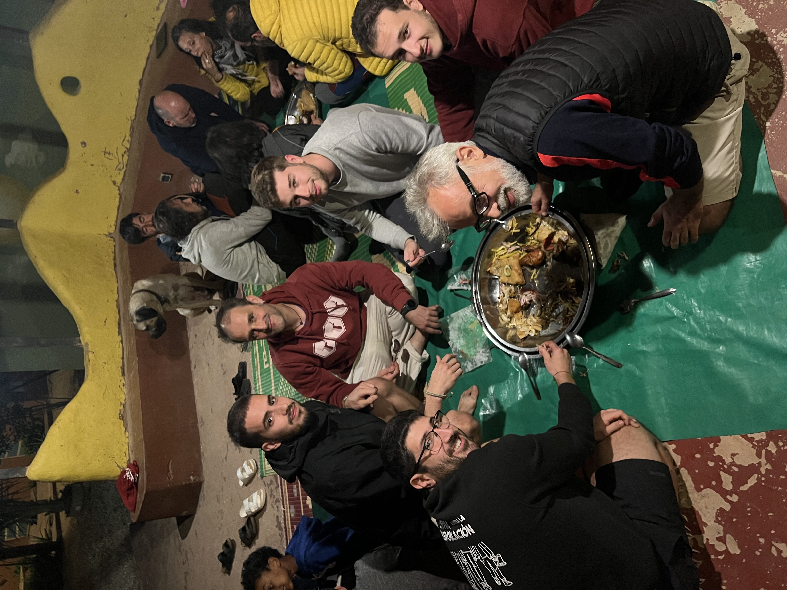

El día comenzó de manera relajada, sin prisas. Nos levantamos tranquilamente y aprovechamos la mañana para avanzar en las tareas pendientes.

### Jaume y Joan: Sincronización de Zabbix con Telegram

Jaume y Joan se centraron en continuar con la configuración de Zabbix, logrando sincronizarlo con Telegram. Establecieron dos grupos de notificaciones: uno para recibir todas las alertas, ya sean de aviso o error, lo que nos permitirá monitorear constantemente la red y realizar tareas de depuración. El segundo grupo solo se activará cuando algún router deje de funcionar durante todo el día, facilitando a la gente local la identificación rápida de los fallos en la red.

### Aitor y Sergio: Cambio de router y problemas con OpenWISP

Aitor y Sergio trabajaron en la actualización de la red de Sunukeur, sustituyendo el router master. Sin embargo, al aplicar la plantilla de configuración de OpenWISP, la interfaz gráfica del router, la LuCI, sufrió una desconfiguración. Decidieron dejar el problema para el día siguiente, ya que necesitaban tiempo para solucionarlo adecuadamente sin correr riesgos de empeorar la situación.

### Zebrabar

A la hora de comer, nos dirigimos al Zebrabar, donde nos encontramos con unos amigos de Lorenzo y Pablo. siendo un total de 24 personas. El plato del día de pescado tuvo especial éxito.

Después de comer, pasamos un buen rato en el lugar, disfrutamos de nuevo de las vistas y de la tranquilidad del lugar.

### Regreso a Sunukeur: Cena y Fútbol

Al regresar a Sunukeur, Lorenzo tenía encargada la cena: pollo a la brasa con patatas fritas y Fataya. Depsués de cenar, pusimos el fútbol en una pantalla en el patio y pudimos disfrutar del 7-1 del Barça.

